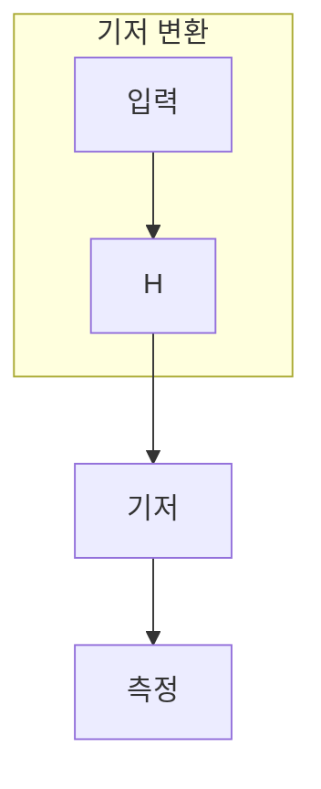

> [!abstract] 한 줄 요약
> H는 계산 기저의 상태를 X 기저의 상태로 옮겨, 같은 상태를 다른 질문으로 읽게 한다.

## 이 노트의 지도



## 핵심 질문

H를 적용한 뒤의 분포는 시작 상태와 측정 기저를 함께 말해야 해석할 수 있다. ==관측 기저==를 결과와 구분해 추적한다.

$$
H|0\rangle=\frac{|0\rangle+|1\rangle}{\sqrt2}
$$

<details>
<summary>H를 두 번 적용하면 왜 원래로 돌아올까?</summary>

H는 자기 자신의 역행렬이므로 $H^2=I$다.

</details>

## 비교하거나 측정할 값

```html preview
<div style="font-family:system-ui,sans-serif;padding:20px;color:var(--foreground)">
  <h3 style="margin:0 0 14px;font-size:15px;font-weight:600">H 뒤 계산 기저 측정</h3>
  <div id="bars" style="display:flex;align-items:flex-end;gap:14px;height:170px"></div>
  <script>
    var data = [["상태 0",50],["상태 1",50]];
    var max = Math.max.apply(null, data.map(function (d) { return d[1]; }));
    document.getElementById('bars').innerHTML = data.map(function (d, i) {
      return '<div style="flex:1;display:flex;flex-direction:column;align-items:center;' +
        'gap:6px;height:100%;justify-content:flex-end">' +
        '<span style="font-size:12px;font-weight:600">' + d[1] + '</span>' +
        '<div style="width:100%;height:' + (d[1] / max * 100) + '%;' +
        'background:var(--chart-' + (i + 1) + ');' +
        'border-radius:var(--radius) var(--radius) 0 0"></div>' +
        '<span style="font-size:12px;color:var(--muted-foreground)">' + d[0] + '</span>' +
        '</div>';
    }).join('');
  </script>
</div>
```

<Tabs>
  <Tab label="입력">입력 상태를 정한다.</Tab>
  <Tab label="변환">H로 기저를 바꾼다.</Tab>
  <Tab label="기저">어떤 기저로 읽는지 명시한다.</Tab>
</Tabs>

> [!caution] 해석의 범위
> 50 대 50은 $|0
angle$에 H를 적용한 경우이며 임의 입력의 보편적 설명이 아니다.

## 핵심 정리

| 요소 | 확인 질문 | 의미 |
| :-- | :-- | :-- |
| 입력 | 무엇을 넣는가 | 입력 |
| 변환 | 무엇이 바뀌는가 | H |
| 관측 | 무엇을 읽는가 | 측정 |

> [!question]- 스스로 점검
> **Q.** H가 ‘동전을 던지는 게이트’라는 설명이 불완전한 이유는?
>
> **A.** H는 확률을 무작위로 만드는 것이 아니라 상태와 관측 기저의 관계를 바꾸기 때문이다.

## 출처

- 공개 노트에는 원본 강의 자료, 자산 이미지, 페이지 단위 근거를 포함하지 않는다.

---

## 원본 강의 흐름 인터랙티브

```html preview
<div style="font-family:system-ui,sans-serif;padding:20px;color:var(--foreground)">
  <label for="noteFlow854924" style="font-size:14px;font-weight:600">Hadamard Gate 단계</label>
  <div id="noteFlow854924-out" style="font-size:26px;font-weight:700;color:var(--chart-1);margin:6px 0">Hadamard Gate 핵심 개념</div>
  <input id="noteFlow854924" type="range" min="1" max="3" step="1" value="1" style="width:100%;accent-color:var(--primary)" />
  <p style="font-size:13px;color:var(--muted-foreground)">슬라이더를 움직이면 원본 PDF에서 정리한 이 노트의 흐름을 확인합니다.</p>
  <script>
    var noteFlow854924 = document.getElementById('noteFlow854924');
    var noteFlow854924Out = document.getElementById('noteFlow854924-out');
    var noteFlow854924Steps = ["Hadamard Gate 핵심 개념","Hadamard Gate 처리 절차","Hadamard Gate 검증·응용"];
    noteFlow854924.addEventListener('input', function () { noteFlow854924Out.textContent = noteFlow854924Steps[Number(noteFlow854924.value) - 1]; });
  </script>
</div>
```
