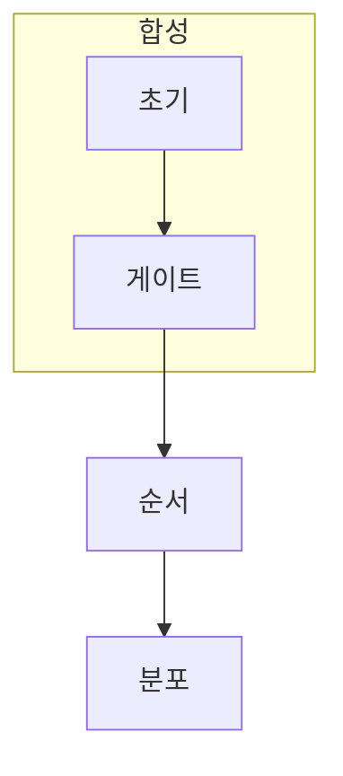

> [!abstract] 한 줄 요약
> 게이트는 목록이 아니라 순서가 있는 합성 연산이며, 같은 게이트도 적용 순서에 따라 다른 상태를 만들 수 있다.

## 이 노트의 지도



## 핵심 질문

회로를 읽을 때는 각 게이트의 이름보다 현재 상태에 어떤 연산이 누적되는지를 따라간다. ==순서==를 결과와 구분해 추적한다.

$$
|\psi'\rangle=U_2U_1|\psi\rangle
$$

<details>
<summary>순서를 바꾸면 왜 달라질까?</summary>

일반적으로 $U_2U_1$과 $U_1U_2$는 같지 않다. 따라서 회로의 왼쪽에서 오른쪽 순서를 보존해야 한다.

</details>

```html preview
<div style="font-family:system-ui,sans-serif;padding:20px;color:var(--foreground)">
  <label for="amt" style="font-size:14px;font-weight:600">게이트 수 </label>
  <div id="out" style="font-size:30px;font-weight:700;color:var(--chart-1);margin:6px 0">2개</div>
  <input id="amt" type="range" min="0" max="8" step="1" value="2"
    style="width:100%;accent-color:var(--primary)" />
  <p style="font-size:13px;color:var(--muted-foreground)">게이트 수는 누적 변환을 추적할 때의 단위다.</p>
  <script>
    var amt = document.getElementById('amt');
    var out = document.getElementById('out');
    amt.addEventListener('input', function () {
      out.textContent = '' + Number(amt.value).toLocaleString() + '개';
    });
  </script>
</div>
```

## 비교하거나 측정할 값

```html preview
<div style="font-family:system-ui,sans-serif;padding:20px">
  <div id="cards" style="display:flex;gap:14px;flex-wrap:wrap"></div>
  <script>
    var stats = [["반복","U²","상쇄 또는 누적","var(--chart-1)"],["순서","U₂U₁","합성 결과","var(--chart-2)"],["측정","분포","최종 확인","var(--chart-3)"]];
    document.getElementById('cards').innerHTML = stats.map(function (s) {
      return '<div style="flex:1;min-width:150px;padding:16px;background:var(--card);' +
        'color:var(--card-foreground);border:1px solid var(--border);' +
        'border-radius:var(--radius)">' +
        '<div style="font-size:13px;color:var(--muted-foreground)">' + s[0] + '</div>' +
        '<div style="font-size:26px;font-weight:700;margin-top:4px">' + s[1] + '</div>' +
        '<div style="font-size:12px;font-weight:600;margin-top:4px;color:' + s[3] + '">' +
        s[2] + '</div>' +
        '</div>';
    }).join('');
  </script>
</div>
```

<Tabs>
  <Tab label="반복">같은 연산의 누적을 본다.</Tab>
  <Tab label="순서">연산자 순서를 보존한다.</Tab>
  <Tab label="측정">최종 분포를 비교한다.</Tab>
</Tabs>

> [!caution] 해석의 범위
> 카드는 일반 성질을 요약하며 특정 회로의 완전한 시뮬레이션이 아니다.

## 핵심 정리

| 요소 | 확인 질문 | 의미 |
| :-- | :-- | :-- |
| 입력 | 무엇을 넣는가 | 누적 |
| 변환 | 무엇이 바뀌는가 | 순서 |
| 관측 | 무엇을 읽는가 | 결과 |

> [!question]- 스스로 점검
> **Q.** 두 게이트의 순서를 바꾸기 전에 확인할 수식은 무엇인가?
>
> **A.** 두 연산자의 곱이 교환되는지, 즉 $U_2U_1=U_1U_2$인지다.

## 출처

- 공개 노트에는 원본 강의 자료, 자산 이미지, 페이지 단위 근거를 포함하지 않는다.
