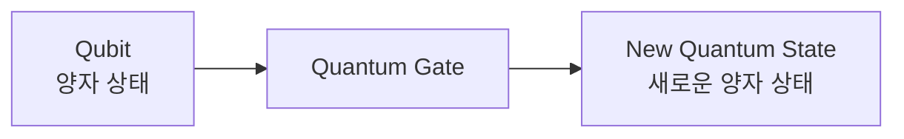
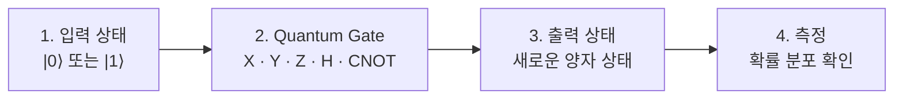

> [!abstract] 한 줄 요약
> Logic Gate는 **값**을 바꾸고, Quantum Gate는 중첩과 위상까지 포함한 **양자 상태 전체**를 변환한다.
> 수학적으로는 유니터리 행렬 연산이다.

## Quantum Gate의 정의


고전 컴퓨터에서 Logic Gate가 Bit를 처리하듯이, 양자 컴퓨터에서는 Quantum Gate가 Qubit을 처리한다.



핵심은 입력과 출력이 모두 **상태**라는 점이다. Bit는 0 또는 1만 가지지만, Qubit은 네 가지를 가질 수 있다 — $\lvert 0 \rangle$, $\lvert 1 \rangle$, 중첩, 그리고 ==위상이 포함된 상태== (눈에 보이지 않는 정보).

## Logic Gate 와의 비교


| 구분 | Classical Logic Gate | Quantum Gate |
| :-- | :-- | :-- |
| 입력 | Bit (0 또는 1) | Qubit (양자 상태) |
| 처리 대상 | 0 또는 1의 값 | 중첩·위상·간섭이 포함된 양자 상태 전체 |
| 변화 방식 | 값을 바꿔다 ($0 \to 1$) | 상태를 변환한다 ($\lvert 0 \rangle \to$ 50% $\lvert 0 \rangle$ + 50% $\lvert 1 \rangle$) |
| 예시 | NOT, AND, OR, NAND, XOR | X, Y, Z, H, CNOT, RX, RY, RZ |
| 결과 | 명확한 0 또는 1 | 측정 전까지 확률적 상태 |
| **QML 관점** | 논리 연산 도구 | **Feature Transformation 도구** |

> [!important] 마지막 행이 이 노트의 이유다
> 같은 "게이트"라는 이름을 쓰지만, QML에서 Quantum Gate는 논리 소자가 아니라 **데이터를 변환하는 도구**로 쓰인다.

<details>
<summary>X Gate 예시 — 중첩에도 적용된다</summary>

단순한 경우는 Bit Flip 처럼 보인다.

$$
X\lvert 0 \rangle = \lvert 1 \rangle \qquad X\lvert 1 \rangle = \lvert 0 \rangle
$$

그러나 중첩 상태에도 그대로 적용된다. 슬라이드는 50% $\lvert 0 \rangle$ + 50% $\lvert 1 \rangle$ 에 X를 걸면 **중첩이 변환된** 새 상태가 된다고 설명한다. 0 또는 1 단독뿐 아니라 위상 정보까지 포함해 변환된다.

</details>

## 대표 Quantum Gate 5종


```html preview
<div style="font-family:system-ui,sans-serif;padding:20px;color:var(--foreground)">
  <div id="gates" style="display:flex;gap:12px;flex-wrap:wrap"></div>
  <script>
    var g = [
      ['X', 'Bit Flip', '비트 반전', 'var(--chart-1)'],
      ['Y', 'Rotation', '회전', 'var(--chart-2)'],
      ['Z', 'Phase Flip', '위상 변경', 'var(--chart-4)'],
      ['H', 'Superposition', '중첩 생성', 'var(--chart-3)'],
      ['CNOT', 'Entanglement', '얽힘 생성', 'var(--chart-5)']
    ];
    document.getElementById('gates').innerHTML = g.map(function (x) {
      return '<div style="flex:1;min-width:130px;padding:14px;background:var(--card);' +
        'color:var(--card-foreground);border:1px solid var(--border);' +
        'border-radius:var(--radius);text-align:center">' +
        '<div style="font-size:28px;font-weight:700;color:' + x[3] + '">' + x[0] + '</div>' +
        '<div style="font-size:13px;font-weight:600;margin-top:6px">' + x[1] + '</div>' +
        '<div style="font-size:12px;color:var(--muted-foreground);margin-top:2px">' +
        x[2] + '</div></div>';
    }).join('');
  </script>
</div>
```

전체 흐름은 네 단계다.



## 수학적 의미 — 유니터리 행렬


1큐비트 상태는 복소수 진폭의 결합으로 표현된다.

$$
\lvert \psi \rangle = \alpha \lvert 0 \rangle + \beta \lvert 1 \rangle
\qquad
\lvert \alpha \rvert^{2} + \lvert \beta \rvert^{2} = 1
$$

Gate는 유니터리 행렬 $U$ 로 표현되며, 상태를 이렇게 변환한다.

$$
\lvert \psi' \rangle = U \lvert \psi \rangle
$$

> [!tip] 유니터리가 보장하는 것
> 유니터리 행렬은 상태의 길이($\lvert \psi \rvert = 1$)를 유지하며, **확률 보존**을 보장한다.
> 즉 게이트를 아무리 걸어도 확률의 합은 항상 1이다.

### 같은 입력, 다른 게이트

초기 상태 $\lvert \psi_0 \rangle = \lvert 0 \rangle$ 에 세 게이트를 각각 걸어 본다.

| Gate | 결과 | 설명 |
| :--: | :-- | :-- |
| X | $\lvert \psi' \rangle = \lvert 1 \rangle$ | 비트가 뒤집힌다 |
| H | $\lvert \psi' \rangle = \dfrac{1}{\sqrt{2}}(\lvert 0 \rangle + \lvert 1 \rangle)$ | 중첩이 된다 |
| Z | $\lvert \psi' \rangle = \lvert 0 \rangle$ | 위상만 변경 — 측정 결과는 그대로 |

> [!warning] Z Gate가 헷갈리는 이유
> $\lvert 0 \rangle$ 에 Z를 걸면 상태표기가 그대로라 "아무 일도 안 일어난" 것처럼 보인다.
> 실제로는 **위상**이 바뀌었고, 그 차이는 중첩 상태에서나 다른 게이트와 조합될 때 드러난다.

슬라이드의 결론은 이것이다 — **같은 입력이라도 어떤 Gate를 적용하느냐에 따라 전혀 다른 상태로 변환된다.**

## 정리

슬라이드가 직접 나열한 네 줄이다.

1. Gate는 Quantum State에 작용하여 상태를 **변환(Transformation)** 한다
2. 수학적으로는 **유니터리 행렬 연산**이다
3. 변환 후 상태는 **측정 확률(분포)을 변화**시킨다
4. QML 모델은 이러한 변환을 통해 데이터를 **더 유용한 형태로 바꿔 학습**한다

## 핵심 정리

| 개념 | 정의 | 왜 중요한가 |
| :-- | :-- | :-- |
| Quantum Gate | 큐비트 상태를 변환하는 연산 | 회로를 구성하는 최소 단위 |
| 유니터리 행렬 $U$ | 길이를 보존하는 행렬 | 확률의 합이 1로 유지되는 이유 |
| X · Y · Z | 비트반전 · 회전 · 위상변경 | 단일 큐비트 조작의 기본기 |
| H | 중첩 생성 | 표현 공간의 입구 |
| CNOT | 얽힘 생성 | 2큐비트 이상의 관계를 만드는 유일한 길 |

## 관련 개념

- **prerequisite** — [06. Hadamard Gate](<./06. Hadamard Gate.md>) : H 하나를 먼저 깊게 본 뒤 일반으로 넓힌다
- **applies** — [07. 상태변화 분석](<./07. 상태변화 분석.md>) : 여기 게이트들을 실제 코드로 조합해 본다
- **applies** — [09. Quantum Circuit](<./09. Quantum Circuit.md>) : 게이트를 나열해 회로를 만드는 단계
- **applies** — [05. QML에서 Quantum의 역할](<./05. QML에서 Quantum의 역할.md>) : Feature Transformation 도구라는 규정이 여기서 온다

> [!question]- 스스로 점검
> **Q1.** 게이트가 유니터리여야 하는 이유는?
>
> **A1.** 확률 보존 때문이다. $\lvert \alpha \rvert^2 + \lvert \beta \rvert^2 = 1$ 이 깨지면 측정 확률의 합이 1이 아니게 돼 물리적으로 성립하지 않는다.
>
> **Q2.** X Gate는 NOT Gate와 같은 것인가?
>
> **A2.** 기저 상태에서만 같아 보인다. NOT은 값 0/1만 뒤집지만, X는 중첩 상태와 위상까지 포함해 변환한다.

## 출처

- `pdf/day08_01_quantum_gate_concepts_lecture.pdf` (7p)
- 강의 인용 출처: IBM Quantum Learning; Qiskit Machine Learning Documentation
