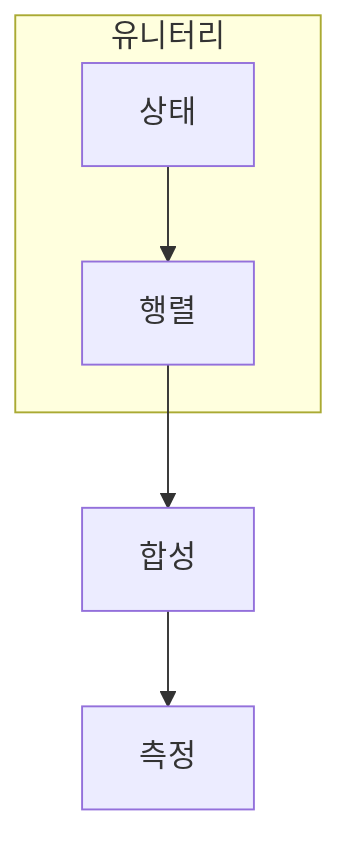

> [!abstract] 한 줄 요약
> 양자 게이트는 상태 공간의 길이를 보존하는 선형 변환이며, 회로는 그 변환의 순서다.

## 이 노트의 지도



## 핵심 질문

게이트의 핵심 조건은 가역성과 확률 보존이다. 논리 게이트와 달리 중첩 상태 전체에 선형적으로 작용한다. ==유니터리==를 결과와 구분해 추적한다.

$$
U^\dagger U=I
$$

<details>
<summary>CNOT은 왜 단일 큐비트 게이트와 다를까?</summary>

제어와 타깃의 관계가 두 큐비트 상태 전체에 조건부 변환을 만들기 때문이다.

</details>

## 비교하거나 측정할 값

```html preview
<div style="font-family:system-ui,sans-serif;padding:20px;color:var(--foreground)">
  <h3 style="margin:0 0 14px;font-size:15px;font-weight:600">대표 게이트의 작용 범위</h3>
  <div id="bars" style="display:flex;align-items:flex-end;gap:14px;height:170px"></div>
  <script>
    var data = [["X",1],["H",1],["CNOT",2]];
    var max = Math.max.apply(null, data.map(function (d) { return d[1]; }));
    document.getElementById('bars').innerHTML = data.map(function (d, i) {
      return '<div style="flex:1;display:flex;flex-direction:column;align-items:center;' +
        'gap:6px;height:100%;justify-content:flex-end">' +
        '<span style="font-size:12px;font-weight:600">' + d[1] + '</span>' +
        '<div style="width:100%;height:' + (d[1] / max * 100) + '%;' +
        'background:var(--chart-' + (i + 1) + ');' +
        'border-radius:var(--radius) var(--radius) 0 0"></div>' +
        '<span style="font-size:12px;color:var(--muted-foreground)">' + d[0] + '</span>' +
        '</div>';
    }).join('');
  </script>
</div>
```

<Tabs>
  <Tab label="X">계산 기저를 뒤집는다.</Tab>
  <Tab label="H">기저를 바꾼다.</Tab>
  <Tab label="CNOT">두 큐비트에 조건부 작용한다.</Tab>
</Tabs>

> [!caution] 해석의 범위
> 막대는 작용하는 큐비트 수를 나타내며 성능 비교가 아니다.

## 핵심 정리

| 요소 | 확인 질문 | 의미 |
| :-- | :-- | :-- |
| 입력 | 무엇을 넣는가 | 조건 |
| 변환 | 무엇이 바뀌는가 | 가역 |
| 관측 | 무엇을 읽는가 | 합성 |

> [!question]- 스스로 점검
> **Q.** 유니터리 조건이 회로 해석에서 주는 보장은 무엇인가?
>
> **A.** 확률 보존과 역연산 가능성이다.

## 출처

- 공개 노트에는 원본 강의 자료, 자산 이미지, 페이지 단위 근거를 포함하지 않는다.

---

## 원본 강의 흐름 인터랙티브

```html preview
<div style="font-family:system-ui,sans-serif;padding:20px;color:var(--foreground)">
  <label for="noteFlow458896" style="font-size:14px;font-weight:600">Quantum Gate 개념 단계</label>
  <div id="noteFlow458896-out" style="font-size:26px;font-weight:700;color:var(--chart-1);margin:6px 0">Quantum Gate 개념 핵심 개념</div>
  <input id="noteFlow458896" type="range" min="1" max="3" step="1" value="1" style="width:100%;accent-color:var(--primary)" />
  <p style="font-size:13px;color:var(--muted-foreground)">슬라이더를 움직이면 원본 PDF에서 정리한 이 노트의 흐름을 확인합니다.</p>
  <script>
    var noteFlow458896 = document.getElementById('noteFlow458896');
    var noteFlow458896Out = document.getElementById('noteFlow458896-out');
    var noteFlow458896Steps = ["Quantum Gate 개념 핵심 개념","Quantum Gate 개념 처리 절차","Quantum Gate 개념 검증·응용"];
    noteFlow458896.addEventListener('input', function () { noteFlow458896Out.textContent = noteFlow458896Steps[Number(noteFlow458896.value) - 1]; });
  </script>
</div>
```
