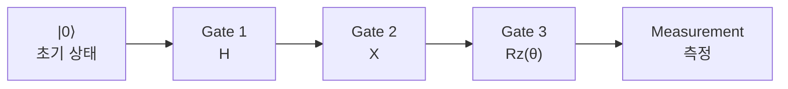
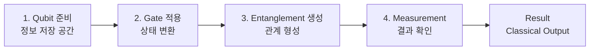

> [!abstract] 한 줄 요약
> 고전 프로그램이 **명령어의 순서**라면, Quantum Circuit은 **Gate의 순서**다.
> 그리고 그 순서는 장식이 아니라 결과를 바꾸는 변수다.

## Quantum Circuit이란

Qubit에 여러 Quantum Gate를 **순서대로** 적용하고, 마지막에 Measurement를 통해 결과를 얻는 양자 계산 구조다.

| | Classical Computer | Quantum Computer |
| :-- | :-- | :-- |
| 구조 | 프로그램 = 명령어의 순서 | Circuit = **Gate의 순서** |
| 흐름 | 입력 → 명령어 실행 → 출력 | Qubit(초기상태) → Quantum Gate → Measurement |



## 핵심 구성 요소 네 가지

| 구성 요소 | 역할 | 쉽게 말하면 |
| :-- | :-- | :-- |
| **Qubit** | 데이터를 담는 기본 단위 | 양자 정보가 저장되는 공간 |
| **Quantum Gate** | Qubit의 상태를 변환 | 상태를 바꾸는 연산 |
| **Entanglement** | Qubit 간 상관관계 생성 | 여러 Qubit을 연결하는 관계 |
| **Measurement** | 결과 출력 | 양자 상태를 고전적 0/1로 변환 |

순서대로 이어 붙이면 한 번의 계산이 된다.



<details>
<summary>2큐비트 회로의 다섯 단계 (슬라이드 p.3)</summary>

```text
q_0 |0⟩ ──[H]──●────[Ry(θ)]──[Z]────╪── c_0
                │
q_1 |0⟩ ───────⊕───────────[X]────╪── c_1
           ①     ②        ③        ④      ⑤
```

1. **Qubit 준비** — 각 Qubit을 $\lvert 0 \rangle$ (또는 $\lvert 1 \rangle$) 상태로 초기화
2. **Gate 적용** — 단일 Qubit Gate(H, X, $R_y$ 등)를 순차적으로
3. **다중 Qubit Gate** — CNOT 같은 Gate로 Qubit 간 상관관계(얽힘) 생성
4. **추가 변환** — 다양한 Gate 조합으로 더 복잡한 양자 상태를 만듦
5. **Measurement** — 각 Qubit을 측정해 0 또는 1을 얻음

</details>

## 회로에는 시간이 있다

회로도를 처음 보면 부품 배치도처럼 읽히지만, 그렇게 읽으면 핵심을 놓친다.

> [!important] 회로도를 읽는 방법
> Quantum Circuit은 **시간의 흐름**을 가지고 있어 **왼쪽에서 오른쪽으로** 실행된다.
> 그림은 배치도가 아니라 ==상태 변화의 흐름도== 다.

같은 부품을 순서만 바꾸면 다른 회로가 된다.

<Tabs>
  <Tab label="Circuit A">

```text
|0⟩ ──[H]──[Ry(θ)]──[X]──╪──
```

시간 흐름: $1 \to 2 \to 3 \to 4$

특정한 상태 변화 과정을 거쳐 결과가 출력된다.

  </Tab>
  <Tab label="Circuit B">

```text
|0⟩ ──[X]──[H]──[Ry(θ)]──╪──
```

시간 흐름: $1 \to 2 \to 3 \to 4$

순서가 달라지면 상태 변화 과정과 결과가 달라진다.

  </Tab>
</Tabs>

> [!note] 앞 노트와 이어지는 지점
> [07. 상태변화 분석](<./07. 상태변화 분석.md>) 에서 H→X 와 X→H 를 실제로 돌려 본 것이 바로 이 이야기다.

## 구조가 결과를 바꾸는 다섯 요소

| 요소 | 설명 | 결과에 미치는 영향 |
| :-- | :-- | :-- |
| Qubit 수 | 회로에서 사용하는 Qubit 개수 | 표현 가능한 상태 공간이 $2^{n}$ 으로 증가 |
| Gate 종류 | 사용하는 Gate 타입 (H, X, Z, CNOT 등) | 어떤 State 변환을 수행할지 결정 |
| Gate 순서 | Gate를 적용하는 순서 | 상태 변화 경로가 달라져 최종 결과가 바뀌어질 수 있음 |
| Entanglement 구조 | Qubit 간 얽힘 관계가 어떻게 만들어지는가 | Qubit들이 독립인지, 연결되어 움직이는지 결정 |
| Measurement 방식 | 어떤 Qubit을, 어떤 기준으로 측정하는가 | 결과 해석 방식과 보이는 분포가 달라짐 |

### 데이터로 보기 — Qubit 하나가 늘 때마다

```html preview
<div style="font-family:system-ui,sans-serif;padding:20px;color:var(--foreground)">
  <h3 style="margin:0 0 4px;font-size:15px;font-weight:600">표현 가능한 상태 수 = 2의 n제곱</h3>
  <p style="margin:0 0 18px;font-size:13px;color:var(--muted-foreground)">
    Qubit 하나를 더하면 상태 공간이 두 배가 된다. 10개면 1,024개다.
  </p>
  <div id="exp" style="display:flex;align-items:flex-end;gap:10px;height:180px"></div>
  <script>
    var n = [1, 2, 3, 4, 5, 6, 7, 8];
    var mx = Math.pow(2, 8);
    document.getElementById('exp').innerHTML = n.map(function (k, i) {
      var v = Math.pow(2, k);
      return '<div style="flex:1;display:flex;flex-direction:column;align-items:center;' +
        'gap:5px;height:100%;justify-content:flex-end">' +
        '<span style="font-size:12px;font-weight:700">' + v + '</span>' +
        '<div style="width:100%;height:' + (v / mx * 100) + '%;' +
        'background:var(--chart-' + ((i % 5) + 1) + ');' +
        'border-radius:var(--radius) var(--radius) 0 0;min-height:3px"></div>' +
        '<span style="font-size:12px;color:var(--muted-foreground)">' + k + 'q</span>' +
        '</div>';
    }).join('');
  </script>
</div>
```

슬라이드의 예시 그대로다 — 1 Qubit은 2개 상태(0, 1), 2 Qubit은 4개(00, 01, 10, 11), 3 Qubit은 8개(000~111).

> [!tip] 이것이 표현력 확장의 산술적 근거
> [05. QML에서 Quantum의 역할](<./05. QML에서 Quantum의 역할.md>) 이 말한 "표현 방식의 확장"이 수치로는 이 그래프다.

## 핵심 정리

| 개념 | 정의 | 왜 중요한가 |
| :-- | :-- | :-- |
| Quantum Circuit | Gate를 순서대로 나열한 계산 구조 | 양자 프로그래밍의 기본 단위 |
| 시간의 흐름 | 왼쪽→오른쪽 실행 순서 | 회로도는 배치도가 아니라 흐름도다 |
| Entanglement | CNOT 등으로 만드는 Qubit 간 관계 | 단일 Qubit으로 못 만드는 상태의 유일한 통로 |
| $2^{n}$ 증가 | Qubit 수에 따른 상태 공간 크기 | QML이 노리는 표현력의 근원 |
| 구조 5요소 | Qubit 수·Gate 종류·순서·얽힘·측정 | 회로 설계가 결국 이 다섯을 정하는 일 |

## 관련 개념

- **prerequisite** — [08. Quantum Gate 개념](<./08. Quantum Gate 개념.md>) : 회로는 게이트를 나열한 것이므로 게이트가 먼저다
- **applies** — [07. 상태변화 분석](<./07. 상태변화 분석.md>) : Gate 순서가 결과를 바꾸는 것을 실측한 노트
- **applies** — [10. Quantum Circuit과 QML](<./10. Quantum Circuit과 QML.md>) : 이 회로에 학습 가능한 부분을 붙여 QML 회로로 만든다
- **applies** — [04. Quantum Feature Space](<./04. Quantum Feature Space.md>) : $2^{n}$ 공간이 왜 유용한지를 다룬다

> [!question]- 스스로 점검
> **Q1.** 회로도에서 왼쪽과 오른쪽은 각각 무엇을 뜻하는가?
>
> **A1.** 공간적 배치가 아니라 시간이다. 왼쪽이 먼저 실행되고 오른쪽이 나중이다.
>
> **Q2.** Qubit을 20개 쓰면 상태 공간은 얼마인가?
>
> **A2.** $2^{20} = 1{,}048{,}576$ 개다. 이 지수 증가가 고전 시뮬레이션을 어렵게 만드는 동시에, QML이 기대는 표현력의 근거기도 하다.

## 출처


- 강의 인용 출처: IBM Quantum Learning; Qiskit Machine Learning Documentation
