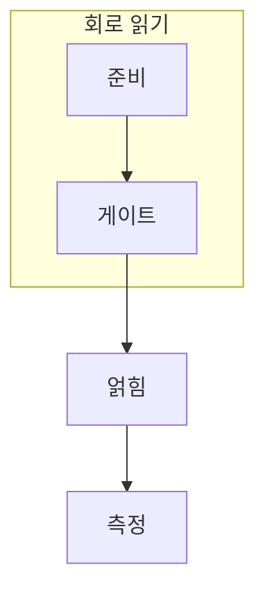

> [!abstract] 한 줄 요약
> 회로는 선 위에 게이트를 나열한 그림이 아니라, 상태 변화와 측정 설계를 시간 순서로 적은 프로그램이다.

## 이 노트의 지도



## 핵심 질문

각 선은 큐비트, 각 열은 한 시점의 연산으로 읽는다. 측정은 마지막에 어떤 정보를 고전 비트로 꺼낼지 결정한다. ==시간 순서==를 결과와 구분해 추적한다.

<details>
<summary>측정을 중간에 넣으면 무엇이 달라질까?</summary>

측정은 상태를 고전 결과로 바꾸므로 이후 연산의 가능한 해석과 회로 구조가 달라진다.

</details>

## 비교하거나 측정할 값

```html preview
<div style="font-family:system-ui,sans-serif;padding:20px">
  <div id="cards" style="display:flex;gap:14px;flex-wrap:wrap"></div>
  <script>
    var stats = [["준비","상태","입력 정함","var(--chart-1)"],["게이트","순서","변환 누적","var(--chart-2)"],["측정","고전값","결과 추출","var(--chart-3)"]];
    document.getElementById('cards').innerHTML = stats.map(function (s) {
      return '<div style="flex:1;min-width:150px;padding:16px;background:var(--card);' +
        'color:var(--card-foreground);border:1px solid var(--border);' +
        'border-radius:var(--radius)">' +
        '<div style="font-size:13px;color:var(--muted-foreground)">' + s[0] + '</div>' +
        '<div style="font-size:26px;font-weight:700;margin-top:4px">' + s[1] + '</div>' +
        '<div style="font-size:12px;font-weight:600;margin-top:4px;color:' + s[3] + '">' +
        s[2] + '</div>' +
        '</div>';
    }).join('');
  </script>
</div>
```

<Tabs>
  <Tab label="준비">초기 상태를 명시한다.</Tab>
  <Tab label="변환">연산 순서를 따라간다.</Tab>
  <Tab label="측정">무엇을 읽는지 확인한다.</Tab>
</Tabs>

> [!caution] 해석의 범위
> 카드는 회로 읽기 순서이며 특정 알고리즘 구현을 뜻하지 않는다.

## 핵심 정리

| 요소 | 확인 질문 | 의미 |
| :-- | :-- | :-- |
| 입력 | 무엇을 넣는가 | 선 |
| 변환 | 무엇이 바뀌는가 | 열 |
| 관측 | 무엇을 읽는가 | 측정 |

> [!question]- 스스로 점검
> **Q.** 회로에서 같은 게이트라도 위치가 중요한 이유는?
>
> **A.** 앞선 게이트가 만든 현재 상태에 작용하므로 시간 순서가 결과를 바꾼다.

## 출처

- 공개 노트에는 원본 강의 자료, 자산 이미지, 페이지 단위 근거를 포함하지 않는다.

---

## 원본 강의 흐름 인터랙티브

```html preview
<div style="font-family:system-ui,sans-serif;padding:20px;color:var(--foreground)">
  <label for="noteFlow241947" style="font-size:14px;font-weight:600">Quantum Circuit 단계</label>
  <div id="noteFlow241947-out" style="font-size:26px;font-weight:700;color:var(--chart-1);margin:6px 0">Quantum Circuit 핵심 개념</div>
  <input id="noteFlow241947" type="range" min="1" max="3" step="1" value="1" style="width:100%;accent-color:var(--primary)" />
  <p style="font-size:13px;color:var(--muted-foreground)">슬라이더를 움직이면 원본 PDF에서 정리한 이 노트의 흐름을 확인합니다.</p>
  <script>
    var noteFlow241947 = document.getElementById('noteFlow241947');
    var noteFlow241947Out = document.getElementById('noteFlow241947-out');
    var noteFlow241947Steps = ["Quantum Circuit 핵심 개념","Quantum Circuit 처리 절차","Quantum Circuit 검증·응용"];
    noteFlow241947.addEventListener('input', function () { noteFlow241947Out.textContent = noteFlow241947Steps[Number(noteFlow241947.value) - 1]; });
  </script>
</div>
```
