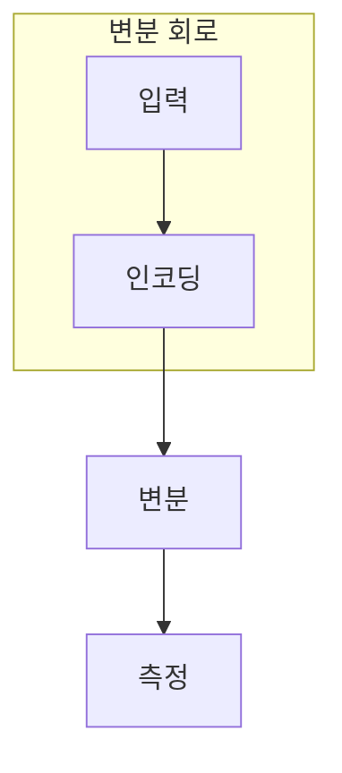

> [!abstract] 한 줄 요약
> QML 회로는 입력을 상태로 만들고 매개변수 변환과 측정으로 고전 학습기가 쓸 신호를 만든다.

## 이 노트의 지도



## 핵심 질문

회로의 앞부분은 입력을 표현하고, 뒷부분은 매개변수화된 변환으로 측정값을 학습 목표에 맞춘다. ==기대값==를 결과와 구분해 추적한다.

$$
\hat{y}=f_\theta(x)
$$

<details>
<summary>측정 샷을 바꾸면 왜 결과 읽기가 달라질까?</summary>

분포 추정의 표본 수가 바뀌므로 같은 회로라도 관측된 빈도의 변동이 달라진다.

</details>

```html preview
<div style="font-family:system-ui,sans-serif;padding:20px;color:var(--foreground)">
  <label for="amt" style="font-size:14px;font-weight:600">측정 샷 </label>
  <div id="out" style="font-size:30px;font-weight:700;color:var(--chart-1);margin:6px 0">1000 shots</div>
  <input id="amt" type="range" min="100" max="5000" step="100" value="1000"
    style="width:100%;accent-color:var(--primary)" />
  <p style="font-size:13px;color:var(--muted-foreground)">샷 수는 측정 분포 추정의 표본 수다.</p>
  <script>
    var amt = document.getElementById('amt');
    var out = document.getElementById('out');
    amt.addEventListener('input', function () {
      out.textContent = '' + Number(amt.value).toLocaleString() + ' shots';
    });
  </script>
</div>
```

## 비교하거나 측정할 값

```html preview
<div style="font-family:system-ui,sans-serif;padding:20px;color:var(--foreground)">
  <h3 style="margin:0 0 14px;font-size:15px;font-weight:600">예시 측정 결과</h3>
  <div id="bars" style="display:flex;align-items:flex-end;gap:14px;height:170px"></div>
  <script>
    var data = [["0",520],["1",480]];
    var max = Math.max.apply(null, data.map(function (d) { return d[1]; }));
    document.getElementById('bars').innerHTML = data.map(function (d, i) {
      return '<div style="flex:1;display:flex;flex-direction:column;align-items:center;' +
        'gap:6px;height:100%;justify-content:flex-end">' +
        '<span style="font-size:12px;font-weight:600">' + d[1] + '</span>' +
        '<div style="width:100%;height:' + (d[1] / max * 100) + '%;' +
        'background:var(--chart-' + (i + 1) + ');' +
        'border-radius:var(--radius) var(--radius) 0 0"></div>' +
        '<span style="font-size:12px;color:var(--muted-foreground)">' + d[0] + '</span>' +
        '</div>';
    }).join('');
  </script>
</div>
```

<Tabs>
  <Tab label="인코딩">입력을 상태로 준비한다.</Tab>
  <Tab label="변분">매개변수를 조절한다.</Tab>
  <Tab label="측정">고전 학습용 값을 낸다.</Tab>
</Tabs>

> [!caution] 해석의 범위
> 520 대 480은 측정 결과 형식을 보이는 예시이며 모델 성능이 아니다.

## 핵심 정리

| 요소 | 확인 질문 | 의미 |
| :-- | :-- | :-- |
| 입력 | 무엇을 넣는가 | 입력 |
| 변환 | 무엇이 바뀌는가 | 매개변수 |
| 관측 | 무엇을 읽는가 | 관측 |

> [!question]- 스스로 점검
> **Q.** QML 회로에서 변분 회로의 매개변수는 어떤 경로로 갱신되는가?
>
> **A.** 측정값을 고전 손실과 최적화기에 전달하는 하이브리드 루프를 통해 갱신된다.

## 출처

- 공개 노트에는 원본 강의 자료, 자산 이미지, 페이지 단위 근거를 포함하지 않는다.
