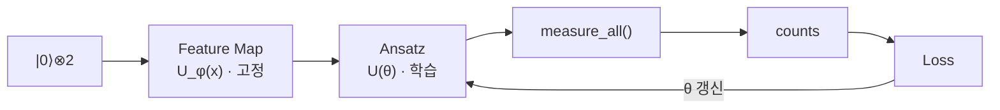

> [!abstract] 한 줄 요약
> 지금까지 만든 Quantum Circuit은 어디에 쓰이는가.
> 답은 Feature Map 뒤에 **학습되는 회로**를 붙이는 것이다.

## 이 노트의 지도



## 1. Variational Circuit — 학습되는 회로

앞 노트까지는 회로를 만드는 법만 다뤄다. 여기서부터는 그 회로가 어떻게 학습과 연결되는지를 본다.

> [!important] 결정적 구분
> **Feature Map은 학습하지 않는다.** 데이터를 Quantum State로 바꿀 뿐이다.
> 학습되는 것은 파라미터 $\theta$ 를 가진 ==Variational Circuit== — 다른 이름으로 **ansatz** — 이다.

전체 회로가 만들어내는 상태는 두 변환의 합성이다.

$$
\lvert \psi(\mathbf{x}, \theta) \rangle \;=\; U(\theta)\, U_{\phi(\mathbf{x})} \lvert 0 \rangle^{\otimes 2}
$$

오른쪽부터 읽는다 — 초기상태에 Feature Map을 걸고, 그 결과에 Ansatz를 건다.

## 2. 회로의 두 부분

<Tabs>
  <Tab label="Feature Map (고정)">

데이터를 Quantum State로 인코딩한다. 학습 대상이 아니다.

```python
from qiskit.circuit.library import zz_feature_map

feature_map = zz_feature_map(
    feature_dimension=2,   # 입력 Feature 2개 → Qubit 2개에 인코딩
    reps=1                 # Feature Map 구조를 1번 반복
)
```

`feature_dimension=2` 는 **두 개의 Feature를 두 개의 Qubit에 인코딩**한다는 뜻이다.

  </Tab>
  <Tab label="Ansatz (학습)">

인코딩된 상태를 **학습 가능한 방식으로** 다시 변환한다.

```python
from qiskit.circuit.library import real_amplitudes

ansatz = real_amplitudes(
    num_qubits=2,   # Qubit 2개로 구성
    reps=1          # 회로 Layer를 1번 반복
)
```

  </Tab>
</Tabs>

<details>
<summary>RealAmplitudes 안에는 무엇이 들어 있는가</summary>

슬라이드 p.6은 세 가지 구성요소를 명시한다.

| 구성요소 | 역할 |
| :-- | :-- |
| RY Rotation Gate | 각 Qubit을 Y축 기준으로 회전 — 회전각이 학습 파라미터 |
| Entanglement Gate | Qubit 사이를 얽어 단일 Qubit으로 표현 못 하는 상태를 만듦 |
| 학습 Parameter | 위 회전각들의 집합 — 최적화 대상 |

이름의 "Real"은 복소 위상을 도입하지 않고 **실수 진폭만** 다룬다는 뜻이다.

</details>

## 3. 조립하기

### 두 회로 결합

```python
qml_circuit = feature_map.compose(ansatz)
```

`compose()` 는 두 회로를 **순서대로** 연결한다. 슬라이드 p.9가 그린 결합 구조는 이렇다.

```text
q0 ─ Feature Map ─ Ansatz ─ Measurement
q1 ─ Feature Map ─ Ansatz ─ Measurement
```

앞부분은 데이터를 넣는 자리이고, 뒷부분이 학습하는 자리다.

### Measurement 추가

```python
qml_circuit.measure_all()
```

측정을 붙이면 모든 Qubit이 Classical Bit로 내려온다.

### 파라미터 확인과 할당

```python
print(qml_circuit.parameters)
# ParameterView([x[0], x[1], θ[0], θ[1], ...])
```

회로의 Parameter가 **두 종류**로 나뉘는 것이 핵심이다.

| 종류 | 출처 | 학습 대상 |
| :-- | :-- | :--: |
| $x[0], x[1]$ | Feature Map — **데이터** | 아니오 |
| $\theta[0] \dots \theta[k]$ | Ansatz — **가중치** | **예** |

```python
import numpy as np

parameter_values = {
    param: np.random.random()
    for param in qml_circuit.parameters
}
bound_circuit = qml_circuit.assign_parameters(parameter_values)
```

### Simulator 실행

> [!warning] 빠지기 쉬운 단계 — `transpile`
> 회로를 그대로 실행할 수 없다. 시뮬레이터가 지원하는 게이트 집합으로 **번역**하는 `transpile` 을 거쳐야 한다.

```python
from qiskit import transpile
from qiskit_aer import AerSimulator

sim = AerSimulator()
compiled_circuit = transpile(bound_circuit, sim)
job = sim.run(compiled_circuit, shots=1000)   # 회로를 1,000번 반복
counts = job.result().get_counts()
```

## 데이터로 보기

```html preview
<div style="font-family:system-ui,sans-serif;padding:20px;color:var(--foreground)">
  <h3 style="margin:0 0 4px;font-size:15px;font-weight:600">측정 결과 — shots=1000</h3>
  <p style="margin:0 0 16px;font-size:13px;color:var(--muted-foreground)">
    랜덤 파라미터 상태. 학습 전이므로 이 분포 자체에는 의미가 없다.
  </p>
  <div id="q" style="display:flex;align-items:flex-end;gap:20px;height:170px"></div>
  <script>
    var d = [['|00⟩', 583], ['|10⟩', 279], ['|01⟩', 115], ['|11⟩', 23]];
    var mx = 583;
    document.getElementById('q').innerHTML = d.map(function (x, i) {
      return '<div style="flex:1;display:flex;flex-direction:column;align-items:center;' +
        'gap:6px;height:100%;justify-content:flex-end">' +
        '<span style="font-size:13px;font-weight:700">' + (x[1] / 10).toFixed(1) + '%</span>' +
        '<div style="width:100%;height:' + (x[1] / mx * 100) + '%;' +
        'background:var(--chart-' + (i + 1) + ');' +
        'border-radius:var(--radius) var(--radius) 0 0"></div>' +
        '<span style="font-size:13px;color:var(--muted-foreground);' +
        'font-family:ui-monospace,monospace">' + x[0] + '</span></div>';
    }).join('');
  </script>
</div>
```

원문 출력과 상대빈도는 다음과 같다.

```text
{'01': 115, '00': 583, '11': 23, '10': 279}
```

| 상태 | 관측 횟수 | 상대 빈도 |
| :--: | --: | --: |
| `00` | 583 | 58.3% |
| `10` | 279 | 27.9% |
| `01` | 115 | 11.5% |
| `11` | 23 | 2.3% |

$$
\hat{P}(00) = \frac{583}{1000} = 0.583
$$

> [!note] 이 분포를 어떻게 읽는가
> 슬라이드는 이렇게 설명한다 — 현재 Gate들의 조합이 Quantum State를 $\lvert 00 \rangle$ **방향으로 가장 많이 변환**했다는 뜻이다.
> 파라미터가 랜덤이므로 이 치우침은 우연이다. **학습이란 손실이 줄어드는 방향으로 $\theta$ 를 갱신해 이 막대를 정답 쪽으로 미는 일**이다.

다만 그 밀기는 이 노트의 범위 밖에 있다.

> [!caution] 여기까지가 절반이다
> 이 노트는 **회로 조립**까지다. 옵티마이저·손실함수·기울기로 이어지는 실제 학습 루프는 `03.variational-learning-and-kernels` 이후 모듈에서 다룬다.

## 핵심 정리

| 개념 | 정의 | 왜 중요한가 |
| :-- | :-- | :-- |
| Feature Map | 데이터를 Quantum State로 바꾸는 **고정** 회로 | 학습 대상이 아니라는 점이 QML 이해의 갈림길 |
| Variational Circuit | 파라미터 $\theta$ 를 가진 **학습** 회로 | 신경망의 가중치에 해당하는 자리 |
| `compose()` | 두 회로를 순서대로 연결 | 인코딩과 학습을 하나의 QML 회로로 만듦 |
| `transpile()` | 시뮬레이터가 아는 게이트로 번역 | 이걸 빼면 실행되지 않는다 |
| counts | Bitstring별 관측 횟수 | 학습이 밀어야 할 대상 |

## 관련 개념

- **prerequisite** — [09. Quantum Circuit](<./09. Quantum Circuit.md>) : 회로와 게이트를 먼저 알아야 조립이 이해된다
- **applies** — [05. QML에서 Quantum의 역할](<./05. QML에서 Quantum의 역할.md>) : 여기서 다룬 Feature Map을 앞단에 그대로 갖다 쓴다
- **applies** — [04. Quantum Feature Space](<./04. Quantum Feature Space.md>) : 인코딩이 도착하는 공간이 왜 고차원인지의 근거
- **contrasts** — [01. 표현력의 한계](<./01. 표현력의 한계.md>) : 고전 모델이 못 하는 것과 대조하면 QML의 동기가 보인다

### 실행 근거

이 노트가 설명하는 회로를 실제로 돌려 본 노트북이다. 다섯 편 모두 강사 배포 코드(`Day11/*.py`)를 전량 보존한 ==faithful== 등급이므로 강의에서 다른 코드로 그대로 인용할 수 있다.

- **evidences** — [Day11 Feature Map 회로 구성 실습](<../work/01_feature_map_circuit.ipynb>) : Feature Map 회로를 코드로 조립한 실행본
- **evidences** — [Day11 Feature Map과 Ansatz 구성 실습](<../work/01_qml_feature_map_ansatz.ipynb>) : Feature Map 뒤에 학습되는 Ansatz를 붙이는 단계
- **evidences** — [Day11 Hadamard 중첩 측정 실습](<../work/02_hadamard_measurement.ipynb>) : 중첩 상태를 측정해 분포를 확인한 결과
- **evidences** — [Day11 중첩·회전·얽힘 회로 실습](<../work/03_superposition_rotation_entanglement.ipynb>) : 회로 구조 세 요소를 한 회로에서 결합한 예
- **evidences** — [Day11 복합 게이트 측정 실습](<../work/04_composite_gate_measurement.ipynb>) : 게이트를 쌌을 때 측정 분포가 어떻게 변하는지

> [!question]- 스스로 점검
> **Q1.** `qml_circuit.parameters` 에 $x$ 와 $\theta$ 가 함께 나오는데, 옵티마이저는 둘 중 무엇만 건드리는가?
>
> **A1.** $\theta$ 만 건드린다. $x$ 는 입력 데이터이므로 샘플마다 값이 주어지고 학습으로 바뀌지 않는다.
>
> **Q2.** `transpile` 을 생략하면 왜 문제가 되는가?
>
> **A2.** `zz_feature_map` · `real_amplitudes` 가 만드는 고수준 게이트는 시뮬레이터가 직접 실행하는 기본 게이트 집합이 아니다. 번역을 거쳐야 실행 가능한 형태가 된다.

## 출처


- 강의 인용 출처: IBM Quantum Learning; Qiskit Machine Learning Documentation
