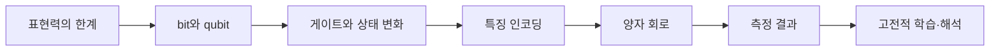

## 양자 ML 과정

이 과정은 “양자 컴퓨터가 빠르다”는 인상에서 출발하지 않는다. 고전 데이터의 표현력이 어디서 막히는지 확인하고, bit·qubit·게이트·회로·측정을 차례로 연결해 QML 회로가 무엇을 학습하는지 이해하는 흐름이다.

> [!NOTE]
> 과정 안내에 원본 강의 슬라이드나 PDF 렌더 이미지는 사용하지 않는다. 모든 도식은 독자 제작한 학습용 SVG다.

```html preview h=205
<div style="font-family:system-ui,sans-serif;padding:14px;color:var(--foreground);background:var(--card);border:1px solid var(--border);border-radius:var(--radius)">
<svg viewBox="0 0 720 155" width="100%" role="img" aria-label="양자 머신러닝 과정의 네 학습 단계를 보여주는 독자 제작 지도">
  <text x="18" y="23" font-size="15" font-weight="700" fill="currentColor">표현력에서 시작해 회로와 측정으로 닫는 학습 경로</text>
  <g transform="translate(27 52)" font-family="system-ui,sans-serif">
    <g><rect width="148" height="58" rx="12" fill="var(--card)" stroke="var(--chart-1)" stroke-width="2"/><text x="74" y="24" text-anchor="middle" font-size="14" font-weight="700" fill="currentColor">표현력</text><text x="74" y="43" text-anchor="middle" font-size="11" fill="var(--muted-foreground)">XOR·특징 공간</text></g>
    <path d="M161 29h45" stroke="var(--muted-foreground)" stroke-width="3"/><path d="M206 29l-10-7v14z" fill="var(--muted-foreground)"/>
    <g transform="translate(221)"><rect width="148" height="58" rx="12" fill="var(--card)" stroke="var(--chart-2)" stroke-width="2"/><text x="74" y="24" text-anchor="middle" font-size="14" font-weight="700" fill="currentColor">상태</text><text x="74" y="43" text-anchor="middle" font-size="11" fill="var(--muted-foreground)">bit·qubit·중첩</text></g>
    <path d="M355 29h45" stroke="var(--muted-foreground)" stroke-width="3"/><path d="M400 29l-10-7v14z" fill="var(--muted-foreground)"/>
    <g transform="translate(415)"><rect width="148" height="58" rx="12" fill="var(--card)" stroke="var(--chart-4)" stroke-width="2"/><text x="74" y="24" text-anchor="middle" font-size="14" font-weight="700" fill="currentColor">회로</text><text x="74" y="43" text-anchor="middle" font-size="11" fill="var(--muted-foreground)">게이트·순서·얽힘</text></g>
    <path d="M549 29h45" stroke="var(--muted-foreground)" stroke-width="3"/><path d="M594 29l-10-7v14z" fill="var(--muted-foreground)"/>
    <g transform="translate(609)"><rect width="82" height="58" rx="12" fill="var(--chart-5)"/><text x="41" y="24" text-anchor="middle" font-size="14" font-weight="700" fill="white">QML</text><text x="41" y="43" text-anchor="middle" font-size="10" fill="white">측정·학습</text></g>
  </g>
</svg>
</div>
```

## 학습 흐름

<Tabs>
  <Tab label="1. 표현">
  01. 표현력의 한계와 02. 왜 양자 컴퓨팅인가에서 고전 모델의 표현 한계와 새로운 계산 표현을 탐색하는 이유를 정리한다.
  </Tab>
  <Tab label="2. 상태">
  03. Bit와 Qubit, 06. Hadamard Gate, 07. 상태변화 분석에서 상태·중첩·측정·게이트 순서가 결과를 바꾸는 방식을 다룬다.
  </Tab>
  <Tab label="3. 특징">
  04. Quantum Feature Space와 05. QML에서 Quantum의 역할에서 고전 특징을 회로의 입력 상태로 바꾸는 과정을 본다.
  </Tab>
  <Tab label="4. 회로">
  08. Quantum Gate 개념, 09. Quantum Circuit, 10. Quantum Circuit과 QML에서 회로를 조립하고 측정 결과를 학습 신호로 읽는다.
  </Tab>
</Tabs>



> [!TIP]
> 이 과목은 앞의 개념을 건너뛰기보다 ==표현 → 상태 → 회로 → 측정== 순서로 읽을 때 가장 자연스럽다.

<details>
<summary>각 구간에서 반드시 답할 수 있어야 하는 질문</summary>

- XOR은 왜 직선 하나로 분류하기 어려운가?
- qubit의 중첩은 측정 전에 무엇을 뜻하는가?
- H 게이트는 어떤 상태 변환을 만드는가?
- 데이터 인코딩은 왜 별도 설계 단계인가?
- 회로의 측정값은 어떻게 고전 손실·예측과 이어지는가?

</details>

```html preview h=185
<div style="font-family:system-ui,sans-serif;padding:14px;color:var(--foreground);background:var(--card);border:1px solid var(--border);border-radius:var(--radius)">
<svg viewBox="0 -16 720 167" width="100%" role="img" aria-label="QML 학습에서 회로 결과가 고전 해석을 거쳐 다음 실험 설계로 돌아가는 독자 제작 순환 도식">
  <text x="18" y="23" font-size="15" font-weight="700" fill="currentColor">QML 학습은 한 번의 회로 실행이 아니라 해석과 재설계의 순환이다</text>
  <g transform="translate(229 76)" font-family="system-ui,sans-serif">
    <circle r="49" fill="none" stroke="var(--chart-4)" stroke-width="8" stroke-dasharray="235 72" transform="rotate(-35)"/><path d="M-34-35l18-3-7 17z" fill="var(--chart-4)"/>
    <g transform="translate(-151 -22)"><rect width="112" height="44" rx="10" fill="var(--card)" stroke="var(--border)"/><text x="56" y="28" text-anchor="middle" font-size="13" font-weight="700" fill="currentColor">회로 설계</text></g>
    <g transform="translate(39 -22)"><rect width="112" height="44" rx="10" fill="var(--card)" stroke="var(--border)"/><text x="56" y="28" text-anchor="middle" font-size="13" font-weight="700" fill="currentColor">측정 해석</text></g>
    <text x="0" y="5" text-anchor="middle" font-size="14" font-weight="700" fill="currentColor">데이터 표현</text>
    <text x="0" y="23" text-anchor="middle" font-size="12" fill="var(--muted-foreground)">변경의 중심</text>
  </g>
  <path d="M439 76h108" stroke="var(--chart-2)" stroke-width="3"/><path d="M547 76l-10-7v14z" fill="var(--chart-2)"/><text x="564" y="72" font-size="13" font-weight="700" fill="var(--chart-2)">다음</text><text x="564" y="90" font-size="13" font-weight="700" fill="var(--chart-2)">실험</text>
</svg>
</div>
```

> [!IMPORTANT]
> “양자”라는 이름이 성능을 보장하지 않는다. 입력 차원, 인코딩, 회로 깊이, 샷 수, 노이즈, 고전 기준선을 함께 비교해야 학습 결과를 해석할 수 있다.

<details>
<summary>블로그 글로 확장할 때의 기준</summary>

1. 한 글에 하나의 질문만 둔다.
2. 독자가 따라 그릴 수 있는 SVG·표·상호작용 시각화로 개념을 보여 준다.
3. 원본 강의 슬라이드·PDF 페이지·스크린샷은 공개 본문에 넣지 않는다.
4. 재현 가능한 코드 결과가 있을 때만 수치·출력을 구체적으로 말한다.

</details>

> [!CAUTION]
> 이 과정의 메타데이터에 남은 자료 경로는 내부 정리용이다. 공개 글의 근거로 원본 이미지를 재사용하지 않는다.
