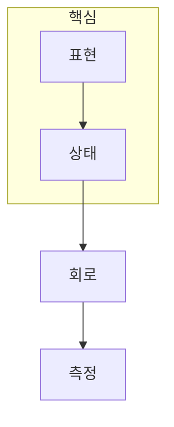

> [!abstract] 한 줄 요약
> 양자 ML은 개별 게이트 암기보다, 입력을 상태로 만들고 측정값을 학습 신호로 되돌리는 흐름을 이해하는 과정이다.

## 네 질문으로 경로 잡기



```html preview
<div style="font-family:system-ui,sans-serif;padding:20px;color:var(--foreground)">
  <label for="amt" style="font-size:14px;font-weight:600">학습 단계</label>
  <div id="out" style="font-size:30px;font-weight:700;color:var(--chart-1);margin:6px 0">1단계</div>
  <input id="amt" type="range" min="1" max="4" step="1" value="1"
    style="width:100%;accent-color:var(--primary)" />
  <p style="font-size:13px;color:var(--muted-foreground)">표현·상태·회로·측정 중 현재 점검할 단계를 고른다.</p>
  <script>
    var amt = document.getElementById('amt');
    var out = document.getElementById('out');
    amt.addEventListener('input', function () {
      out.textContent = Number(amt.value) + '단계';
    });
  </script>
</div>
```

<Tabs>
  <Tab label="표현">입력 특징과 모델의 표현 한계를 구분한다.</Tab>
  <Tab label="상태">큐비트·게이트가 상태에 하는 일을 추적한다.</Tab>
  <Tab label="회로">측정 가능한 값을 고전 손실과 연결한다.</Tab>
</Tabs>

<details>
<summary>자기 점검 순서</summary>

입력은 무엇인지, 회로가 무엇을 바꾸는지, 측정으로 무엇을 읽는지, 그 값이 어떻게 평가되는지를 차례로 적는다.

</details>

> [!caution] 범위
> 이 안내서는 순서를 제공하며, 특정 회로나 하드웨어의 성능 주장을 하지 않는다.

| 질문 | 확인할 대상 | 결과 |
| :-- | :-- | :-- |
| 무엇을 표현하는가 | 입력 특징 | 인코딩 |
| 무엇이 바뀌는가 | 상태와 회로 | 변환 |
| 무엇을 읽는가 | 측정값 | 학습 신호 |

> [!question]- 스스로 점검
> **Q.** QML 회로에서 고전 최적화기가 받는 값은 무엇인가?
>
> **A.** 측정으로 얻어 손실 함수에 연결한 수치적 관측값이다.

## 출처

- 공개 노트에는 원본 강의 자료, 자산 이미지, 페이지 단위 근거를 포함하지 않는다.
