> [!abstract] 이 과목은
> 논리 게이트부터 CPU·기억장치·파이프라이닝까지. 학기: 2-1.

## 학습 경로

번호는 강의 진도 순이다. 앞 문서를 읽었다는 전제로 다음 문서가 쓰인다.

```mermaid
flowchart LR
    N0["1. 기억 장치 시스템의 개요"]
    N1["1. 논리 게이트"]
    N2["1. 제어 장치의 기능"]
    N3["1. 진법과 진법 변환"]
    N4["1. 프로세스 구성과 동작"]
    N5["2. 불 대수"]
    N6["==`Booth 알고리즘`=="]
    N7["2. 정수 표현"]
    N8["2. 제어 장치의 종류"]
    N9["2. 주기억 장치"]
    N10["3. 레지스터"]
    N11["3. 명령어 사이클"]
    N0 --> N1
    N1 --> N2
    N2 --> N3
    N3 --> N4
    N4 --> N5
    N5 --> N6
    N6 --> N7
    N7 --> N8
    N8 --> N9
    N9 --> N10
    N10 --> N11
    N11 --> MORE["… 외 12편"]
```

## 정리문서

모두 `notes/` 에 있다. 총 27편.

| 문서 | 다루는 내용 |
| :-- | :-- |
| [1. 기억 장치 시스템의 개요](<./notes/1. 기억 장치 시스템의 개요.md>) | — |
| [1. 논리 게이트](<./notes/1. 논리 게이트.md>) | — |
| [1. 제어 장치의 기능](<./notes/1. 제어 장치의 기능.md>) | — |
| [1. 진법과 진법 변환](<./notes/1. 진법과 진법 변환.md>) | — |
| [1. 프로세스 구성과 동작](<./notes/1. 프로세스 구성과 동작.md>) | — |
| [2. 불 대수](<./notes/2. 불 대수.md>) | — |
| [==`Booth 알고리즘`==](<./notes/2. 산술 논리 연산 장치.md>) | — |
| [2. 정수 표현](<./notes/2. 정수 표현.md>) | — |
| [2. 제어 장치의 종류](<./notes/2. 제어 장치의 종류.md>) | — |
| [2. 주기억 장치](<./notes/2. 주기억 장치.md>) | — |
| [3. 레지스터](<./notes/3. 레지스터.md>) | — |
| [3. 명령어 사이클](<./notes/3. 명령어 사이클.md>) | — |
| [3. 실수 표현](<./notes/3. 실수 표현.md>) | — |
| [3. 카르노 맵](<./notes/3. 카르노 맵.md>) | — |
| [3. 캐시 기억 장치](<./notes/3. 캐시 기억 장치.md>) | — |
| [참고 내용](<./notes/4. 가상 기억 장치.md>) | — |
| [4. 디지털 코드](<./notes/4. 디지털 코드.md>) | — |
| [조합 논리 회로](<./notes/4. 조합 논리 회로.md>) | — |
| [4. 컴퓨터 명령어](<./notes/4. 컴퓨터 명령어.md>) | — |
| [4. 프로세서 제어](<./notes/4. 프로세서 제어.md>) | — |
| [5. 에러 검출 코드](<./notes/5. 에러 검출 코드.md>) | — |
| [5. 주소 지정 방식](<./notes/5. 주소 지정 방식.md>) | — |
| [5. 파이프 라이닝](<./notes/5. 파이프 라이닝.md>) | — |
| [6. CISC와 RISC](<./notes/6. CISC와 RISC.md>) | — |
| [Cache Friendly 코딩 실습](<./notes/과제_CacheFriendly코딩실습.md>) | — |
| [애플 M4 CPU](<./notes/애플 M4 CPU.md>) | — |
| [컴퓨터구조 중간 시험 범위](<./notes/중간 시험 범위.md>) | — |

## 원본 자료

교수가 배포한 자료다. `sources/` 에 있고 수정하지 않는다. 총 14건.

- `1705817.pdf`
- `1705817_AI학과_엄윤상.pdf`
- `4.조합 논리 회로.pdf`
- `5.순서 논리 회로.pdf`
- `6.집적 회로.pdf`
- `기억 장치 2.pdf`
- `기억 장치.pdf`
- `데이터의 표현.pdf`
- `서론 2.pdf`
- `서론.pdf`
- `제어 장치 2.pdf`
- `제어 장치.pdf`
- `중앙 처리 장치 2.pdf`
- `중앙 처리 장치.pdf`

## 관련 과목

> [!note] 아직 비어 있다
> 다른 과목과의 관계는 지식그래프 4단계에서 관계 타입(`prerequisite` · `elaborates` · `contrasts` · `applies` · `evidences`)과 함께 채운다. 근거 없이 미리 이어두지 않는다.
