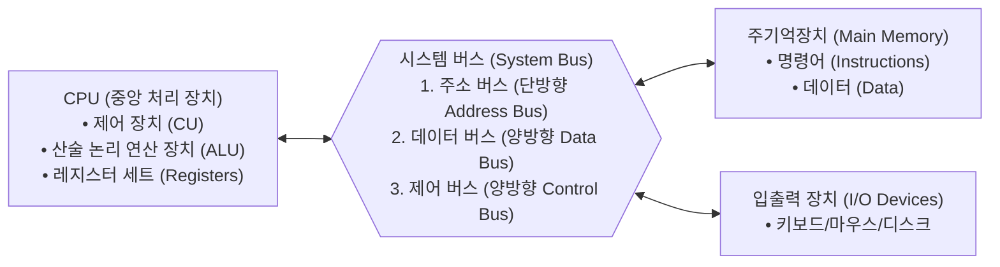

> [!abstract] 핵심 요약
> **컴퓨터 구조(Computer Architecture)**는 하드웨어와 소프트웨어의 인터페이스를 규정하는 시스템 설계의 핵심이다.
> 명령어와 데이터를 동일한 메모리에 적재하여 순차 실행하는 **폰 노이만 아키텍처(Von Neumann Architecture)**를 기본으로 하며, CPU 실행 시간 공식($\text{Time} = \text{IC} \times \text{CPI} \times T_c$)과 병렬 처리 가속의 한계를 나타내는 **암달의 법칙(Amdahl's Law)**은 하드웨어 가속기 및 멀티코어 설계의 기본 척도이다.

---

## 1. 폰 노이만 아키텍처와 3대 시스템 버스



---

## 2. CPU 성능 평가 공식과 암달의 법칙(Amdahl's Law)

### 1) CPU 실행 시간 공식 (Execution Time)
$$\text{CPU Time} = \text{Instruction Count (IC)} \times \text{CPI} \times \text{Clock Cycle Time } (T_c) = \frac{\text{IC} \times \text{CPI}}{\text{Clock Frequency } (f)}$$

### 2) MIPS (Million Instructions Per Second)
$$\text{MIPS} = \frac{\text{Instruction Count}}{\text{Execution Time} \times 10^6} = \frac{f}{\text{CPI} \times 10^6}$$

### 3) 암달의 법칙 (Amdahl's Law)
전체 작업 중 개선 가능한 비율이 $p$이고, 개선 부품의 속도 향상비가 $s$일 때 전체 가속도 $S$:
$$S_{\text{latency}} = \frac{1}{(1 - p) + \frac{p}{s}} \quad \left(\lim_{s \to \infty} S = \frac{1}{1 - p}\right)$$

---

## 3. 실시간 CPU 성능 및 암달의 법칙 가속비 시뮬레이터

```html preview
<div style="font-family:system-ui,-apple-system,sans-serif;padding:20px;background:var(--card);color:var(--card-foreground);border:1px solid var(--border);border-radius:var(--radius)">
  <div style="font-size:16px;font-weight:700;margin-bottom:14px;color:var(--primary);display:flex;align-items:center;gap:8px">
    <span>⚡ CPU 성능 지표(CPI/MIPS) & 암달의 법칙(Amdahl) 가속도 계산기</span>
  </div>

  <div style="display:grid;grid-template-columns:1fr 1fr;gap:12px;margin-bottom:14px">
    <div style="padding:10px;background:var(--background);border:1px solid var(--border);border-radius:var(--radius)">
      <div style="font-size:12px;font-weight:700;color:var(--chart-1);margin-bottom:6px">CPU 스펙:</div>
      <div style="display:flex;flex-direction:column;gap:6px">
        <div style="display:flex;justify-content:space-between;align-items:center">
          <span style="font-size:11px">클럭 주파수 (GHz):</span>
          <input id="inFreq" type="number" value="3.5" step="0.1" style="width:70px;padding:3px;background:var(--card);color:var(--foreground);border:1px solid var(--border);border-radius:var(--radius);text-align:center;font-weight:700" />
        </div>
        <div style="display:flex;justify-content:space-between;align-items:center">
          <span style="font-size:11px">평균 CPI (명령어당 사이클):</span>
          <input id="inCpi" type="number" value="1.4" step="0.1" style="width:70px;padding:3px;background:var(--card);color:var(--foreground);border:1px solid var(--border);border-radius:var(--radius);text-align:center;font-weight:700" />
        </div>
      </div>
    </div>

    <div style="padding:10px;background:var(--background);border:1px solid var(--border);border-radius:var(--radius)">
      <div style="font-size:12px;font-weight:700;color:var(--chart-2);margin-bottom:6px">암달의 법칙 파라미터:</div>
      <div style="display:flex;flex-direction:column;gap:6px">
        <div style="display:flex;justify-content:space-between;align-items:center">
          <span style="font-size:11px">병렬화 가능 비율 p (%):</span>
          <input id="inPFrac" type="number" value="80" min="0" max="100" style="width:70px;padding:3px;background:var(--card);color:var(--foreground);border:1px solid var(--border);border-radius:var(--radius);text-align:center;font-weight:700" />
        </div>
        <div style="display:flex;justify-content:space-between;align-items:center">
          <span style="font-size:11px">코어 수 / 가속배율 s:</span>
          <input id="inSpeedup" type="number" value="8" min="1" style="width:70px;padding:3px;background:var(--card);color:var(--foreground);border:1px solid var(--border);border-radius:var(--radius);text-align:center;font-weight:700" />
        </div>
      </div>
    </div>
  </div>

  <div style="display:grid;grid-template-columns:repeat(3, 1fr);gap:10px">
    <div style="padding:8px;background:var(--background);border:1px solid var(--border);border-radius:var(--radius);text-align:center">
      <div style="font-size:10px;color:var(--muted-foreground)">MIPS 성능</div>
      <div id="mipsResultOut" style="font-size:14px;font-weight:800;color:var(--chart-1)"></div>
    </div>
    <div style="padding:8px;background:var(--background);border:1px solid var(--border);border-radius:var(--radius);text-align:center">
      <div style="font-size:10px;color:var(--muted-foreground)">실제 가속도 (Speedup)</div>
      <div id="speedupResultOut" style="font-size:14px;font-weight:800;color:var(--chart-2)"></div>
    </div>
    <div style="padding:8px;background:var(--background);border:1px solid var(--border);border-radius:var(--radius);text-align:center">
      <div style="font-size:10px;color:var(--muted-foreground)">이론상 최대 한계 (s→∞)</div>
      <div id="maxSpeedupOut" style="font-size:14px;font-weight:800;color:var(--primary)"></div>
    </div>
  </div>

  <script>
    function updateArch() {
      var freq = (parseFloat(document.getElementById('inFreq').value) || 3.5) * 1e9;
      var cpi = parseFloat(document.getElementById('inCpi').value) || 1.4;
      var p = (parseFloat(document.getElementById('inPFrac').value) || 80) / 100;
      var s = parseFloat(document.getElementById('inSpeedup').value) || 8;

      var mips = (freq / (cpi * 1e6));
      var actualSpeedup = 1 / ((1 - p) + (p / s));
      var maxSpeedup = (p < 1) ? (1 / (1 - p)) : Infinity;

      document.getElementById('mipsResultOut').textContent = mips.toFixed(1) + " MIPS";
      document.getElementById('speedupResultOut').textContent = actualSpeedup.toFixed(2) + " 배";
      document.getElementById('maxSpeedupOut').textContent = (maxSpeedup === Infinity ? "무한대" : maxSpeedup.toFixed(2) + " 배");
    }

    ['inFreq', 'inCpi', 'inPFrac', 'inSpeedup'].forEach(function(id) {
      document.getElementById(id).addEventListener('input', updateArch);
    });
    updateArch();
  </script>
</div>
```
