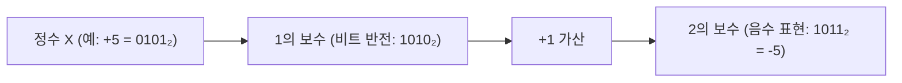
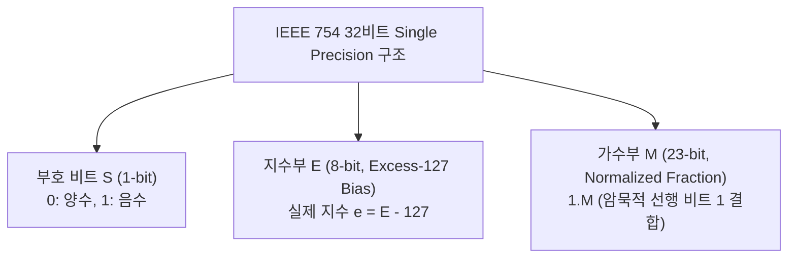

> [!abstract] 핵심 요약
> 컴퓨터는 모든 텍스트, 숫자, 명령어를 2진 비트(Bit) 패턴으로 저장한다.
> 음수 표현 시 $+0$과 $-0$의 중복을 없애고 덧셈기 하나로 뺄셈을 처리하는 **2의 보수(Two's Complement: $-X = \bar{X} + 1$)**와, 실수 표현의 표준인 **IEEE 754 부동소수점 규격($(-1)^S \times 1.M \times 2^{E - 127}$)**, 그리고 단일 비트 오류를 스스로 교정하는 **해밍 코드(Hamming Code)**는 디지털 하드웨어 데이터 처리의 근간이다.

---

## 1. 정수 표현과 2의 보수(Two's Complement) 연산

$$N = -b_{n-1} 2^{n-1} + \sum_{i=0}^{n-2} b_i 2^i, \quad A - B = A + (\bar{B} + 1)$$



---

## 2. IEEE 754 단정밀도(32-bit) 부동소수점 구조



$$\text{Value} = (-1)^S \times (1.M)_2 \times 2^{E - 127}$$

---

## 3. 해밍 코드(Hamming Code) 패리티 비트 조건

전송 데이터 비트 $m$개와 패리티 비트 $p$개 사이에는 다음 부등식이 성립해야 1비트 에러 검출 및 자동 정정이 가능하다:

$$2^p \ge m + p + 1$$

---

## 4. 실시간 IEEE 754 32비트 부동소수점 비트 분해기

```html preview
<div style="font-family:system-ui,-apple-system,sans-serif;padding:20px;background:var(--card);color:var(--card-foreground);border:1px solid var(--border);border-radius:var(--radius)">
  <div style="font-size:16px;font-weight:700;margin-bottom:14px;color:var(--primary);display:flex;align-items:center;gap:8px">
    <span>🔬 IEEE 754 단정밀도(32-bit) 부동소수점 실시간 비트 분해기</span>
  </div>

  <div style="display:flex;gap:12px;margin-bottom:14px;align-items:center">
    <label style="font-size:12px;font-weight:700">실수 입력 (Float):</label>
    <input id="floatInput" type="number" value="-13.625" step="0.125" style="padding:6px 10px;background:var(--background);color:var(--foreground);border:1px solid var(--border);border-radius:var(--radius);font-family:monospace;font-weight:700" />
    <span style="font-size:11px;color:var(--muted-foreground)">예: -13.625, 0.15625, 3.14159</span>
  </div>

  <div style="display:grid;grid-template-columns:repeat(3, 1fr);gap:8px;margin-bottom:12px">
    <div style="padding:8px;background:var(--background);border:1px solid var(--chart-1);border-radius:var(--radius);text-align:center">
      <div style="font-size:10px;color:var(--muted-foreground)">부호 (Sign: 1-bit)</div>
      <div id="signBitOut" style="font-family:monospace;font-size:14px;font-weight:800;color:var(--chart-1)"></div>
    </div>
    <div style="padding:8px;background:var(--background);border:1px solid var(--chart-2);border-radius:var(--radius);text-align:center">
      <div style="font-size:10px;color:var(--muted-foreground)">지수 (Exponent: 8-bit)</div>
      <div id="expBitOut" style="font-family:monospace;font-size:14px;font-weight:800;color:var(--chart-2)"></div>
    </div>
    <div style="padding:8px;background:var(--background);border:1px solid var(--chart-3);border-radius:var(--radius);text-align:center">
      <div style="font-size:10px;color:var(--muted-foreground)">가수 (Mantissa: 23-bit)</div>
      <div id="mantBitOut" style="font-family:monospace;font-size:12px;font-weight:800;color:var(--chart-3);word-break:break-all"></div>
    </div>
  </div>

  <div style="padding:10px;background:var(--background);border:1px solid var(--primary);border-radius:var(--radius);font-family:monospace;font-size:12px">
    <div style="color:var(--muted-foreground);font-size:10px">전체 32비트 16진수(Hex) 및 수식 해석:</div>
    <div id="fullHexOut" style="font-weight:700;color:var(--primary);margin-top:2px"></div>
  </div>

  <script>
    function parseIEEE754() {
      var val = parseFloat(document.getElementById('floatInput').value) || 0;
      var buf = new ArrayBuffer(4);
      var f32 = new Float32Array(buf);
      var u32 = new Uint32Array(buf);

      f32[0] = val;
      var bits = u32[0];
      var bitStr = bits.toString(2).padStart(32, '0');

      var sign = bitStr.substring(0, 1);
      var exp = bitStr.substring(1, 9);
      var mant = bitStr.substring(9, 32);

      var expVal = parseInt(exp, 2);
      var actualExp = expVal - 127;

      document.getElementById('signBitOut').textContent = sign + " (" + (sign === '0' ? '+양수' : '-음수') + ")";
      document.getElementById('expBitOut').textContent = exp + " (" + expVal + " - 127 = 2^" + actualExp + ")";
      document.getElementById('mantBitOut').textContent = mant;

      var hex = "0x" + bits.toString(16).toUpperCase().padStart(8, '0');
      document.getElementById('fullHexOut').textContent = hex + " ➔ (-1)^" + sign + " × 1." + mant.substring(0, 6) + "... × 2^(" + actualExp + ")";
    }

    document.getElementById('floatInput').addEventListener('input', parseIEEE754);
    parseIEEE754();
  </script>
</div>
```
