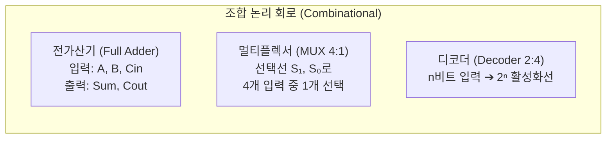
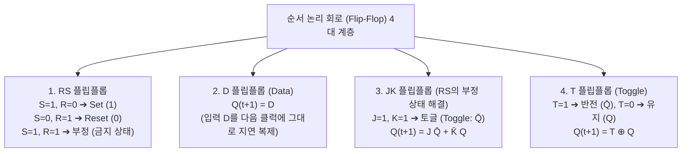

> [!abstract] 핵심 요약
> **디지털 논리 회로(Digital Logic Circuits)**는 컴퓨터의 연산 장치(ALU)와 메모리를 구축하는 물리적 기본 블록이다.
> 현재의 입력만으로 출력이 결정되는 **조합 논리 회로(가산기, MUX, 디코더)**와, 내부 상태를 기억하여 과거의 이력과 클럭(Clock)에 따라 동작하는 **순서 논리 회로(RS, D, JK, T 플립플롭)**로 구분된다.

---

## 1. 전가산기(Full Adder)와 4:1 멀티플렉서(MUX)

### 1) 전가산기 불 대수식 (Sum & Carry Out)
$$\text{Sum} = A \oplus B \oplus C_{\text{in}}$$
$$C_{\text{out}} = AB + C_{\text{in}}(A \oplus B) = AB + BC_{\text{in}} + AC_{\text{in}}$$



---

## 2. 순서 논리 회로와 4대 플립플롭(Flip-Flop) 특성표



---

## 3. 실시간 1비트 전가산기(Full Adder) & D/JK 플립플롭 시뮬레이터

```html preview
<div style="font-family:system-ui,-apple-system,sans-serif;padding:20px;background:var(--card);color:var(--card-foreground);border:1px solid var(--border);border-radius:var(--radius)">
  <div style="font-size:16px;font-weight:700;margin-bottom:14px;color:var(--primary);display:flex;align-items:center;gap:8px">
    <span>💡 1-bit 전가산기(Full Adder) & JK 플립플롭 논리 시뮬레이터</span>
  </div>

  <div style="display:grid;grid-template-columns:1fr 1fr;gap:12px;margin-bottom:14px">
    <div style="padding:10px;background:var(--background);border:1px solid var(--border);border-radius:var(--radius)">
      <div style="font-size:12px;font-weight:700;color:var(--chart-1);margin-bottom:6px">전가산기 입력 (0 또는 1 클릭):</div>
      <div style="display:flex;gap:8px;align-items:center">
        <button id="btnA" style="padding:6px 12px;border:1px solid var(--border);border-radius:var(--radius);font-weight:700;cursor:pointer">A: 0</button>
        <button id="btnB" style="padding:6px 12px;border:1px solid var(--border);border-radius:var(--radius);font-weight:700;cursor:pointer">B: 0</button>
        <button id="btnCin" style="padding:6px 12px;border:1px solid var(--border);border-radius:var(--radius);font-weight:700;cursor:pointer">Cin: 0</button>
      </div>
      <div style="margin-top:10px;font-family:monospace;font-size:13px;font-weight:700">
        ➔ Sum = <span id="faSum" style="color:var(--chart-1)">0</span>, Cout = <span id="faCout" style="color:var(--chart-2)">0</span>
      </div>
    </div>

    <div style="padding:10px;background:var(--background);border:1px solid var(--border);border-radius:var(--radius)">
      <div style="font-size:12px;font-weight:700;color:var(--chart-2);margin-bottom:6px">JK 플립플롭 클럭 트리거:</div>
      <div style="display:flex;gap:6px;align-items:center">
        <button id="btnJ" style="padding:4px 10px;border:1px solid var(--border);border-radius:var(--radius);font-size:11px;font-weight:700;cursor:pointer">J: 1</button>
        <button id="btnK" style="padding:4px 10px;border:1px solid var(--border);border-radius:var(--radius);font-size:11px;font-weight:700;cursor:pointer">K: 1</button>
        <button id="btnClk" style="padding:4px 12px;background:var(--primary);color:#fff;border:none;border-radius:var(--radius);font-size:11px;font-weight:700;cursor:pointer">클럭 상승 엣지 (CLK ⭡)</button>
      </div>
      <div style="margin-top:10px;font-family:monospace;font-size:13px;font-weight:700">
        ➔ 현재 상태 Q = <span id="jkQ" style="color:var(--primary)">0</span> (J=1, K=1 이면 토글)
      </div>
    </div>
  </div>

  <script>
    var inA = 0, inB = 0, inCin = 0;
    var inJ = 1, inK = 1, stateQ = 0;

    function updateFA() {
      var sum = inA ^ inB ^ inCin;
      var cout = (inA & inB) | (inCin & (inA ^ inB));

      document.getElementById('btnA').textContent = "A: " + inA;
      document.getElementById('btnB').textContent = "B: " + inB;
      document.getElementById('btnCin').textContent = "Cin: " + inCin;

      document.getElementById('faSum').textContent = sum;
      document.getElementById('faCout').textContent = cout;
    }

    document.getElementById('btnA').onclick = function() { inA ^= 1; updateFA(); };
    document.getElementById('btnB').onclick = function() { inB ^= 1; updateFA(); };
    document.getElementById('btnCin').onclick = function() { inCin ^= 1; updateFA(); };

    function updateJK() {
      document.getElementById('btnJ').textContent = "J: " + inJ;
      document.getElementById('btnK').textContent = "K: " + inK;
      document.getElementById('jkQ').textContent = stateQ;
    }

    document.getElementById('btnJ').onclick = function() { inJ ^= 1; updateJK(); };
    document.getElementById('btnK').onclick = function() { inK ^= 1; updateJK(); };

    document.getElementById('btnClk').onclick = function() {
      if (inJ === 0 && inK === 0) {
        // 유지
      } else if (inJ === 0 && inK === 1) {
        stateQ = 0; // 리셋
      } else if (inJ === 1 && inK === 0) {
        stateQ = 1; // 셋
      } else if (inJ === 1 && inK === 1) {
        stateQ ^= 1; // 토글
      }
      updateJK();
    };

    updateFA();
    updateJK();
  </script>
</div>
```
