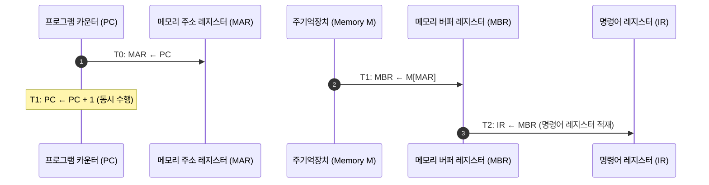
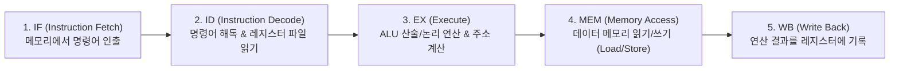

> [!abstract] 핵심 요약
> **중앙 처리 장치(CPU)**는 컴퓨터의 두뇌로서 프로그램 명령어를 인출(Fetch), 해독(Decode), 실행(Execute)하는 하드웨어이다.
> 고정 길이 명령어로 단일 사이클 실행을 지향하는 **RISC(Reduced Instruction Set Computer)**와 복합 명령어를 지원하는 **CISC**, 그리고 명령어 처리율(Throughput)을 극대화하는 **5단계 파이프라인(IF-ID-EX-MEM-WB)** 및 데이터 해저드(Data Hazard) 해결을 위한 포워딩(Forwarding) 기법은 현대 마이크로프로세서 설계의 핵심이다.

---

## 1. 명령어 인출 사이클(Fetch Cycle) RTL 마이크로연산



---

## 2. 5단계 명령어 파이프라인(5-Stage Pipeline)과 3대 해저드



| 파이프라인 해저드 유형 | 발생 원인 | 대표적 해결 기법 |
| :-- | :-- | :-- |
| **1. 구조적 해저드 (Structural Hazard)** | 동일 클럭에 여러 명령어가 단일 하드웨어 자원(메모리/ALU) 경합 | 하버드 구조(명령어/데이터 캐시 분리) |
| **2. 데이터 해저드 (Data Hazard - RAW)** | 이전 명령어의 연산 결과(WB)가 나오기 전에 다음 명령어가 참조(ID) | **데이터 포워딩 (Forwarding / Bypassing)**, 파이프라인 스톨 |
| **3. 제어 해저드 (Control Hazard)** | 분기(Branch/Jump) 명령어의 분기 여부가 EX 단계 이후에 확정 | **분기 예측 (Branch Prediction)**, 지연 분기(Delayed Branch) |

---

## 3. 실시간 5단계 파이프라인 타이밍 다이어그램 시뮬레이터

```html preview
<div style="font-family:system-ui,-apple-system,sans-serif;padding:20px;background:var(--card);color:var(--card-foreground);border:1px solid var(--border);border-radius:var(--radius)">
  <div style="font-size:16px;font-weight:700;margin-bottom:14px;color:var(--primary);display:flex;align-items:center;gap:8px">
    <span>📊 5단계 명령어 파이프라인 클럭 타이밍 & 스톨(Stall) 시뮬레이터</span>
  </div>

  <div style="margin-bottom:12px;display:flex;gap:10px;align-items:center">
    <button id="stepPipeBtn" style="padding:6px 14px;background:var(--primary);color:#fff;border:none;border-radius:var(--radius);font-size:12px;font-weight:700;cursor:pointer">다음 클럭 사이클 진행 (Next Cycle)</button>
    <button id="resetPipeBtn" style="padding:6px 12px;background:var(--muted);color:var(--foreground);border:1px solid var(--border);border-radius:var(--radius);font-size:12px;cursor:pointer">초기화</button>
    <span id="cycleCounter" style="font-size:13px;font-weight:800;color:var(--chart-1)">Cycle: 0</span>
  </div>

  <div style="overflow-x:auto;padding:10px;background:var(--background);border:1px solid var(--border);border-radius:var(--radius)">
    <table style="width:100%;font-size:11px;font-family:monospace;text-align:center;border-collapse:collapse">
      <thead style="border-bottom:1px solid var(--border);color:var(--muted-foreground)">
        <tr><th>명령어 (Instruction)</th><th>C1</th><th>C2</th><th>C3</th><th>C4</th><th>C5</th><th>C6</th><th>C7</th></tr>
      </thead>
      <tbody id="pipeTableBody">
        <tr><td>I1: ADD R1, R2, R3</td><td>IF</td><td>ID</td><td>EX</td><td>MEM</td><td>WB</td><td>-</td><td>-</td></tr>
        <tr><td>I2: SUB R4, R1, R5</td><td>-</td><td>IF</td><td>ID</td><td>EX</td><td>MEM</td><td>WB</td><td>-</td></tr>
        <tr><td>I3: AND R6, R7, R8</td><td>-</td><td>-</td><td>IF</td><td>ID</td><td>EX</td><td>MEM</td><td>WB</td></tr>
      </tbody>
    </table>
  </div>

  <div style="font-size:11px;color:var(--muted-foreground);margin-top:10px">
    💡 데이터 포워딩(Forwarding)이 적용되어 I1의 EX 출력(R1)이 I2의 EX 입력으로 직접 전달되므로 스톨(Stall) 없이 매 사이클마다 1개 명령어(CPI ≈ 1.0)가 완료됩니다.
  </div>

  <script>
    var currentCycle = 1;
    document.getElementById('stepPipeBtn').onclick = function() {
      if (currentCycle < 7) currentCycle++;
      document.getElementById('cycleCounter').textContent = "Cycle: " + currentCycle;
    };
    document.getElementById('resetPipeBtn').onclick = function() {
      currentCycle = 1;
      document.getElementById('cycleCounter').textContent = "Cycle: 1";
    };
  </script>
</div>
```
