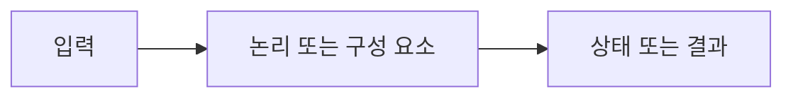

> [!abstract]
> 순서 논리 회로는 현재 입력뿐 아니라 이전 상태를 함께 사용해 출력을 결정한다.

## 핵심 구조

<Tabs><Tab title="입력">신호와 데이터가 회로에 들어온다.</Tab><Tab title="처리">구성 요소가 규칙에 따라 처리한다.</Tab><Tab title="출력">처리 결과가 다음 단계로 전달된다.</Tab></Tabs>



> [!important]
> 구성 요소의 역할과 데이터 흐름을 분리해 보면 전체 동작을 추적할 수 있다.

```html preview h=120px
<div style="font-family:system-ui,sans-serif;padding:14px;border:1px solid var(--border);border-radius:12px;background:var(--card);color:var(--foreground)"><strong>05. 순서 논리 회로</strong><div style="margin-top:10px">입력 → 처리 → 결과</div></div>
```

<details><summary>왜 흐름을 나누어 볼까?</summary>

각 단계의 입력과 출력을 구분하면 오류와 병목의 위치를 설명하기 쉽다.
</details>

## 검증 관점

==같은 비트나 신호라도 회로의 상태와 해석 규칙에 따라 의미가 달라질 수 있다.==

```html preview h=110px
<div style="font-family:system-ui,sans-serif;padding:14px;border:1px solid var(--border);border-radius:12px;background:var(--card);color:var(--foreground)">관찰 <b>→</b> 처리 <b>→</b> 확인</div>
```

<details><summary>작은 예시로 확인하기</summary>

입력 하나를 바꾸고 어떤 출력 또는 상태 변화가 생기는지 순서대로 기록한다.
</details>

> [!warning]
> 입력·상태·출력 중 하나를 생략하면 회로 동작을 잘못 해석할 수 있다.

다음 확인을 학습 순서에 넣는다.

> [!tip]
> 표나 도식으로 신호의 변화를 직접 추적한다.

### 스스로 점검

- 입력과 출력은 무엇인가?
- 상태가 있다면 어디에 보관되는가?
- 결과를 어떤 예시로 검증할 수 있는가?

---

## 원본 강의 흐름 인터랙티브

```html preview
<div style="font-family:system-ui,sans-serif;padding:20px;color:var(--foreground)">
  <label for="noteFlow926803" style="font-size:14px;font-weight:600">순서 논리 회로 단계</label>
  <div id="noteFlow926803-out" style="font-size:26px;font-weight:700;color:var(--chart-1);margin:6px 0">순서 논리 회로 핵심 개념</div>
  <input id="noteFlow926803" type="range" min="1" max="3" step="1" value="1" style="width:100%;accent-color:var(--primary)" />
  <p style="font-size:13px;color:var(--muted-foreground)">슬라이더를 움직이면 원본 PDF에서 정리한 이 노트의 흐름을 확인합니다.</p>
  <script>
    var noteFlow926803 = document.getElementById('noteFlow926803');
    var noteFlow926803Out = document.getElementById('noteFlow926803-out');
    var noteFlow926803Steps = ["순서 논리 회로 핵심 개념","순서 논리 회로 처리 절차","순서 논리 회로 검증·응용"];
    noteFlow926803.addEventListener('input', function () { noteFlow926803Out.textContent = noteFlow926803Steps[Number(noteFlow926803.value) - 1]; });
  </script>
</div>
```
