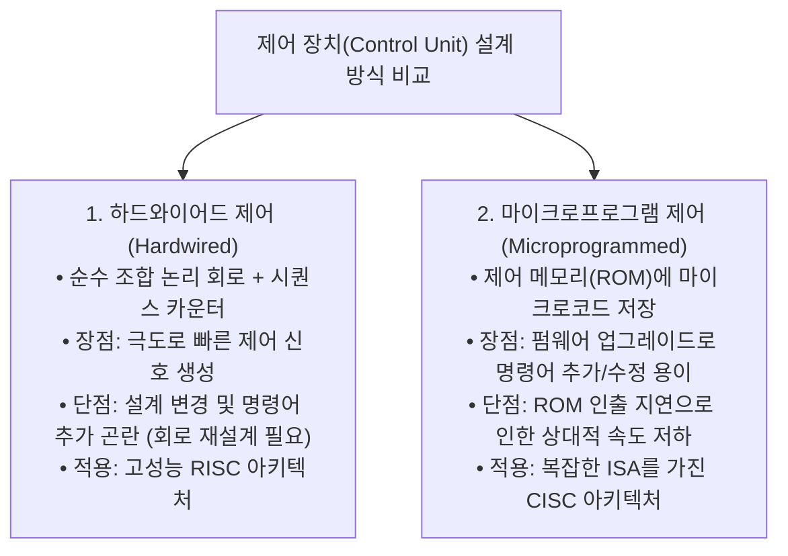
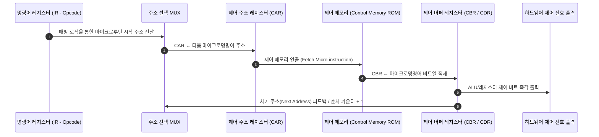

> [!abstract] 핵심 요약
> **제어 장치(Control Unit, CU)**는 CPU 내부의 모든 레지스터 전송 및 ALU 연산 타이밍 신호(Micro-operations)를 총괄 지휘하는 지휘관이다.
> 조합 논리 게이트로 초고속 신호를 생성하는 **하드와이어드(Hardwired)** 제어(RISC 탑재)와, 제어 메모리(ROM)에 마이크로루틴을 저장하여 펌웨어 수정이 용이한 **마이크로프로그램(Microprogrammed)** 제어(CISC 탑재)의 설계 패러다임을 이해하는 것이 필수적이다.

---

## 1. 하드와이어드(Hardwired) vs 마이크로프로그램(Microprogrammed) 비교



---

## 2. 마이크로프로그램 제어 장치의 하드웨어 블록도



---

## 3. 수평적(Horizontal) vs 수직적(Vertical) 마이크로명령어

| 구분 | 수평적 마이크로명령어 (Horizontal) | 수직적 마이크로명령어 (Vertical) |
| :-- | :-- | :-- |
| **비트 구성** | 1개 제어 신호당 1비트 직접 할당 ($N$비트) | $K$개 상호 배타적 신호를 $\lceil \log_2 K \rceil$ 비트로 인코딩 |
| **디코더 필요 여부** | **디코더 불필요** (신호 직접 출력) | **외부 디코더 필수** (인코딩 비트 해독) |
| **제어 속도** | **초고속** (지연 없음) | 디코딩 지연 발생 |
| **제어 메모리 폭** | 명령어 길이가 매우 길어짐 | 명령어 비트 폭이 좁아 메모리 절약 |

---

## 4. 실시간 마이크로프로그램 제어기 CAR/CBR 실행 시뮬레이터

```html preview
<div style="font-family:system-ui,-apple-system,sans-serif;padding:20px;background:var(--card);color:var(--card-foreground);border:1px solid var(--border);border-radius:var(--radius)">
  <div style="font-size:16px;font-weight:700;margin-bottom:14px;color:var(--primary);display:flex;align-items:center;gap:8px">
    <span>⚙️ 마이크로프로그램 제어기(CAR ➔ ROM ➔ CBR) 실시간 시뮬레이터</span>
  </div>

  <div style="display:grid;grid-template-columns:1fr 1fr;gap:12px;margin-bottom:14px">
    <div style="padding:10px;background:var(--background);border:1px solid var(--border);border-radius:var(--radius)">
      <div style="font-size:12px;font-weight:700;color:var(--chart-1);margin-bottom:6px">제어 메모리(ROM) 루틴 테이블:</div>
      <div style="font-family:monospace;font-size:11px;line-height:1.6">
        <div id="romLine0" style="padding:2px">Addr 0x00: MAR ← PC, PC ← PC+1 (Fetch-1)</div>
        <div id="romLine1" style="padding:2px">Addr 0x01: MBR ← M[MAR], IR ← MBR (Fetch-2)</div>
        <div id="romLine2" style="padding:2px">Addr 0x02: Decode IR & Branch to Opcode</div>
        <div id="romLine3" style="padding:2px">Addr 0x10: AC ← AC + MBR (ADD 실행)</div>
      </div>
    </div>

    <div style="padding:10px;background:var(--background);border:1px solid var(--border);border-radius:var(--radius)">
      <div style="font-size:12px;font-weight:700;color:var(--chart-2);margin-bottom:6px">제어 레지스터 현재 상태:</div>
      <div style="font-family:monospace;font-size:13px;line-height:1.8">
        • CAR (제어 주소): <span id="carOut" style="font-weight:800;color:var(--primary)">0x00</span><br/>
        • CBR (활성 제어신호): <span id="cbrOut" style="font-weight:800;color:var(--chart-3)">MAR_IN, PC_INC</span>
      </div>
    </div>
  </div>

  <div style="display:flex;gap:8px">
    <button id="stepCarBtn" style="padding:6px 14px;background:var(--primary);color:#fff;border:none;border-radius:var(--radius);font-size:12px;font-weight:700;cursor:pointer">다음 마이크로 스텝 (Step CAR)</button>
    <button id="resetCarBtn" style="padding:6px 12px;background:var(--muted);color:var(--foreground);border:1px solid var(--border);border-radius:var(--radius);font-size:12px;cursor:pointer">초기화</button>
  </div>

  <script>
    var rom = [
      { addr: "0x00", desc: "Addr 0x00: MAR ← PC, PC ← PC+1", cbr: "MAR_IN, PC_INC, READ_MEM", elemId: "romLine0" },
      { addr: "0x01", desc: "Addr 0x01: MBR ← M[MAR], IR ← MBR", cbr: "MBR_LOAD, IR_IN", elemId: "romLine1" },
      { addr: "0x02", desc: "Addr 0x02: Decode IR & Branch to 0x10", cbr: "MAP_OPCODE, JUMP_0x10", elemId: "romLine2" },
      { addr: "0x10", desc: "Addr 0x10: AC ← AC + MBR", cbr: "ALU_ADD, AC_LOAD, END_INSTR", elemId: "romLine3" }
    ];

    var idx = 0;

    function updateRomView() {
      for (var i = 0; i < rom.length; i++) {
        var el = document.getElementById(rom[i].elemId);
        if (i === idx) {
          el.style.background = "var(--primary)";
          el.style.color = "#fff";
          el.style.fontWeight = "700";
          el.style.borderRadius = "3px";
        } else {
          el.style.background = "transparent";
          el.style.color = "inherit";
          el.style.fontWeight = "normal";
        }
      }

      document.getElementById('carOut').textContent = rom[idx].addr;
      document.getElementById('cbrOut').textContent = rom[idx].cbr;
    }

    document.getElementById('stepCarBtn').onclick = function() {
      idx = (idx + 1) % rom.length;
      updateRomView();
    };

    document.getElementById('resetCarBtn').onclick = function() {
      idx = 0;
      updateRomView();
    };

    updateRomView();
  </script>
</div>
```
