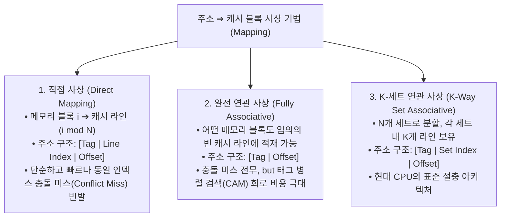

> [!abstract] 핵심 요약
> **메모리 계층 구조(Memory Hierarchy)**는 초고속이지만 소용량인 SRAM(캐시)부터 대용량 DRAM(주기억장치)까지 비용과 속도의 균형을 맞추는 핵심 하드웨어 아키텍처이다.
> 최근 참조된 데이터가 다시 쓰인다는 **시간 지역성(Temporal Locality)**과 인접 데이터가 곧 쓰인다는 **공간 지역성(Spatial Locality)**을 활용하며, 캐시 적중률에 따른 **평균 메모리 접근 시간($\text{AMAT} = t_h + m \times M_p$)**을 최소화하는 것이 시스템 성능 최적화의 핵심이다.

---

## 1. 3대 캐시 사상 방식(Cache Mapping) 비교



---

## 2. 캐시 미스 3C 분류와 AMAT 공식

### 1) 캐시 미스의 3가지 원인 (3C Misses)
1. **필연적 미스 (Compulsory / Cold Miss)**: 최초 접근 시 블록이 캐시에 없어 발생하는 불가피한 미스
2. **용량 미스 (Capacity Miss)**: 캐시 총 용량이 프로그램 작업 집합(Working Set)보다 작아 밀려나는 미스
3. **충돌 미스 (Conflict Miss)**: 연관도(Associativity) 한계로 동일 세트에 블록이 경합하여 발생하는 미스

### 2) 평균 메모리 접근 시간 (AMAT)
$$\text{AMAT} = \text{Hit Time } (t_h) + \text{Miss Rate } (m) \times \text{Miss Penalty } (M_p)$$

---

## 3. 실시간 캐시 적중률 & AMAT 성능 시뮬레이터

```html preview
<div style="font-family:system-ui,-apple-system,sans-serif;padding:20px;background:var(--card);color:var(--card-foreground);border:1px solid var(--border);border-radius:var(--radius)">
  <div style="font-size:16px;font-weight:700;margin-bottom:14px;color:var(--primary);display:flex;align-items:center;gap:8px">
    <span>💾 캐시 메모리 평균 접근 시간(AMAT) 실시간 계산기</span>
  </div>

  <div style="display:grid;grid-template-columns:repeat(3, 1fr);gap:10px;margin-bottom:14px">
    <div>
      <label style="font-size:11px;color:var(--muted-foreground)">L1 캐시 적중 시간 (ns):</label>
      <input id="inHitTime" type="number" value="1.0" step="0.5" min="0.1" style="width:100%;padding:4px 8px;background:var(--background);color:var(--foreground);border:1px solid var(--border);border-radius:var(--radius);font-weight:700" />
    </div>
    <div>
      <label style="font-size:11px;color:var(--muted-foreground)">캐시 미스율 (Miss Rate) %:</label>
      <input id="inMissRate" type="number" value="5.0" step="0.5" min="0" max="50" style="width:100%;padding:4px 8px;background:var(--background);color:var(--foreground);border:1px solid var(--border);border-radius:var(--radius);font-weight:700" />
    </div>
    <div>
      <label style="font-size:11px;color:var(--muted-foreground)">DRAM 미스 페널티 (ns):</label>
      <input id="inPenalty" type="number" value="80" step="5" min="10" style="width:100%;padding:4px 8px;background:var(--background);color:var(--foreground);border:1px solid var(--border);border-radius:var(--radius);font-weight:700" />
    </div>
  </div>

  <div style="display:grid;grid-template-columns:1fr 1fr;gap:12px">
    <div style="padding:10px;background:var(--background);border:1px solid var(--border);border-radius:var(--radius);text-align:center">
      <div style="font-size:11px;color:var(--muted-foreground)">AMAT (평균 메모리 접근 시간)</div>
      <div id="amatResultOut" style="font-size:18px;font-weight:800;color:var(--primary);margin-top:2px"></div>
    </div>
    <div style="padding:10px;background:var(--background);border:1px solid var(--border);border-radius:var(--radius);text-align:center">
      <div style="font-size:11px;color:var(--muted-foreground)">DRAM 대비 유효 속도 가속비</div>
      <div id="speedupMemOut" style="font-size:18px;font-weight:800;color:var(--chart-2);margin-top:2px"></div>
    </div>
  </div>

  <script>
    function calcAMAT() {
      var th = parseFloat(document.getElementById('inHitTime').value) || 1.0;
      var mr = (parseFloat(document.getElementById('inMissRate').value) || 5.0) / 100;
      var mp = parseFloat(document.getElementById('inPenalty').value) || 80;

      var amat = th + (mr * mp);
      var dramTime = th + mp;
      var speedup = dramTime / amat;

      document.getElementById('amatResultOut').textContent = amat.toFixed(2) + " ns";
      document.getElementById('speedupMemOut').textContent = speedup.toFixed(1) + " 배 빠름";
    }

    ['inHitTime', 'inMissRate', 'inPenalty'].forEach(function(id) {
      document.getElementById(id).addEventListener('input', calcAMAT);
    });
    calcAMAT();
  </script>
</div>
```
