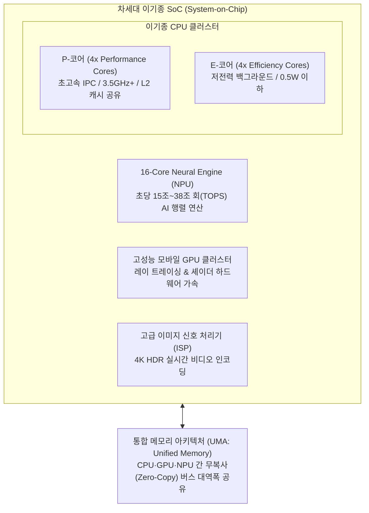
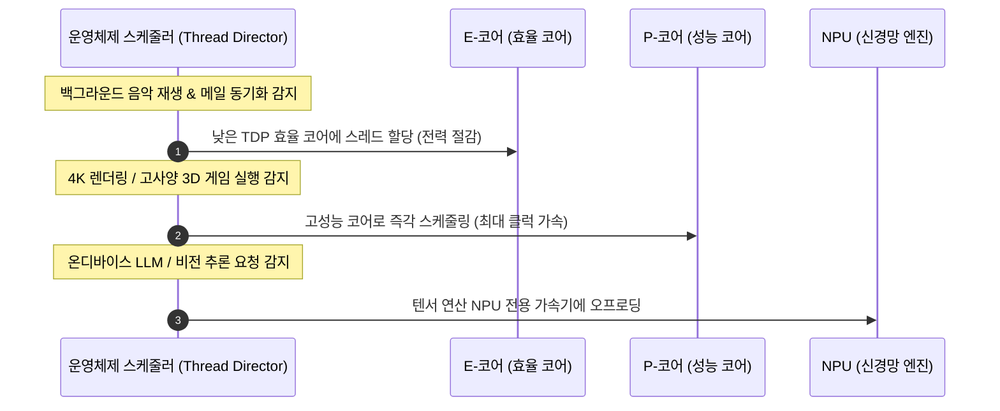

> [!abstract] 핵심 요약
> 현대 프로세서 아키텍처는 단순 단일 코어 클럭 경쟁에서 벗어나 **이기종 SoC(System on Chip)** 설계로 진화했다.
> 고성능 코어(Performance Core)와 고효율 코어(Efficiency Core)를 결합한 **ARMv9 big.LITTLE**, 초미세 반도체 공정(TSMC 3nm), 인공지능 텐서 연산을 전담하는 **16코어 Neural Engine(NPU)**, 그리고 CPU·GPU·NPU가 데이터 복사 없이 캐시를 공유하는 **통합 메모리 아키텍처(UMA)**는 최신 컴퓨팅의 핵심 표준이다.

---

## 1. 이기종 SoC 아키텍처 블록도 (Apple Silicon M-Series / ARMv9)



---

## 2. P-코어 vs E-코어 워크로드 동적 스케줄링



---

## 3. 실시간 이기종 CPU/NPU 워크로드 전력-성능 시뮬레이터

```html preview
<div style="font-family:system-ui,-apple-system,sans-serif;padding:20px;background:var(--card);color:var(--card-foreground);border:1px solid var(--border);border-radius:var(--radius)">
  <div style="font-size:16px;font-weight:700;margin-bottom:14px;color:var(--primary);display:flex;align-items:center;gap:8px">
    <span>⚡ 이기종 SoC 워크로드별 코어 스케줄링 & 전력 소모(TDP) 시뮬레이터</span>
  </div>

  <div style="margin-bottom:14px">
    <label style="font-size:12px;font-weight:700">작업 워크로드 유형 선택:</label>
    <select id="workloadSelect" style="width:100%;padding:6px 10px;background:var(--background);color:var(--foreground);border:1px solid var(--border);border-radius:var(--radius);font-weight:700;margin-top:4px">
      <option value="idle">1. 대기 모드 / 문서 작성 (Idle / Typing)</option>
      <option value="media">2. 백그라운드 음악 & 웹 서핑 (Media Streaming)</option>
      <option value="gaming">3. 3D 그래픽 렌더링 / 게이밍 (3D Gaming)</option>
      <option value="ai">4. 온디바이스 생성형 AI 추론 (Neural Engine AI)</option>
    </select>
  </div>

  <div style="display:grid;grid-template-columns:repeat(3, 1fr);gap:10px;margin-bottom:12px">
    <div style="padding:10px;background:var(--background);border:1px solid var(--border);border-radius:var(--radius);text-align:center">
      <div style="font-size:10px;color:var(--muted-foreground)">활성 코어 구성</div>
      <div id="activeCoresOut" style="font-size:13px;font-weight:800;color:var(--primary);margin-top:2px">4x E-코어</div>
    </div>
    <div style="padding:10px;background:var(--background);border:1px solid var(--border);border-radius:var(--radius);text-align:center">
      <div style="font-size:10px;color:var(--muted-foreground)">실시간 소비 전력 (TDP)</div>
      <div id="powerOut" style="font-size:14px;font-weight:800;color:var(--chart-1);margin-top:2px">0.8 W</div>
    </div>
    <div style="padding:10px;background:var(--background);border:1px solid var(--border);border-radius:var(--radius);text-align:center">
      <div style="font-size:10px;color:var(--muted-foreground)">연산 처리율 (TOPS/IPC)</div>
      <div id="perfOut" style="font-size:13px;font-weight:800;color:var(--chart-2);margin-top:2px">최대 효율 모드</div>
    </div>
  </div>

  <div id="workloadDescOut" style="padding:10px;background:var(--background);border:1px solid var(--primary);border-radius:var(--radius);font-size:11px;color:var(--card-foreground)">
    💡 가벼운 작업 시 P-코어를 완전히 파워 게이팅(Power Gating)하여 배터리 수명을 극대화합니다.
  </div>

  <script>
    var data = {
      idle: { cores: "1x E-코어", power: "0.3 W", perf: "기본 클럭 (1.2 GHz)", desc: "💡 대기 상태에서는 단일 E-코어만 최소 전력으로 동작합니다." },
      media: { cores: "4x E-코어", power: "1.2 W", perf: "효율 모드 (2.0 GHz)", desc: "💡 멀티미디어 디코딩과 웹 렌더링을 E-코어 클러스터가 처리합니다." },
      gaming: { cores: "4x P-코어 + GPU", power: "18.5 W", perf: "최대 성능 (3.5 GHz)", desc: "💡 4개의 고성능 P-코어와 전용 GPU 클러스터가 풀가동됩니다." },
      ai: { cores: "16x NPU Engine", power: "6.0 W", perf: "38.0 TOPS (AI 가속)", desc: "💡 CPU 부하 없이 NPU 텐서 가속기가 전담하여 초고속 저전력 신경망 추론을 수행합니다." }
    };

    document.getElementById('workloadSelect').addEventListener('change', function() {
      var sel = this.value;
      var info = data[sel];
      document.getElementById('activeCoresOut').textContent = info.cores;
      document.getElementById('powerOut').textContent = info.power;
      document.getElementById('perfOut').textContent = info.perf;
      document.getElementById('workloadDescOut').innerHTML = info.desc;
    });
  </script>
</div>
```
