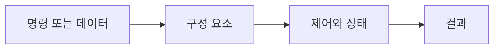

> [!abstract]
> 중앙 처리 장치는 명령을 가져와 해석하고 실행하며 결과를 저장하는 핵심 처리 장치다.

## 핵심 구조

<Tabs><Tab title="입력">명령·데이터·신호를 받는다.</Tab><Tab title="처리">구성 요소가 규칙에 따라 동작한다.</Tab><Tab title="출력">결과나 제어 신호를 다음 단계로 보낸다.</Tab></Tabs>



> [!important]
> 구성 요소의 역할은 다른 구성 요소와 주고받는 데이터와 신호 속에서 읽어야 한다.

```html preview h=120px
<div style="font-family:system-ui,sans-serif;padding:14px;border:1px solid var(--border);border-radius:12px;background:var(--card);color:var(--foreground)"><strong>09. 중앙 처리 장치</strong><p>입력 → 처리 → 제어 → 결과</p></div>
```

<details><summary>왜 단계별로 보나?</summary>

단계마다 바뀌는 값과 신호를 분리하면 전체 명령 실행을 설명할 수 있다.
</details>

## 검증 관점

==같은 구성 요소도 어떤 명령과 상태에서 동작하는지 함께 확인해야 한다.==

```html preview h=110px
<div style="font-family:system-ui,sans-serif;padding:14px;border:1px solid var(--border);border-radius:12px;background:var(--card);color:var(--foreground)">관찰 <b>→</b> 실행 <b>→</b> 결과 확인</div>
```

<details><summary>작은 예시</summary>

입력 하나를 정하고, 어떤 제어 신호와 결과가 이어지는지 순서대로 기록한다.
</details>

> [!warning]
> 데이터 경로와 제어 경로를 혼동하면 명령 실행 순서를 잘못 이해할 수 있다.

다음 확인을 학습 순서에 넣는다.

> [!tip]
> 구성 요소별 입력과 출력을 도식으로 표기해 본다.

### 스스로 점검

- 이 구성 요소의 입력과 출력은 무엇인가?
- 어떤 제어 신호 또는 상태가 필요한가?
- 결과를 어떻게 검증할 수 있는가?
