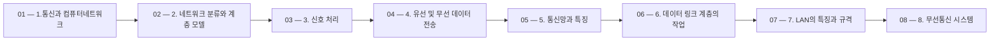

 > [!abstract] 사용법
 > 이 지도는 현재 폴더의 원본 PDF를 파일 순서대로 묶어 **강의 진행 → 핵심 단서 → 점검 포인트**를 연결합니다. 세부 개념은 같은 폴더의 주제 노트와 함께 대조하세요.

## 강의 흐름



<Tabs>
  <Tab label="파일 순서">파일명에 포함된 주차·장·버전 표기를 먼저 읽어 강의의 큰 흐름을 잡습니다.</Tab>
  <Tab label="중복 자료">같은 접두사나 버전이 겹치면 앞 자료를 기준으로 뒤 자료의 보충·실습 여부를 비교합니다.</Tab>
  <Tab label="검증">첫 페이지 단서는 방향만 제시하므로 정의·식·코드·수치는 원본 PDF에서 다시 확인합니다.</Tab>
</Tabs>

## 원본 PDF 목록

| 파일 | 쪽수 | 첫 페이지 단서 |
| :-- | --: | :-- |
| 1.통신과 컴퓨터네트워크.pdf | 24 | Ch. 1 동아대학교 컴퓨터AI 공학부 S03 301-01호실 (이양민 교수 연구실) 1 2024.09 (Kakao ID: yanwenry) |
| 2. 네트워크 분류와 계층 모델.pdf | 17 | Ch. 2 동아대학교 컴퓨터AI 공학부 S03 301-01호실 (이양민 교수 연구실) 1 2024.09 (Kakao ID: yanwenry) |
| 3. 신호 처리.pdf | 26 | Ch. 3 동아대학교 컴퓨터AI 공학부 S03 301-01호실 (이양민 교수 연구실) 1 2024.09 (Kakao ID: yanwenry) |
| 4. 유선 및 무선 데이터 전송.pdf | 30 | Ch. 4 동아대학교 컴퓨터AI 공학부 S03 301-01호실 (이양민 교수 연구실) 1 2024.09 (Kakao ID: yanwenry) |
| 5. 통신망과 특징.pdf | 19 | Ch. 5 동아대학교 컴퓨터AI 공학부 S03 301-01호실 (이양민 교수 연구실) 1 2024.10 (Kakao ID: yanwenry) |
| 6. 데이터 링크 계층의 작업.pdf | 34 | Ch. 6 동아대학교 컴퓨터AI 공학부 S03 301-01호실 (이양민 교수 연구실) 1 2024.10 (Kakao ID: yanwenry) |
| 7. LAN의 특징과 규격.pdf | 16 | Ch. 7 동아대학교 컴퓨터AI 공학부 S03 301-01호실 (이양민 교수 연구실) 1 2024.10 (Kakao ID: yanwenry) |
| 8. 무선통신 시스템.pdf | 22 | Ch. 8 동아대학교 컴퓨터AI 공학부 S03 301-01호실 (이양민 교수 연구실) 1 2024.11 (Kakao ID: yanwenry) |
| 9. 네트워크 계층.pdf | 23 | Ch. 9 동아대학교 컴퓨터AI 공학부 S03 301-01호실 (이양민 교수 연구실) 1 2024.11 (Kakao ID: yanwenry) |
| 10. 라우팅 알고리즘.pdf | 20 | Ch. 10 동아대학교 컴퓨터AI 공학부 S03 301-01호실 (이양민 교수 연구실) 1 2024.11 (Kakao ID: yanwenry) |
| 11. 인터넷 프로토콜라우팅 알고리즘.pdf | 20 | Ch. 11 동아대학교 컴퓨터AI 공학부 S03 301-01호실 (이양민 교수 연구실) 1 2024.11 (Kakao ID: yanwenry) |
| 12. 네트워크 계층 작업과 프로토콜.pdf | 35 | Ch. 12 동아대학교 컴퓨터AI 공학부 S03 301-01호실 (이양민 교수 연구실) 1 2024.11 (Kakao ID: yanwenry) |
| 13. 전송 계층.pdf | 22 | Ch. 13 동아대학교 컴퓨터AI 공학부 S03 301-01호실 (이양민 교수 연구실) 1 2024.12 (Kakao ID: yanwenry) |
| 14. TCP와 소켓 프로그래밍.pdf | 28 | Ch. 14 동아대학교 컴퓨터AI 공학부 S03 301-01호실 (이양민 교수 연구실) 1 2024.12 (Kakao ID: yanwenry) |
| 16장 보안.pdf | 32 | Ch. 16 동아대학교 컴퓨터AI 공학부 S03 301-01호실 (이양민 교수 연구실) 1 2024.12 (Kakao ID: yanwenry) |

## 원본 단계 인터랙티브

```html preview
<div style="font-family:system-ui,sans-serif;padding:20px;color:var(--foreground)">
  <label for="flow527899401" style="font-size:14px;font-weight:600">원본 자료 단계</label>
  <div id="flow527899401-out" style="font-size:24px;font-weight:700;color:var(--chart-1);margin:6px 0">1.통신과 컴퓨터네트워크</div>
  <input id="flow527899401" type="range" min="1" max="15" step="1" value="1" style="width:100%;accent-color:var(--primary)" />
  <p style="font-size:13px;color:var(--muted-foreground)">슬라이더를 움직이면 파일명 순서대로 자료의 위치를 확인합니다.</p>
  <script>
    var flow527899401 = document.getElementById('flow527899401');
    var flow527899401Out = document.getElementById('flow527899401-out');
    var flow527899401Steps = ["1.통신과 컴퓨터네트워크","2. 네트워크 분류와 계층 모델","3. 신호 처리","4. 유선 및 무선 데이터 전송","5. 통신망과 특징","6. 데이터 링크 계층의 작업","7. LAN의 특징과 규격","8. 무선통신 시스템","9. 네트워크 계층","10. 라우팅 알고리즘","11. 인터넷 프로토콜라우팅 알고리즘","12. 네트워크 계층 작업과 프로토콜","13. 전송 계층","14. TCP와 소켓 프로그래밍","16장 보안"];
    flow527899401.addEventListener('input', function () {
      flow527899401Out.textContent = flow527899401Steps[Number(flow527899401.value) - 1] || '';
    });
  </script>
</div>
```

## 점검 포인트

- **범위:** 15개 PDF, 총 368쪽.
- **근거:** 표의 쪽수와 첫 페이지 단서는 현재 sources/ 파일에서 직접 추출했습니다.
- **학습 순서:** 흐름도와 슬라이더를 먼저 훑은 뒤, 주제 노트의 정의·절차·실습 결과를 순서대로 대조합니다.

> [!warning] 과해석 방지
> 이 지도에는 파일명·쪽수·첫 페이지 추출 단서만 기록했습니다. PDF에 없는 구현 세부, 성능 수치, 권장 설정은 추가하지 않습니다.

<details>
<summary>다음 읽기</summary>

현재 단계의 원본을 열어 제목·절차·도식을 확인한 뒤, 같은 폴더의 주제 노트에 해당 근거가 반영되었는지 점검하세요.

</details>
