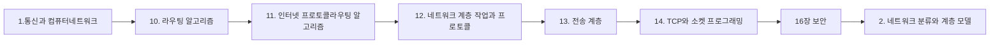

> [!abstract] 사용법
> 이 문서는 원본 PDF의 **순서 → 핵심 단서 → 학습 점검**을 한 번에 보는 지도입니다. 세부 개념은 같은 폴더의 주제 노트와 원본 PDF를 함께 대조하세요.

## 강의 흐름



<Tabs>
  <Tab label="파일 순서">파일명과 주차·장 제목을 강의 진행 신호로 삼아 처음부터 읽습니다.</Tab>
  <Tab label="읽기 전략">이론에서 실습·평가로 이동하며 같은 주제의 중복 PDF는 보조 자료로 비교합니다.</Tab>
  <Tab label="검증">텍스트가 빈약한 자료는 추출되지 않은 도식·수식을 임의로 채우지 않고 원본에서 확인합니다.</Tab>
</Tabs>

## 원본 PDF 목록

| 파일 | 쪽수 | 첫 페이지 단서 |
| :-- | --: | :-- |
| 1.통신과 컴퓨터네트워크.pdf | — | Ch. 1 동아대학교 컴퓨터AI 공학부 S03 301-01호실 (이양민 교수 연구실) 1 2024.09 (Kakao ID: yanwenry) |
| 10. 라우팅 알고리즘.pdf | — | Ch. 10 동아대학교 컴퓨터AI 공학부 S03 301-01호실 (이양민 교수 연구실) 1 2024.11 (Kakao ID: yanwenry) |
| 11. 인터넷 프로토콜라우팅 알고리즘.pdf | — | Ch. 11 동아대학교 컴퓨터AI 공학부 S03 301-01호실 (이양민 교수 연구실) 1 2024.11 (Kakao ID: yanwenry) |
| 12. 네트워크 계층 작업과 프로토콜.pdf | — | Ch. 12 동아대학교 컴퓨터AI 공학부 S03 301-01호실 (이양민 교수 연구실) 1 2024.11 (Kakao ID: yanwenry) |
| 13. 전송 계층.pdf | — | Ch. 13 동아대학교 컴퓨터AI 공학부 S03 301-01호실 (이양민 교수 연구실) 1 2024.12 (Kakao ID: yanwenry) |
| 14. TCP와 소켓 프로그래밍.pdf | — | Ch. 14 동아대학교 컴퓨터AI 공학부 S03 301-01호실 (이양민 교수 연구실) 1 2024.12 (Kakao ID: yanwenry) |
| 16장 보안.pdf | — | Ch. 16 동아대학교 컴퓨터AI 공학부 S03 301-01호실 (이양민 교수 연구실) 1 2024.12 (Kakao ID: yanwenry) |
| 2. 네트워크 분류와 계층 모델.pdf | — | Ch. 2 동아대학교 컴퓨터AI 공학부 S03 301-01호실 (이양민 교수 연구실) 1 2024.09 (Kakao ID: yanwenry) |
| 3. 신호 처리.pdf | — | Ch. 3 동아대학교 컴퓨터AI 공학부 S03 301-01호실 (이양민 교수 연구실) 1 2024.09 (Kakao ID: yanwenry) |
| 4. 유선 및 무선 데이터 전송.pdf | — | Ch. 4 동아대학교 컴퓨터AI 공학부 S03 301-01호실 (이양민 교수 연구실) 1 2024.09 (Kakao ID: yanwenry) |
| 5. 통신망과 특징.pdf | — | Ch. 5 동아대학교 컴퓨터AI 공학부 S03 301-01호실 (이양민 교수 연구실) 1 2024.10 (Kakao ID: yanwenry) |
| 6. 데이터 링크 계층의 작업.pdf | — | Ch. 6 동아대학교 컴퓨터AI 공학부 S03 301-01호실 (이양민 교수 연구실) 1 2024.10 (Kakao ID: yanwenry) |
| 7. LAN의 특징과 규격.pdf | — | Ch. 7 동아대학교 컴퓨터AI 공학부 S03 301-01호실 (이양민 교수 연구실) 1 2024.10 (Kakao ID: yanwenry) |
| 8. 무선통신 시스템.pdf | — | Ch. 8 동아대학교 컴퓨터AI 공학부 S03 301-01호실 (이양민 교수 연구실) 1 2024.11 (Kakao ID: yanwenry) |
| 9. 네트워크 계층.pdf | — | Ch. 9 동아대학교 컴퓨터AI 공학부 S03 301-01호실 (이양민 교수 연구실) 1 2024.11 (Kakao ID: yanwenry) |

## 원본 단계 인터랙티브

```html preview
<div style="font-family:system-ui,sans-serif;padding:20px;color:var(--foreground)">
  <label for="flow933385" style="font-size:14px;font-weight:600">원본 자료 단계</label>
  <div id="flow933385-out" style="font-size:24px;font-weight:700;color:var(--chart-1);margin:6px 0">1.통신과 컴퓨터네트워크</div>
  <input id="flow933385" type="range" min="1" max="15" step="1" value="1" style="width:100%;accent-color:var(--primary)" />
  <p style="font-size:13px;color:var(--muted-foreground)">슬라이더를 움직이면 파일명 순서대로 자료의 역할을 확인합니다.</p>
  <script>
    var flow933385 = document.getElementById('flow933385');
    var flow933385Out = document.getElementById('flow933385-out');
    var flow933385Steps = ["1.통신과 컴퓨터네트워크","10. 라우팅 알고리즘","11. 인터넷 프로토콜라우팅 알고리즘","12. 네트워크 계층 작업과 프로토콜","13. 전송 계층","14. TCP와 소켓 프로그래밍","16장 보안","2. 네트워크 분류와 계층 모델","3. 신호 처리","4. 유선 및 무선 데이터 전송","5. 통신망과 특징","6. 데이터 링크 계층의 작업","7. LAN의 특징과 규격","8. 무선통신 시스템","9. 네트워크 계층"];
    flow933385.addEventListener('input', function () {
      flow933385Out.textContent = flow933385Steps[Number(flow933385.value) - 1];
    });
  </script>
</div>
```

## 점검 포인트

- **범위:** 15개 PDF, 총 0쪽.
- **근거:** 첫 페이지 추출 단서를 표에 남겨 주제명과 흐름을 확인했습니다.
- **시각 자료:** 0개 파일은 첫 페이지 텍스트가 빈약하므로 필요한 경우 승인된 크롭 후보로만 별도 검토합니다.

> [!warning] 과해석 방지
> 이 지도에는 파일명·쪽수·추출된 첫 페이지 단서만 기록했습니다. PDF에 없는 구현 세부, 성능 수치, 권장 설정은 추가하지 않습니다.

<details>
<summary>다음 읽기</summary>

현재 단계의 파일을 선택한 뒤, 같은 폴더의 주제 노트에서 정의·절차·실습 결과를 대조하세요.

</details>
