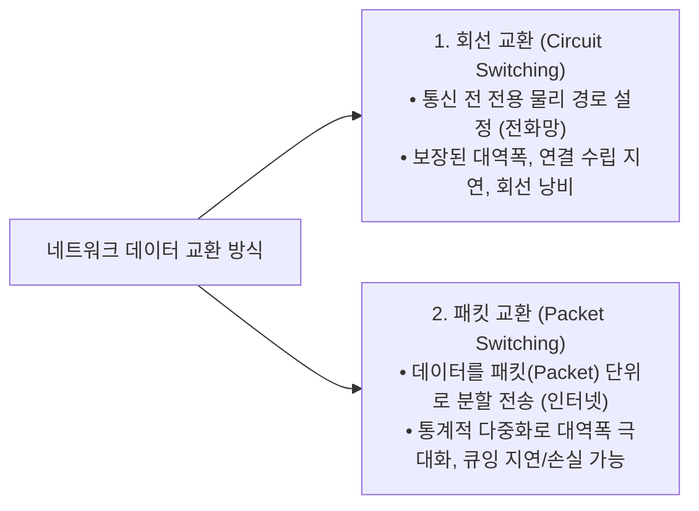
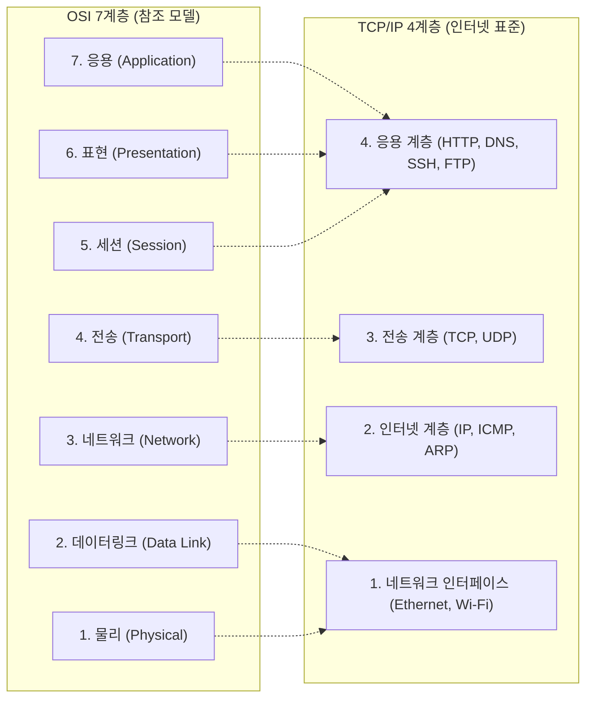

> [!abstract] 핵심 요약
> **컴퓨터 네트워크(Computer Networks)**는 자율적인 다수의 단말 장치(Host)들이 통신 프로토콜을 기반으로 데이터를 교환하는 분산 시스템이다.
> 데이터 전송률인 **$\text{bps}(\text{bit per second})$**와 파일 크기(Byte)의 정량적 변환($1\text{ Byte} = 8\text{ bits}$), 대역폭을 공유하여 효율성을 극대화하는 **패킷 교환(Packet Switching)** 방식, 그리고 통신 과정을 모듈화한 **OSI 7계층**과 실제 인터넷의 표준인 **TCP/IP 4계층**의 계층 간 **헤더 캡슐화(Encapsulation)**를 완벽히 이해해야 한다.

---

## 1. 전송 시간 계산과 패킷 교환 방식

### 1) 네트워크 전송 시간 기본 공식
$$T_{\text{trans}} = \frac{\text{Data Size (bits)}}{\text{Bandwidth (bps)}} = \frac{\text{File Size (Bytes)} \times 8}{\text{Bandwidth (bps)}}$$

- *예시*: 100MB 크기의 파일을 100Mbps 네트워크로 전송 시:
  $$T_{\text{trans}} = \frac{100 \times 10^6 \times 8\text{ bits}}{100 \times 10^6\text{ bps}} = 8.0\text{ 초} \quad (\text{헤더 오버헤드 포함 시 대략 } 10\text{초})$$

### 2) 회선 교환 (Circuit) vs 패킷 교환 (Packet)


---

## 2. OSI 7계층 vs TCP/IP 4계층 및 프로토콜 캡슐화



```mermaid
sequenceDiagram
    autonumber
    participant App as 응용 계층 (Data)
    participant Trans as 전송 계층 (Segment = TCP Header + Data)
    participant Net as 네트워크 계층 (Packet = IP Header + Segment)
    participant Link as 데이터링크 계층 (Frame = ETH Header + Packet + FCS)

    App->>Trans: 사용자 원본 데이터 전달
    Trans->>Net: 포트 번호(Port) 헤더 추가 ➔ 세그먼트(Segment)
    Net->>Link: 송수신 IP 주소 헤더 추가 ➔ 패킷(Packet)
    Link->>Link: 송수신 MAC 주소 헤더 + 트레일러(CRC) 추가 ➔ 프레임(Frame)
    Note over Link: 물리 계층(비트 스트림 0101)으로 전기/광 신호 송출
```

---

## 3. 실시간 계층별 PDU 캡슐화 & 전송 시간 계산기

```html preview
<div style="font-family:system-ui,-apple-system,sans-serif;padding:20px;background:var(--card);color:var(--card-foreground);border:1px solid var(--border);border-radius:var(--radius)">
  <div style="font-size:16px;font-weight:700;margin-bottom:14px;color:var(--primary);display:flex;align-items:center;gap:8px">
    <span>📦 OSI/TCP-IP 프로토콜 계층 캡슐화 & 대역폭 전송 시간 계산기</span>
  </div>

  <div style="display:grid;grid-template-columns:1fr 1fr;gap:12px;margin-bottom:14px">
    <div>
      <label style="font-size:11px;color:var(--muted-foreground)">전송 파일 크기 (MB):</label>
      <input id="inFileSizeMB" type="number" value="100" min="1" style="width:100%;padding:4px 8px;background:var(--background);color:var(--foreground);border:1px solid var(--border);border-radius:var(--radius);font-weight:700" />
    </div>
    <div>
      <label style="font-size:11px;color:var(--muted-foreground)">네트워크 대역폭 (Mbps):</label>
      <input id="inBandwidthMbps" type="number" value="100" min="1" style="width:100%;padding:4px 8px;background:var(--background);color:var(--foreground);border:1px solid var(--border);border-radius:var(--radius);font-weight:700" />
    </div>
  </div>

  <div style="display:grid;grid-template-columns:1fr 1fr;gap:12px;margin-bottom:14px">
    <div style="padding:10px;background:var(--background);border:1px solid var(--border);border-radius:var(--radius);text-align:center">
      <div style="font-size:10px;color:var(--muted-foreground)">순수 이론 전송 시간 (비트 변환)</div>
      <div id="theoryTimeOut" style="font-size:16px;font-weight:800;color:var(--primary);margin-top:2px">8.00 초</div>
    </div>
    <div style="padding:10px;background:var(--background);border:1px solid var(--border);border-radius:var(--radius);text-align:center">
      <div style="font-size:10px;color:var(--muted-foreground)">헤더 오버헤드(+10%) 반영 실측치</div>
      <div id="realTimeOut" style="font-size:16px;font-weight:800;color:var(--chart-1);margin-top:2px">8.80 초</div>
    </div>
  </div>

  <div style="padding:10px;background:var(--background);border:1px solid var(--border);border-radius:var(--radius)">
    <div style="font-size:11px;font-weight:700;color:var(--chart-2);margin-bottom:4px">계층별 PDU 캡슐화 구조:</div>
    <div style="font-family:monospace;font-size:11px;line-height:1.6">
      [ETH Header | <span style="color:var(--chart-1)">IP Header</span> | <span style="color:var(--primary)">TCP Header</span> | Data Payload | <span style="color:var(--muted-foreground)">FCS Checksum</span>]
    </div>
  </div>

  <script>
    function calcTrans() {
      var mb = parseFloat(document.getElementById('inFileSizeMB').value) || 100;
      var mbps = parseFloat(document.getElementById('inBandwidthMbps').value) || 100;

      var bits = mb * 8;
      var timeSec = bits / mbps;
      var realSec = timeSec * 1.1;

      document.getElementById('theoryTimeOut').textContent = timeSec.toFixed(2) + " 초";
      document.getElementById('realTimeOut').textContent = realSec.toFixed(2) + " 초 (헤더 포함)";
    }

    ['inFileSizeMB', 'inBandwidthMbps'].forEach(function(id) {
      document.getElementById(id).addEventListener('input', calcTrans);
    });
    calcTrans();
  </script>
</div>
```
