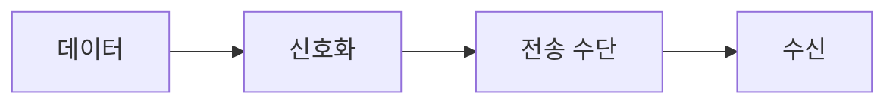

> [!abstract] 한 줄 요약
> 통신은 한쪽의 데이터를 다른 쪽으로 전달하는 과정이며, 신호와 전송 수단은 그 전달을 가능하게 하는 매개다.



> [!info] 핵심 원리
> 가까운 거리의 대화부터 원격지의 우편·전신·전화까지, 통신 시스템은 전달 거리와 속도의 제약을 줄여 왔다. 유선과 무선의 차이는 매체의 형태이지, 데이터를 전달한다는 목표는 같다.

## 통신을 시스템으로 읽기

발신자와 수신자 사이에는 데이터 자체만 있는 것이 아니다. 데이터를 실어 나르는 신호, 신호가 지나갈 매체, 그리고 수신 후 의미를 되살리는 과정이 함께 있어야 전달이 성립한다. 방송은 한 발신자가 다수의 수신자에게 보내는 형태라는 점에서 1:1 통신과 구별된다.

```html preview
<div style="padding: 14px; border: 1px solid var(--border); border-radius: 14px; background: var(--card);">
  <div style="font-weight: 700; color: var(--foreground); margin-bottom: 8px;">01. 통신과 컴퓨터 네트워크의 흐름</div>
  <svg viewBox="0 0 560 130" role="img" aria-label="데이터에서 신호에서 매체에서 수신 흐름" style="width: 100%; height: auto;">
    <g transform="translate(16 44)"><rect width="118" height="54" rx="10" style="fill: var(--background); stroke: var(--chart-1); stroke-width: 2"></rect><text x="59" y="32" text-anchor="middle" style="fill: var(--foreground); font-size: 13px; font-family: sans-serif">데이터</text></g><path d="M134 71 H150" style="stroke: var(--muted-foreground); stroke-width: 2; fill: none"></path><g transform="translate(152 44)"><rect width="118" height="54" rx="10" style="fill: var(--background); stroke: var(--chart-2); stroke-width: 2"></rect><text x="59" y="32" text-anchor="middle" style="fill: var(--foreground); font-size: 13px; font-family: sans-serif">신호</text></g><path d="M270 71 H286" style="stroke: var(--muted-foreground); stroke-width: 2; fill: none"></path><g transform="translate(288 44)"><rect width="118" height="54" rx="10" style="fill: var(--background); stroke: var(--chart-3); stroke-width: 2"></rect><text x="59" y="32" text-anchor="middle" style="fill: var(--foreground); font-size: 13px; font-family: sans-serif">매체</text></g><path d="M406 71 H422" style="stroke: var(--muted-foreground); stroke-width: 2; fill: none"></path><g transform="translate(424 44)"><rect width="118" height="54" rx="10" style="fill: var(--background); stroke: var(--chart-4); stroke-width: 2"></rect><text x="59" y="32" text-anchor="middle" style="fill: var(--foreground); font-size: 13px; font-family: sans-serif">수신</text></g>
    <text x="16" y="120" style="fill: var(--muted-foreground); font-size: 12px; font-family: sans-serif;">각 상자는 역할을, 화살표는 처리 순서를 나타낸다.</text>
  </svg>
</div>
```

<Tabs>
<Tab label="관점">
통신을 ‘누가 누구에게 무엇을 전달하는가’로 먼저 정리한다.
</Tab>
<Tab label="매체">
유선은 통신선을, 무선은 전파 기반의 연결을 사용한다.
</Tab>
<Tab label="서비스">
인터넷은 시간 제약을 낮추어 주문형 콘텐츠 같은 서비스 모델을 가능하게 한다.
</Tab>
</Tabs>

> [!note] 연결해서 생각하기
> 통신은 한쪽의 데이터를 다른 쪽으로 전달하는 과정이며, 신호와 전송 수단은 그 전달을 가능하게 하는 매개다. 이 관점으로 보면, 용어를 개별 정의가 아니라 전달 과정의 어느 지점에 놓이는지로 정리할 수 있다.

<details>
<summary>스스로 점검하기</summary>

1. 발신 데이터와 전달 신호를 구분한다.
2. 유선과 무선은 전달 목표가 아니라 매체에서 구분한다.
3. 다수 수신 구조인지 1:1 구조인지 말로 설명한다.

</details>

> [!warning] 원문 오류
> 추출 원문에는 `brodcasting` 표기가 있다. 이 노트는 해당 원문 표기를 고치지 않고 오류임만 기록한다.
