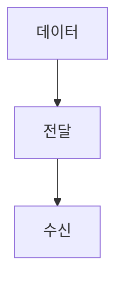

> [!abstract] 한 줄 요약
> 통신은 ==한쪽의 데이터==를 다른 쪽으로 전달하는 일이다.

## 이 노트의 지도



## 핵심 개념

강의는 통신을 한쪽의 데이터를 다른 쪽으로 전달하는 것으로 정의하며 대화·우편·봉화를 통신 수단 사례로 든다.

> [!important] 핵심 규칙
> 컴퓨터 네트워크도 전달 대상·출발지·도착지를 구분해 읽는다.

$$
\text{통신}=\text{출발지 데이터}\rightarrow\text{도착지}
$$

<details>
<summary>전달 수단</summary>

대화는 가까운 거리, 우편과 봉화는 원격지 정보 전달의 사례로 제시된다.

</details>

<Tabs>
  <Tab label="가까운 전달">대화처럼 가까운 거리의 통신 수단을 뜻한다.</Tab>
  <Tab label="원격 전달">우편·봉화처럼 떨어진 곳에 정보를 전달하는 수단을 뜻한다.</Tab>
</Tabs>

> [!tip] 적용 단서
> ==전달== 자체와 전달 매체를 구분하면 통신 정의를 넓게 이해할 수 있다.

## 핵심 단서

```html preview
<div style="font-family:system-ui,sans-serif;padding:20px;display:flex;align-items:center;gap:20px;color:var(--foreground)"><svg width="120" height="120" viewBox="0 0 120 120" role="img" aria-label="강의의 통신 사례"><circle cx="60" cy="60" r="46" stroke-width="14" style="fill:none;stroke:var(--border)"/><circle cx="60" cy="60" r="46" stroke-width="14" stroke-linecap="round" stroke-dasharray="289" stroke-dashoffset="0" transform="rotate(-90 60 60)" style="fill:none;stroke:var(--chart-1)"/><text x="60" y="67" text-anchor="middle" font-size="22" font-weight="700" style="fill:var(--foreground)">3</text></svg><div><div style="font-weight:600;font-size:15px">강의의 통신 사례</div><div style="font-size:13px;color:var(--muted-foreground);margin-top:2px">대화·우편·봉화 3/3</div></div></div>
```

$$
\text{정보 전달}=\text{데이터}+\text{전달 수단}
$$

<details>
<summary>전기 통신</summary>

강의는 모스부호를 최초로 전기를 이용한 통신 시스템으로 언급한다.

</details>

<details>
<summary>네트워크의 출발</summary>

통신의 정의를 데이터 전달로 두면 이후 신호·전송매체·계층의 역할을 연결할 수 있다.

</details>

> [!question]- 스스로 점검
> **Q.** 통신을 데이터 전달로 정의하는 이점은 무엇인가?
>
> **A.** 서로 다른 전달 수단을 같은 출발지·도착지·데이터 관점에서 볼 수 있기 때문이다.

## 작성 경계

> [!warning] 출처 경계
> 제공된 추출 텍스트만 사용했으며 원본 시각자료·첨부물·페이지 표기는 넣지 않았다.

---

## 원본 강의 흐름 인터랙티브

```html preview
<div style="font-family:system-ui,sans-serif;padding:20px;color:var(--foreground)">
  <label for="noteFlow326630" style="font-size:14px;font-weight:600">통신과 컴퓨터 네트워크 단계</label>
  <div id="noteFlow326630-out" style="font-size:26px;font-weight:700;color:var(--chart-1);margin:6px 0">통신과 컴퓨터 네트워크 핵심 개념</div>
  <input id="noteFlow326630" type="range" min="1" max="3" step="1" value="1" style="width:100%;accent-color:var(--primary)" />
  <p style="font-size:13px;color:var(--muted-foreground)">슬라이더를 움직이면 원본 PDF에서 정리한 이 노트의 흐름을 확인합니다.</p>
  <script>
    var noteFlow326630 = document.getElementById('noteFlow326630');
    var noteFlow326630Out = document.getElementById('noteFlow326630-out');
    var noteFlow326630Steps = ["통신과 컴퓨터 네트워크 핵심 개념","통신과 컴퓨터 네트워크 처리 절차","통신과 컴퓨터 네트워크 검증·응용"];
    noteFlow326630.addEventListener('input', function () { noteFlow326630Out.textContent = noteFlow326630Steps[Number(noteFlow326630.value) - 1]; });
  </script>
</div>
```
