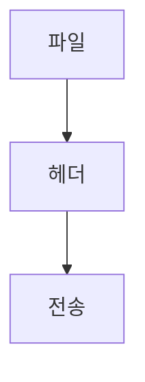

> [!abstract] 한 줄 요약
> 네트워크 속도는 ==bps==로 읽고 실제 전송에는 헤더가 더해진다.

## 이 노트의 지도



## 핵심 개념

강의는 네트워크 전송속도를 bit per second인 bps로 표시하며, 데이터 전송에는 헤더라는 포장이 추가된다고 설명한다.

> [!important] 핵심 규칙
> bit와 Byte를 구분해야 전송 시간 계산의 단위를 맞출 수 있다.

$$
100\text{ Mbps}=12.5\text{ MB/s}
$$

<details>
<summary>전송 시간 사례</summary>

100MB 파일을 100Mbps 네트워크로 보낼 때 이론상 8초지만 헤더 때문에 대략 10초가 걸릴 수 있다고 제시한다.

</details>

<Tabs>
  <Tab label="bit">전송속도 bps에서 쓰는 단위다.</Tab>
  <Tab label="Byte">파일 크기 MB를 읽을 때 쓰는 단위다.</Tab>
</Tabs>

> [!tip] 적용 단서
> 계산 전에 ==8 bit=1 Byte== 변환을 적용한다.

## 핵심 단서

```html preview
<div style="font-family:system-ui,sans-serif;padding:20px;color:var(--foreground)"><h3 style="margin:0 0 14px;font-size:15px;font-weight:600">강의 전송 사례</h3><div id="bars" style="display:flex;align-items:flex-end;gap:14px;height:170px"></div><script>
var data=["파일",100],["Mbps 환산",12.5],["이론 시간",8]("파일",100],["Mbps 환산",12.5],["이론 시간",8.md);var max=Math.max.apply(null,data.map(function(d){return d[1];}))||1;document.getElementById('bars').innerHTML=data.map(function(d,i){return '<div style="flex:1;display:flex;flex-direction:column;align-items:center;gap:6px;height:100%;justify-content:flex-end"><span style="font-size:12px;font-weight:600">'+d[1]+'</span><div style="width:100%;height:'+(d[1]/max*100)+'%;background:var(--chart-'+(i+1)+');border-radius:var(--radius) var(--radius) 0 0"></div><span style="font-size:12px;color:var(--muted-foreground)">'+d[0]+'</span></div>';}).join('');
</script></div>
```

$$
\text{전송량}=\text{데이터}+\text{헤더}
$$

<details>
<summary>헤더</summary>

헤더는 전송할 데이터를 포장해 보내기 위해 추가되는 정보로 설명된다.

</details>

<details>
<summary>계층 모델</summary>

계층 모델은 각 계층이 맡은 작업을 나누어 이해하는 다음 단원의 틀이 된다.

</details>

> [!question]- 스스로 점검
> **Q.** 이론 시간과 실제 시간이 다를 수 있는 이유는 무엇인가?
>
> **A.** 데이터 자체 외에 헤더가 추가되어 전송해야 할 양이 커지기 때문이다.

## 작성 경계

> [!warning] 출처 경계
> 제공된 추출 텍스트만 사용했으며 원본 시각자료·첨부물·페이지 표기는 넣지 않았다.

---

## 원본 강의 흐름 인터랙티브

```html preview
<div style="font-family:system-ui,sans-serif;padding:20px;color:var(--foreground)">
  <label for="noteFlow231021" style="font-size:14px;font-weight:600">네트워크 분류와 계층 모델 단계</label>
  <div id="noteFlow231021-out" style="font-size:26px;font-weight:700;color:var(--chart-1);margin:6px 0">네트워크 분류와 계층 모델 핵심 개념</div>
  <input id="noteFlow231021" type="range" min="1" max="3" step="1" value="1" style="width:100%;accent-color:var(--primary)" />
  <p style="font-size:13px;color:var(--muted-foreground)">슬라이더를 움직이면 원본 PDF에서 정리한 이 노트의 흐름을 확인합니다.</p>
  <script>
    var noteFlow231021 = document.getElementById('noteFlow231021');
    var noteFlow231021Out = document.getElementById('noteFlow231021-out');
    var noteFlow231021Steps = ["네트워크 분류와 계층 모델 핵심 개념","네트워크 분류와 계층 모델 처리 절차","네트워크 분류와 계층 모델 검증·응용"];
    noteFlow231021.addEventListener('input', function () { noteFlow231021Out.textContent = noteFlow231021Steps[Number(noteFlow231021.value) - 1]; });
  </script>
</div>
```
