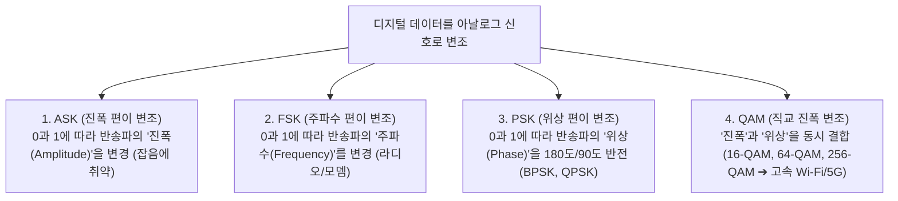

> [!abstract] 핵심 요약
> 물리 계층(Physical Layer)을 통한 데이터 전송은 전송 매체의 **대역폭(Bandwidth, $B$)**과 **신호 대 잡음비(SNR)**에 의해 이론적 한계가 결정된다.
> 무잡음 환경에서 신호 레벨 수($M$)에 따른 한계를 제시한 **나이퀴스트 공식($C = 2B \log_2 M$)**과 열잡음이 존재하는 실제 환경의 물리적 한계를 규정한 **섀넌 채널 용량 공식($C = B \log_2 (1 + \text{SNR})$)**, 그리고 현대 고속 무선 통신의 핵심인 **QAM(직교 진폭 변조)**을 마스터해야 한다.

---

## 1. 2대 물리 전송 용량 한계 공식

### 1) 나이퀴스트 (Nyquist) 공식 (무잡음 채널)
$$C = 2B \log_2 M \quad [\text{bps}]$$
- $B$: 채널 대역폭 (Hz)
- $M$: 이산 신호 레벨의 개수 ($M=2 \implies 1\text{ bit/signal}$)

### 2) 섀넌 (Shannon) 채널 용량 공식 (잡음 채널)
$$C = B \log_2 (1 + \text{SNR}) \quad [\text{bps}]$$
$$\text{SNR}_{\text{dB}} = 10 \log_{10} \left( \frac{\text{Signal Power}}{\text{Noise Power}} \right) \iff \text{SNR} = 10^{\frac{\text{SNR}_{\text{dB}}}{10}}$$

- *예시*: 대역폭 $B = 3000\text{ Hz}$, $\text{SNR}_{\text{dB}} = 30\text{ dB} \implies \text{SNR} = 1000$:
  $$C = 3000 \times \log_2 (1 + 1000) \approx 3000 \times 9.967 \approx 29,901\text{ bps} \approx 30\text{ kbps}$$

---

## 2. 디지털 변복조(Modulation) 4대 방식



---

## 3. 실시간 섀넌(Shannon) 채널 용량 & SNR 계산기

```html preview
<div style="font-family:system-ui,-apple-system,sans-serif;padding:20px;background:var(--card);color:var(--card-foreground);border:1px solid var(--border);border-radius:var(--radius)">
  <div style="font-size:16px;font-weight:700;margin-bottom:14px;color:var(--primary);display:flex;align-items:center;gap:8px">
    <span>📡 섀넌(Shannon) 이론적 최대 채널 용량(C) 실시간 계산기</span>
  </div>

  <div style="display:grid;grid-template-columns:1fr 1fr;gap:12px;margin-bottom:14px">
    <div>
      <label style="font-size:11px;color:var(--muted-foreground)">채널 대역폭 B (kHz):</label>
      <input id="inBandwidthKHz" type="number" value="20" min="1" step="5" style="width:100%;padding:4px 8px;background:var(--background);color:var(--foreground);border:1px solid var(--border);border-radius:var(--radius);font-weight:700" />
    </div>
    <div>
      <label style="font-size:11px;color:var(--muted-foreground)">신호 대 잡음비 SNR (dB):</label>
      <input id="inSnrDb" type="number" value="30" min="0" max="60" step="1" style="width:100%;padding:4px 8px;background:var(--background);color:var(--foreground);border:1px solid var(--border);border-radius:var(--radius);font-weight:700" />
    </div>
  </div>

  <div style="display:grid;grid-template-columns:1fr 1fr;gap:12px;margin-bottom:12px">
    <div style="padding:10px;background:var(--background);border:1px solid var(--border);border-radius:var(--radius);text-align:center">
      <div style="font-size:10px;color:var(--muted-foreground)">선형 신호 대 잡음비 (SNR)</div>
      <div id="snrLinearOut" style="font-size:16px;font-weight:800;color:var(--chart-1);margin-top:2px">1,000 : 1</div>
    </div>
    <div style="padding:10px;background:var(--background);border:1px solid var(--border);border-radius:var(--radius);text-align:center">
      <div style="font-size:10px;color:var(--muted-foreground)">이론상 최대 채널 용량 (C)</div>
      <div id="shannonCapOut" style="font-size:18px;font-weight:800;color:var(--primary);margin-top:2px">199.3 kbps</div>
    </div>
  </div>

  <script>
    function calcShannon() {
      var bKhz = parseFloat(document.getElementById('inBandwidthKHz').value) || 20;
      var snrDb = parseFloat(document.getElementById('inSnrDb').value) || 30;

      var b = bKhz * 1000;
      var snr = Math.pow(10, snrDb / 10);
      var cap = b * (Math.log(1 + snr) / Math.LN2);

      document.getElementById('snrLinearOut').textContent = Math.round(snr).toLocaleString() + " : 1";
      document.getElementById('shannonCapOut').textContent = (cap / 1000).toFixed(1) + " kbps (" + (cap / 1000000).toFixed(3) + " Mbps)";
    }

    ['inBandwidthKHz', 'inSnrDb'].forEach(function(id) {
      document.getElementById(id).addEventListener('input', calcShannon);
    });
    calcShannon();
  </script>
</div>
```
