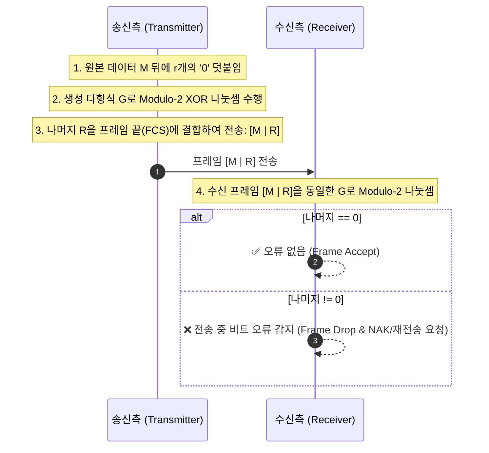

> [!abstract] 핵심 요약
> **데이터 링크 계층(Data Link Layer)**은 물리적으로 직접 연결된 인접 노드(Node-to-Node) 간에 오류 없이 신뢰성 있는 프레임 전송을 보장한다.
> 프레임의 시작과 끝을 구분하기 위한 **비트 스터핑(Bit Stuffing - 5연속 1 뒤 0 강제 삽입)**, 하드웨어 수준에서 버스트 오류를 완벽히 검출하는 **CRC(Cyclic Redundancy Check) 모듈로-2 다항식 나눗셈**, 그리고 파이프라이닝 기반의 **Go-Back-N vs Selective Repeat ARQ** 슬라이딩 윈도우 메커니즘을 정량적으로 분석해야 한다.

---

## 1. 비트 스터핑(Bit Stuffing)과 플래그 동기화


---

## 2. CRC(Cyclic Redundancy Check) 오류 검출 2진 연산

$$T(x) = M(x) \cdot x^r + R(x), \quad R(x) = \text{Remainder}\left( \frac{M(x) \cdot x^r}{G(x)} \right) \quad (\text{Modulo-2 XOR 나눗셈})$$



---

## 3. 3대 자동 재전송 요청(ARQ) 프로토콜 비교

| ARQ 방식 | 송신 윈도우 크기 ($W_S$) | 수신 윈도우 크기 ($W_R$) | 오류 발생 시 동작 특성 |
| :-- | :--: | :--: | :-- |
| **Stop-and-Wait** | 1 | 1 | 1개 프레임 전송 후 ACK 올 때까지 대기 (대역폭 낭비 극대) |
| **Go-Back-N** | $N > 1$ | 1 | 오류 발생 프레임부터 이후 모든 프레임을 **전부 재전송** |
| **Selective Repeat** | $N > 1$ | $N > 1$ | 오류가 발생한 **해당 프레임만 선별적 재전송** (버퍼 필요) |

---

## 4. 실시간 CRC 모듈로-2 XOR 나눗셈 계산기

```html preview
<div style="font-family:system-ui,-apple-system,sans-serif;padding:20px;background:var(--card);color:var(--card-foreground);border:1px solid var(--border);border-radius:var(--radius)">
  <div style="font-size:16px;font-weight:700;margin-bottom:14px;color:var(--primary);display:flex;align-items:center;gap:8px">
    <span>🛡️ CRC 순환 중복 검사 Modulo-2 나눗셈 실시간 연산기</span>
  </div>

  <div style="display:grid;grid-template-columns:1fr 1fr;gap:12px;margin-bottom:14px">
    <div>
      <label style="font-size:11px;color:var(--muted-foreground)">원본 데이터 비트 (Data Bits):</label>
      <input id="inCrcData" type="text" value="110101" style="width:100%;padding:4px 8px;background:var(--background);color:var(--foreground);border:1px solid var(--border);border-radius:var(--radius);font-family:monospace;font-size:12px;font-weight:700" />
    </div>
    <div>
      <label style="font-size:11px;color:var(--muted-foreground)">생성 다항식 G (Generator Poly):</label>
      <input id="inCrcGen" type="text" value="1011" style="width:100%;padding:4px 8px;background:var(--background);color:var(--foreground);border:1px solid var(--border);border-radius:var(--radius);font-family:monospace;font-size:12px;font-weight:700" />
    </div>
  </div>

  <button id="btnCalcCrc" style="padding:6px 16px;background:var(--primary);color:#fff;border:none;border-radius:var(--radius);font-weight:700;cursor:pointer;margin-bottom:12px">CRC 나머지(FCS) 계산</button>

  <div style="display:grid;grid-template-columns:1fr 1fr;gap:12px">
    <div style="padding:10px;background:var(--background);border:1px solid var(--border);border-radius:var(--radius);text-align:center">
      <div style="font-size:10px;color:var(--muted-foreground)">계산된 FCS 나머지 (Checksum R)</div>
      <div id="crcRemOut" style="font-family:monospace;font-size:18px;font-weight:800;color:var(--chart-1);margin-top:2px">010</div>
    </div>
    <div style="padding:10px;background:var(--background);border:1px solid var(--border);border-radius:var(--radius);text-align:center">
      <div style="font-size:10px;color:var(--muted-foreground)">최종 송신 프레임 [Data + FCS]</div>
      <div id="crcFrameOut" style="font-family:monospace;font-size:18px;font-weight:800;color:var(--primary);margin-top:2px">110101 010</div>
    </div>
  </div>

  <script>
    function mod2Div(dividend, divisor) {
      var pick = divisor.length;
      var tmp = dividend.substring(0, pick);

      while (pick < dividend.length) {
        if (tmp[0] === '1') {
          var res = "";
          for (var j = 1; j < divisor.length; j++) {
            res += (tmp[j] === divisor[j]) ? "0" : "1";
          }
          tmp = res + dividend[pick];
        } else {
          tmp = tmp.substring(1) + dividend[pick];
        }
        pick++;
      }

      if (tmp[0] === '1') {
        var res = "";
        for (var j = 1; j < divisor.length; j++) {
          res += (tmp[j] === divisor[j]) ? "0" : "1";
        }
        tmp = res;
      } else {
        tmp = tmp.substring(1);
      }
      return tmp;
    }

    function runCrc() {
      var data = document.getElementById('inCrcData').value.trim();
      var gen = document.getElementById('inCrcGen').value.trim();

      var r = gen.length - 1;
      var appended = data;
      for (var i = 0; i < r; i++) appended += "0";

      var rem = mod2Div(appended, gen);
      document.getElementById('crcRemOut').textContent = rem;
      document.getElementById('crcFrameOut').textContent = data + " " + rem;
    }

    document.getElementById('btnCalcCrc').addEventListener('click', runCrc);
    runCrc();
  </script>
</div>
```
