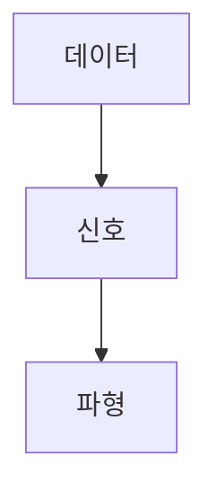

> [!abstract] 한 줄 요약
> 신호는 데이터를 옮기는 파형 또는 흐름이며 ==아날로그와 디지털==은 값의 연속성에서 다르다.

## 이 노트의 지도



## 핵심 개념

강의는 신호를 데이터를 한쪽에서 다른 곳으로 옮길 때 사용하는 파형 또는 데이터 흐름으로 정의한다.

> [!important] 핵심 규칙
> 아날로그는 연속적인 값, 디지털은 숫자·문자 등으로 표현한 불연속적인 값으로 구분한다.

$$
\text{아날로그}=\text{연속},\qquad\text{디지털}=\text{불연속}
$$

<details>
<summary>신호의 역할</summary>

신호는 데이터 자체가 아니라 데이터를 전달하기 위한 파형이나 흐름이라는 점이 핵심이다.

</details>

<Tabs>
  <Tab label="아날로그">연속적으로 변하는 값을 가진다.</Tab>
  <Tab label="디지털">상태나 세기를 숫자·문자 등으로 표현한다.</Tab>
</Tabs>

> [!tip] 적용 단서
> 값의 ==연속성==을 먼저 확인하면 두 표현을 구분할 수 있다.

## 핵심 단서

```html preview
<div style="font-family:system-ui,sans-serif;padding:20px"><div id="cards" style="display:flex;gap:14px;flex-wrap:wrap"></div><script>
var stats=[["신호","파형","데이터 전달","var(--chart-2)"],["아날로그","연속","값 변화","var(--chart-1)"],["디지털","불연속","표현 값","var(--chart-5)"]];document.getElementById('cards').innerHTML=stats.map(function(s){return '<div style="flex:1;min-width:150px;padding:16px;background:var(--card);color:var(--card-foreground);border:1px solid var(--border);border-radius:var(--radius)"><div style="font-size:13px;color:var(--muted-foreground)">'+s[0]+'</div><div style="font-size:26px;font-weight:700;margin-top:4px">'+s[1]+'</div><div style="font-size:12px;font-weight:600;margin-top:4px;color:'+s[3]+'">'+s[2]+'</div></div>';}).join('');
</script></div>
```

$$
\text{신호}\Rightarrow\text{데이터 흐름}
$$

<details>
<summary>표현의 차이</summary>

강의는 아날로그 상태나 세기를 숫자나 문자로 표현한 것을 디지털이라고 설명한다.

</details>

<details>
<summary>전송과 연결</summary>

신호 개념은 전송매체가 무엇을 전달하는지 이해하는 기반이다.

</details>

> [!question]- 스스로 점검
> **Q.** 신호와 데이터의 관계는 무엇인가?
>
> **A.** 신호는 데이터를 다른 곳으로 옮길 때 사용하는 파형 또는 흐름이다.

## 작성 경계

> [!warning] 출처 경계
> 제공된 추출 텍스트만 사용했으며 원본 시각자료·첨부물·페이지 표기는 넣지 않았다.
