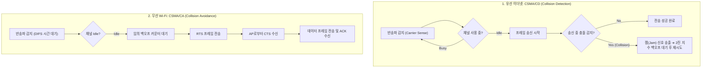
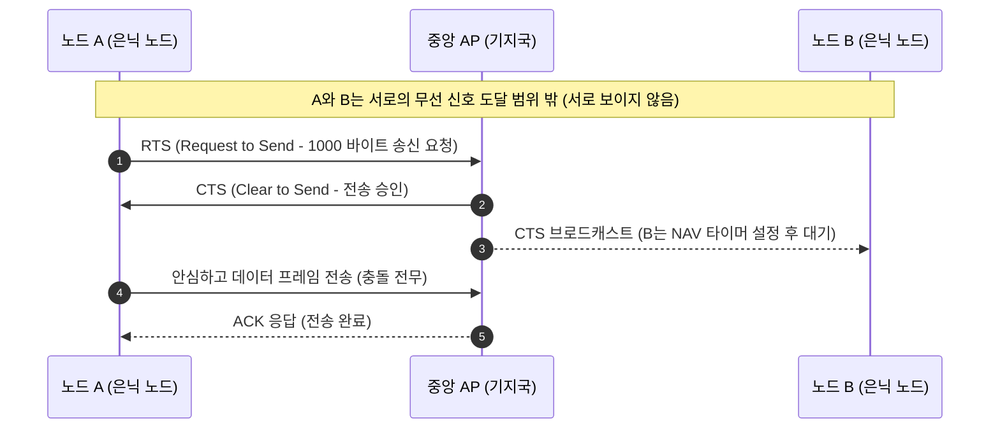

> [!abstract] 핵심 요약
> 다수의 호스트가 단일 물리 매체를 공유할 때 패킷 충돌을 제어하는 **매체 접근 제어(MAC, Medium Access Control)**는 로컬 네트워크의 핵심이다.
> 유선 환경에서는 충돌을 즉시 감지하여 중단하는 **CSMA/CD(2진 지수 백오프)**를 사용하며, 전파 감쇠로 인해 자체 송신 중 충돌 감지가 불가능한 무선 Wi-Fi 환경에서는 임의 대기(DIFS/Backoff)와 **RTS/CTS 핸드셰이크**를 통해 충돌을 사전에 회피하는 **CSMA/CA**를 사용한다.

---

## 1. CSMA/CD vs CSMA/CA 동작 알고리즘 비교



---

## 2. 은닉 노드 문제(Hidden Terminal)와 RTS/CTS 해결



---

## 3. 실시간 이더넷 CSMA/CD 2진 지수 백오프 시뮬레이터

```html preview
<div style="font-family:system-ui,-apple-system,sans-serif;padding:20px;background:var(--card);color:var(--card-foreground);border:1px solid var(--border);border-radius:var(--radius)">
  <div style="font-size:16px;font-weight:700;margin-bottom:14px;color:var(--primary);display:flex;align-items:center;gap:8px">
    <span>📡 CSMA/CD 2진 지수 백오프(Binary Exponential Backoff) 시뮬레이터</span>
  </div>

  <div style="display:flex;gap:10px;align-items:center;margin-bottom:14px">
    <button id="btnCollide" style="padding:6px 14px;background:var(--destructive,#ef4444);color:#fff;border:none;border-radius:var(--radius);font-weight:700;cursor:pointer">충돌 발생 (Collision!)</button>
    <button id="btnResetBackoff" style="padding:6px 12px;background:var(--muted);color:var(--foreground);border:1px solid var(--border);border-radius:var(--radius);font-size:12px;cursor:pointer">초기화</button>
    <span id="colCountOut" style="font-size:12px;font-weight:700">충돌 횟수 (c): 0</span>
  </div>

  <div style="display:grid;grid-template-columns:1fr 1fr;gap:12px">
    <div style="padding:10px;background:var(--background);border:1px solid var(--border);border-radius:var(--radius)">
      <div style="font-size:10px;color:var(--muted-foreground)">백오프 난수 선택 범위 [0, 2^c - 1]</div>
      <div id="slotRangeOut" style="font-family:monospace;font-size:16px;font-weight:800;color:var(--primary);margin-top:2px">K ∈ {0, 1} (1슬롯)</div>
    </div>
    <div style="padding:10px;background:var(--background);border:1px solid var(--border);border-radius:var(--radius)">
      <div style="font-size:10px;color:var(--muted-foreground)">선택된 대기 슬롯 시간 (Wait Time)</div>
      <div id="waitTimeOut" style="font-family:monospace;font-size:16px;font-weight:800;color:var(--chart-1);margin-top:2px">대기 없음</div>
    </div>
  </div>

  <script>
    var collisionCount = 0;
    var SLOT_TIME_US = 51.2; // 51.2 us in 10Mbps Ethernet

    function updateBackoffUI() {
      document.getElementById('colCountOut').textContent = "충돌 횟수 (c): " + collisionCount;
      if (collisionCount === 0) {
        document.getElementById('slotRangeOut').textContent = "대기 없음 (Idle)";
        document.getElementById('waitTimeOut').textContent = "즉시 전송 가능";
        return;
      }

      var maxK = Math.pow(2, Math.min(collisionCount, 10)) - 1;
      var chosenK = Math.floor(Math.random() * (maxK + 1));
      var waitTime = (chosenK * SLOT_TIME_US).toFixed(1);

      document.getElementById('slotRangeOut').textContent = "K ∈ [0, " + maxK + "]";
      document.getElementById('waitTimeOut').textContent = chosenK + " 슬롯 (" + waitTime + " μs 대기)";
    }

    document.getElementById('btnCollide').onclick = function() {
      if (collisionCount < 16) {
        collisionCount++;
        updateBackoffUI();
      } else {
        alert("16회 연속 충돌: 패킷 전송 실패 및 드롭!");
      }
    };

    document.getElementById('btnResetBackoff').onclick = function() {
      collisionCount = 0;
      updateBackoffUI();
    };
  </script>
</div>
```
