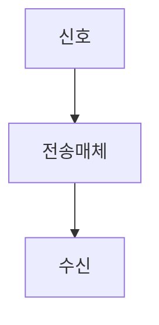

> [!abstract] 한 줄 요약
> 전송매체는 신호를 전달하는 물질이며 통신선은 ==간섭을 줄이며== 신호를 멀리 보낸다.

## 이 노트의 지도



## 핵심 개념

강의는 전송매체를 신호를 한쪽에서 다른 쪽으로 전달하는 데 쓰는 물질로 정의하며, 유선 전송매체를 통신선이라고 한다.

> [!important] 핵심 규칙
> 통신선은 외부 힘에 의한 간섭을 덜 받으면서 신호를 최대한 멀리 전달해야 한다.

$$
\text{전송매체}\Rightarrow\text{신호 전달}
$$

<details>
<summary>꼬임선</summary>

두 개의 선을 꼬아 사용하는 선이 꼬임선이며 이더넷에서 사용한다고 제시한다.

</details>

<Tabs>
  <Tab label="유선">통신선처럼 물질을 따라 신호를 전달한다.</Tab>
  <Tab label="무선">강의는 유선 매체와 대비되는 전송 방식으로 다룬다.</Tab>
</Tabs>

> [!tip] 적용 단서
> 매체를 고를 때 ==간섭==과 전달 거리를 함께 고려한다.

## 핵심 단서

```html preview
<div style="font-family:system-ui,sans-serif;padding:20px;color:var(--foreground)"><h3 style="margin:0 0 14px;font-size:15px;font-weight:600">강의의 전송 구분</h3><div id="bars" style="display:flex;align-items:flex-end;gap:14px;height:170px"></div><script>
var data=["꼬임선",2],["유선",1],["무선",1]("꼬임선",2],["유선",1],["무선",1.md);var max=Math.max.apply(null,data.map(function(d){return d[1];}))||1;document.getElementById('bars').innerHTML=data.map(function(d,i){return '<div style="flex:1;display:flex;flex-direction:column;align-items:center;gap:6px;height:100%;justify-content:flex-end"><span style="font-size:12px;font-weight:600">'+d[1]+'</span><div style="width:100%;height:'+(d[1]/max*100)+'%;background:var(--chart-'+(i+1)+');border-radius:var(--radius) var(--radius) 0 0"></div><span style="font-size:12px;color:var(--muted-foreground)">'+d[0]+'</span></div>';}).join('');
</script></div>
```

$$
\text{통신선 역할}=\text{간섭 감소}+\text{거리 전달}
$$

<details>
<summary>외부 영향</summary>

외부의 힘 때문에 통신선에 흐르는 신호가 간섭을 받을 수 있다고 설명한다.

</details>

<details>
<summary>이더넷 연결</summary>

강의는 꼬임선을 이더넷에서 사용하는 선으로 연결해 설명한다.

</details>

> [!question]- 스스로 점검
> **Q.** 통신선의 역할을 단순 연결 이상으로 보는 이유는 무엇인가?
>
> **A.** 외부 간섭을 줄이면서도 신호를 먼 거리까지 보내야 하기 때문이다.

## 작성 경계

> [!warning] 출처 경계
> 제공된 추출 텍스트만 사용했으며 원본 시각자료·첨부물·페이지 표기는 넣지 않았다.

---

## 원본 강의 흐름 인터랙티브

```html preview
<div style="font-family:system-ui,sans-serif;padding:20px;color:var(--foreground)">
  <label for="noteFlow514633" style="font-size:14px;font-weight:600">유선 및 무선 데이터 전송 단계</label>
  <div id="noteFlow514633-out" style="font-size:26px;font-weight:700;color:var(--chart-1);margin:6px 0">유선 및 무선 데이터 전송 핵심 개념</div>
  <input id="noteFlow514633" type="range" min="1" max="3" step="1" value="1" style="width:100%;accent-color:var(--primary)" />
  <p style="font-size:13px;color:var(--muted-foreground)">슬라이더를 움직이면 원본 PDF에서 정리한 이 노트의 흐름을 확인합니다.</p>
  <script>
    var noteFlow514633 = document.getElementById('noteFlow514633');
    var noteFlow514633Out = document.getElementById('noteFlow514633-out');
    var noteFlow514633Steps = ["유선 및 무선 데이터 전송 핵심 개념","유선 및 무선 데이터 전송 처리 절차","유선 및 무선 데이터 전송 검증·응용"];
    noteFlow514633.addEventListener('input', function () { noteFlow514633Out.textContent = noteFlow514633Steps[Number(noteFlow514633.value) - 1]; });
  </script>
</div>
```
