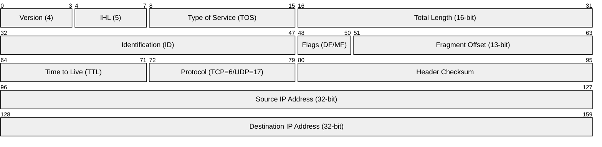
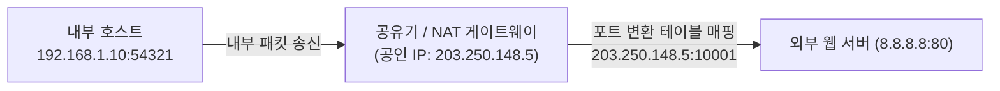

> [!abstract] 핵심 요약
> **네트워크 계층(Network Layer)**은 패킷이 발신지에서 목적지 호스트까지 최적의 경로를 거쳐 안전하게 도달하도록 논리적 주소 지정과 라우팅을 수행한다.
> 패킷 루핑을 방지하는 **TTL(Time-To-Live)**과 MTU 초과 시 분할을 위한 **단편화(Fragmentation)** 메커니즘, 주소 고갈을 막기 위한 **CIDR 서브네팅($/24$)** 및 **NAT(NAPT)**, 논리적 IP를 물리적 MAC 주소로 변환하는 **ARP**, 그리고 네트워크 오류 진단 프로토콜인 **ICMP(ping / traceroute)**는 인터넷 통신의 기둥이다.

---

## 1. IPv4 20-Byte 기본 헤더 구조



---

## 2. CIDR 서브네팅(Subnetting) 계산 공식

- 전체 주소 공간: $32\text{ bits}$
- 프리픽스 길이: $/n$ (네트워크 비트 수 $n$, 호스트 비트 수 $h = 32 - n$)
- 서브넷당 총 IP 수: $2^h$
- **가용 호스트 수**: $2^h - 2$ *(네트워크 주소 및 브로드캐스트 주소 제외)*

---

## 3. 사설 IP 대역과 NAT(Network Address Translation)



---

## 4. 실시간 IPv4 CIDR 서브네팅 & 가용 호스트 계산기

```html preview
<div style="font-family:system-ui,-apple-system,sans-serif;padding:20px;background:var(--card);color:var(--card-foreground);border:1px solid var(--border);border-radius:var(--radius)">
  <div style="font-size:16px;font-weight:700;margin-bottom:14px;color:var(--primary);display:flex;align-items:center;gap:8px">
    <span>🌐 IPv4 CIDR 서브넷 마스크 & 가용 호스트 실시간 계산기</span>
  </div>

  <div style="display:grid;grid-template-columns:2fr 1fr;gap:12px;margin-bottom:14px">
    <div>
      <label style="font-size:11px;color:var(--muted-foreground)">IP 주소 (IP Address):</label>
      <input id="inSubnetIp" type="text" value="192.168.10.0" style="width:100%;padding:4px 8px;background:var(--background);color:var(--foreground);border:1px solid var(--border);border-radius:var(--radius);font-family:monospace;font-size:12px;font-weight:700" />
    </div>
    <div>
      <label style="font-size:11px;color:var(--muted-foreground)">CIDR 프리픽스 (/n):</label>
      <input id="inCidrPrefix" type="number" value="26" min="8" max="30" style="width:100%;padding:4px 8px;background:var(--background);color:var(--foreground);border:1px solid var(--border);border-radius:var(--radius);font-weight:700" />
    </div>
  </div>

  <div style="display:grid;grid-template-columns:1fr 1fr;gap:12px;margin-bottom:12px">
    <div style="padding:10px;background:var(--background);border:1px solid var(--border);border-radius:var(--radius)">
      <div style="font-size:10px;color:var(--muted-foreground)">서브넷 마스크 (Subnet Mask)</div>
      <div id="maskOut" style="font-family:monospace;font-size:14px;font-weight:800;color:var(--chart-1);margin-top:2px">255.255.255.192</div>
    </div>
    <div style="padding:10px;background:var(--background);border:1px solid var(--border);border-radius:var(--radius)">
      <div style="font-size:10px;color:var(--muted-foreground)">실제 할당 가능 호스트 수 (2^h - 2)</div>
      <div id="hostCountOut" style="font-family:monospace;font-size:16px;font-weight:800;color:var(--primary);margin-top:2px">62 대</div>
    </div>
  </div>

  <div id="subnetRangeDesc" style="padding:10px;background:var(--background);border:1px solid var(--border);border-radius:var(--radius);font-family:monospace;font-size:11px">
    네트워크 주소: 192.168.10.0 | 브로드캐스트 주소: 192.168.10.63
  </div>

  <script>
    function updateSubnet() {
      var prefix = parseInt(document.getElementById('inCidrPrefix').value) || 26;
      var h = 32 - prefix;
      var totalIps = Math.pow(2, h);
      var usableHosts = totalIps - 2;

      var maskNum = 0;
      for (var i = 0; i < prefix; i++) {
        maskNum = (maskNum << 1) | 1;
      }
      maskNum = maskNum << h;

      var m1 = (maskNum >>> 24) & 255;
      var m2 = (maskNum >>> 16) & 255;
      var m3 = (maskNum >>> 8) & 255;
      var m4 = maskNum & 255;

      document.getElementById('maskOut').textContent = m1 + "." + m2 + "." + m3 + "." + m4;
      document.getElementById('hostCountOut').textContent = usableHosts.toLocaleString() + " 대 (" + totalIps + " IPs)";
      document.getElementById('subnetRangeDesc').textContent = "호스트 범위: .1 ~ ." + (totalIps - 2) + " | 브로드캐스트: ." + (totalIps - 1);
    }

    document.getElementById('inCidrPrefix').addEventListener('input', updateSubnet);
    updateSubnet();
  </script>
</div>
```
