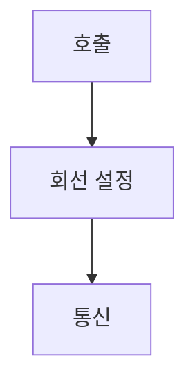

> [!abstract] 한 줄 요약
> 회선 교환은 통신 전에 연결을 설정하고 ==회선==을 독점해 사용한다.

## 이 노트의 지도



## 핵심 개념

강의는 교환원이 전선을 바꿔 상대방을 연결하던 방식에서 회선 교환의 의미를 설명한다.

> [!important] 핵심 규칙
> 전화망은 통신 시작 전에 통신 합의와 콜셋업이 필요하며 독점 사용·시간당 과금 특징을 가진다.

$$
\text{통신}=\text{call setup}\rightarrow\text{회선 사용}
$$

<details>
<summary>자동식 교환</summary>

전자식 교환기는 전화번호에 해당하는 회선을 자동으로 연결하며 이런 네트워크를 회선 교환망이라 부른다.

</details>

<Tabs>
  <Tab label="수동식">교환원이 전선을 바꿔 꽂아 연결한다.</Tab>
  <Tab label="자동식">전화번호에 따라 전자식 교환기가 회선을 연결한다.</Tab>
</Tabs>

> [!tip] 적용 단서
> 통신 시작 전에 ==연결 설정==이 필요한지로 회선 교환의 특징을 읽는다.

## 핵심 단서

```html preview
<div style="font-family:system-ui,sans-serif;padding:20px;display:flex;align-items:center;gap:20px;color:var(--foreground)"><svg width="120" height="120" viewBox="0 0 120 120" role="img" aria-label="교환 방식"><circle cx="60" cy="60" r="46" stroke-width="14" style="fill:none;stroke:var(--border)"/><circle cx="60" cy="60" r="46" stroke-width="14" stroke-linecap="round" stroke-dasharray="289" stroke-dashoffset="0" transform="rotate(-90 60 60)" style="fill:none;stroke:var(--chart-1)"/><text x="60" y="67" text-anchor="middle" font-size="22" font-weight="700" style="fill:var(--foreground)">2</text></svg><div><div style="font-weight:600;font-size:15px">교환 방식</div><div style="font-size:13px;color:var(--muted-foreground);margin-top:2px">수동식·자동식 2/2</div></div></div>
```

$$
\text{PSTN}=\text{회선 교환 전화망}
$$

<details>
<summary>전화망</summary>

자동식 회선 교환 방식을 사용하는 전화망을 공중 교환 전화망으로 소개한다.

</details>

<details>
<summary>교환의 의미</summary>

회선과 switching이라는 말은 연결할 전선을 바꾼다는 설명에서 출발한다.

</details>

> [!question]- 스스로 점검
> **Q.** 회선 교환에서 콜셋업이 먼저 필요한 이유는 무엇인가?
>
> **A.** 통신에 사용할 회선을 시작 전에 연결·합의해야 하기 때문이다.

## 작성 경계

> [!warning] 출처 경계
> 제공된 추출 텍스트만 사용했으며 원본 시각자료·첨부물·페이지 표기는 넣지 않았다.

---

## 원본 강의 흐름 인터랙티브

```html preview
<div style="font-family:system-ui,sans-serif;padding:20px;color:var(--foreground)">
  <label for="noteFlow110064" style="font-size:14px;font-weight:600">통신망과 특징 단계</label>
  <div id="noteFlow110064-out" style="font-size:26px;font-weight:700;color:var(--chart-1);margin:6px 0">통신망과 특징 핵심 개념</div>
  <input id="noteFlow110064" type="range" min="1" max="3" step="1" value="1" style="width:100%;accent-color:var(--primary)" />
  <p style="font-size:13px;color:var(--muted-foreground)">슬라이더를 움직이면 원본 PDF에서 정리한 이 노트의 흐름을 확인합니다.</p>
  <script>
    var noteFlow110064 = document.getElementById('noteFlow110064');
    var noteFlow110064Out = document.getElementById('noteFlow110064-out');
    var noteFlow110064Steps = ["통신망과 특징 핵심 개념","통신망과 특징 처리 절차","통신망과 특징 검증·응용"];
    noteFlow110064.addEventListener('input', function () { noteFlow110064Out.textContent = noteFlow110064Steps[Number(noteFlow110064.value) - 1]; });
  </script>
</div>
```
