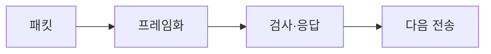

> [!abstract] 한 줄 요약
> 데이터 링크 계층은 패킷에 프레임 형식을 더하고, 경계·오류·재전송을 관리해 같은 LAN 안의 전달을 돕는다.



> [!info] 핵심 원리
> 동기식 전송은 시작과 끝을 알리는 표식을 사용한다. 데이터 내부에 표식과 같은 패턴이 나타날 수 있으므로 문자 스터핑이나 비트 스터핑으로 경계를 보호한다.

## 신뢰성과 속도의 조절

ACK와 일련번호는 손실·중복·지연 상황에서 어떤 프레임을 확인하거나 다시 보낼지 판단하게 한다. Stop-and-Wait는 단순하지만 기다리는 시간이 커질 수 있고, 슬라이딩 윈도우는 확인을 기다리지 않고 여러 프레임을 보낼 수 있게 한다. ARQ 방식은 재전송 범위와 수신 버퍼의 요구가 서로 다르다.

```html preview
<div style="padding: 14px; border: 1px solid var(--border); border-radius: 14px; background: var(--card);">
  <div style="font-weight: 700; color: var(--foreground); margin-bottom: 8px;">06. 데이터 링크 계층의 작업의 흐름</div>
  <svg viewBox="0 0 560 130" role="img" aria-label="패킷에서 헤더에서 ACK에서 윈도우 흐름" style="width: 100%; height: auto;">
    <g transform="translate(16 44)"><rect width="118" height="54" rx="10" style="fill: var(--background); stroke: var(--chart-1); stroke-width: 2"></rect><text x="59" y="32" text-anchor="middle" style="fill: var(--foreground); font-size: 13px; font-family: sans-serif">패킷</text></g><path d="M134 71 H150" style="stroke: var(--muted-foreground); stroke-width: 2; fill: none"></path><g transform="translate(152 44)"><rect width="118" height="54" rx="10" style="fill: var(--background); stroke: var(--chart-2); stroke-width: 2"></rect><text x="59" y="32" text-anchor="middle" style="fill: var(--foreground); font-size: 13px; font-family: sans-serif">헤더</text></g><path d="M270 71 H286" style="stroke: var(--muted-foreground); stroke-width: 2; fill: none"></path><g transform="translate(288 44)"><rect width="118" height="54" rx="10" style="fill: var(--background); stroke: var(--chart-3); stroke-width: 2"></rect><text x="59" y="32" text-anchor="middle" style="fill: var(--foreground); font-size: 13px; font-family: sans-serif">ACK</text></g><path d="M406 71 H422" style="stroke: var(--muted-foreground); stroke-width: 2; fill: none"></path><g transform="translate(424 44)"><rect width="118" height="54" rx="10" style="fill: var(--background); stroke: var(--chart-4); stroke-width: 2"></rect><text x="59" y="32" text-anchor="middle" style="fill: var(--foreground); font-size: 13px; font-family: sans-serif">윈도우</text></g>
    <text x="16" y="120" style="fill: var(--muted-foreground); font-size: 12px; font-family: sans-serif;">각 상자는 역할을, 화살표는 처리 순서를 나타낸다.</text>
  </svg>
</div>
```

<Tabs>
<Tab label="경계">
프리앰블·포스트앰블과 스터핑으로 프레임의 범위를 구분한다.
</Tab>
<Tab label="확인">
ACK와 일련번호로 수신·중복 여부를 판단한다.
</Tab>
<Tab label="흐름">
윈도우 크기는 확인 없이 보낼 수 있는 프레임의 수를 정한다.
</Tab>
</Tabs>

> [!note] 연결해서 생각하기
> 데이터 링크 계층은 패킷에 프레임 형식을 더하고, 경계·오류·재전송을 관리해 같은 LAN 안의 전달을 돕는다. 이 관점으로 보면, 용어를 개별 정의가 아니라 전달 과정의 어느 지점에 놓이는지로 정리할 수 있다.

<details>
<summary>스스로 점검하기</summary>

1. 프레임과 패킷을 구분한다.
2. 스터핑이 필요한 상황을 설명한다.
3. Stop-and-Wait와 슬라이딩 윈도우의 차이를 말한다.

</details>

> [!warning] 원문 오류
> 추출 원문에는 `error corection code` 표기가 있다. 이 노트는 해당 원문 표기를 고치지 않고 오류임만 기록한다.
