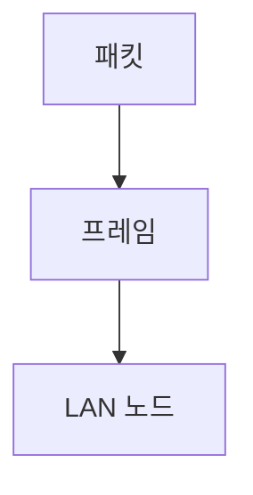

> [!abstract] 한 줄 요약
> 데이터 링크 계층은 패킷에 헤더를 붙여 ==프레임==을 만들고 LAN 노드에 전달한다.

## 이 노트의 지도



## 핵심 개념

강의는 데이터 링크 계층이 물리 계층을 이용해 LAN에 속한 노드에 데이터를 전송한다고 설명한다.

> [!important] 핵심 규칙
> 네트워크 계층 패킷에 링크 계층 헤더를 붙여 만든 데이터 단위가 프레임이다.

$$
\text{프레임}=\text{패킷}+\text{링크 계층 헤더}
$$

<details>
<summary>동기식 전송</summary>

동기식 전송은 프레임을 보내기 전에 전송 시작을 알리며, 강의는 현재 동기식 전송을 사용한다고 설명한다.

</details>

<Tabs>
  <Tab label="비동기식">예고 없이 데이터를 보내는 방식으로 제시된다.</Tab>
  <Tab label="동기식">시작을 알린 뒤 프레임을 보내는 방식이다.</Tab>
</Tabs>

> [!tip] 적용 단서
> 프레임 경계에서는 ==시작과 끝==을 알리는 신호가 필요하다.

## 핵심 단서

```html preview
<div style="font-family:system-ui,sans-serif;padding:20px"><div id="cards" style="display:flex;gap:14px;flex-wrap:wrap"></div><script>
var stats=[["상위 단위","패킷","네트워크 계층","var(--chart-2)"],["링크 단위","프레임","헤더 추가","var(--chart-1)"],["경계","플래그","시작·끝","var(--chart-5)"]];document.getElementById('cards').innerHTML=stats.map(function(s){return '<div style="flex:1;min-width:150px;padding:16px;background:var(--card);color:var(--card-foreground);border:1px solid var(--border);border-radius:var(--radius)"><div style="font-size:13px;color:var(--muted-foreground)">'+s[0]+'</div><div style="font-size:26px;font-weight:700;margin-top:4px">'+s[1]+'</div><div style="font-size:12px;font-weight:600;margin-top:4px;color:'+s[3]+'">'+s[2]+'</div></div>';}).join('');
</script></div>
```

$$
\text{동기식}=\text{시작 신호}+\text{프레임}
$$

<details>
<summary>프리앰블과 포스트앰블</summary>

강의는 앞의 플래그를 프리앰블, 뒤의 플래그를 포스트앰블이라 부른다.

</details>

<details>
<summary>계층 연결</summary>

링크 계층은 네트워크 계층이 보낸 패킷을 받아 물리 계층으로 전달한다.

</details>

> [!question]- 스스로 점검
> **Q.** 패킷과 프레임을 구분하는 이유는 무엇인가?
>
> **A.** 프레임은 LAN 전달을 위해 패킷에 링크 계층 헤더를 붙인 단위이기 때문이다.

## 작성 경계

> [!warning] 출처 경계
> 제공된 추출 텍스트만 사용했으며 원본 시각자료·첨부물·페이지 표기는 넣지 않았다.

---

## 원본 강의 흐름 인터랙티브

```html preview
<div style="font-family:system-ui,sans-serif;padding:20px;color:var(--foreground)">
  <label for="noteFlow242595" style="font-size:14px;font-weight:600">데이터 링크 계층의 작업 단계</label>
  <div id="noteFlow242595-out" style="font-size:26px;font-weight:700;color:var(--chart-1);margin:6px 0">데이터 링크 계층의 작업 핵심 개념</div>
  <input id="noteFlow242595" type="range" min="1" max="3" step="1" value="1" style="width:100%;accent-color:var(--primary)" />
  <p style="font-size:13px;color:var(--muted-foreground)">슬라이더를 움직이면 원본 PDF에서 정리한 이 노트의 흐름을 확인합니다.</p>
  <script>
    var noteFlow242595 = document.getElementById('noteFlow242595');
    var noteFlow242595Out = document.getElementById('noteFlow242595-out');
    var noteFlow242595Steps = ["데이터 링크 계층의 작업 핵심 개념","데이터 링크 계층의 작업 처리 절차","데이터 링크 계층의 작업 검증·응용"];
    noteFlow242595.addEventListener('input', function () { noteFlow242595Out.textContent = noteFlow242595Steps[Number(noteFlow242595.value) - 1]; });
  </script>
</div>
```
