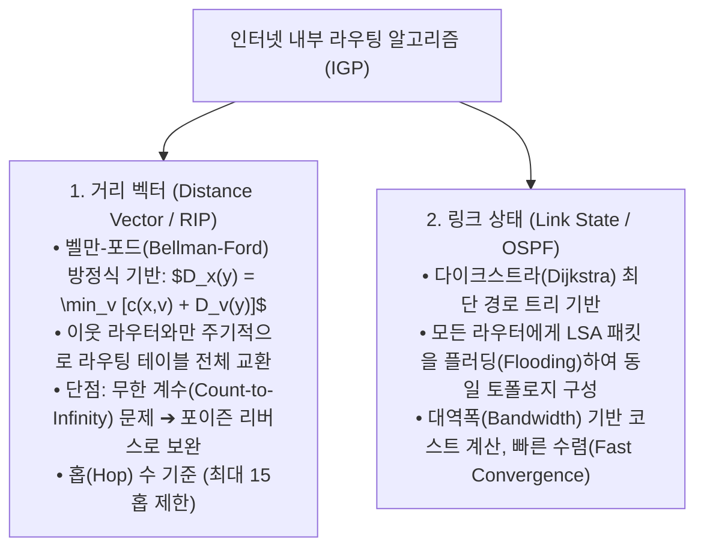
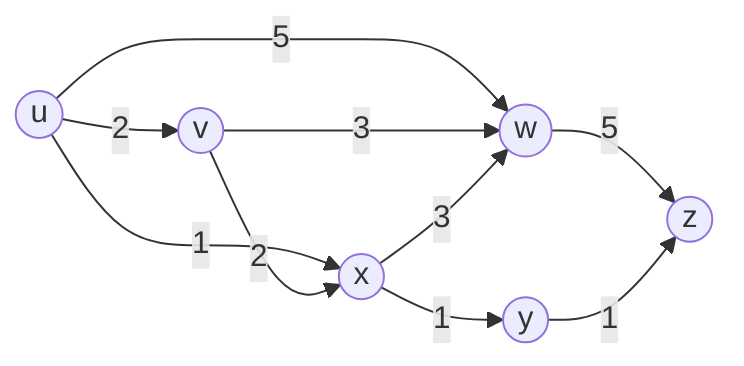

> [!abstract] 핵심 요약
> **라우팅(Routing)**은 패킷이 목적지까지 이동할 최적의 전체 경로를 결정하는 제어 평면(Control Plane)의 알고리즘이다.
> 이웃 노드와만 비용을 교환하는 **거리 벡터(Distance Vector / Bellman-Ford / RIP)**와 전체 네트워크 토폴로지를 공유한 후 각자 최단 트리를 계산하는 **링크 상태(Link State / Dijkstra / OSPF)**의 수렴 속도 및 루프 방지 원리를 비교하고, 전 세계 인터넷을 연결하는 **AS 간 외부 라우팅 BGP**를 이해하는 것이 핵심이다.

---

## 1. 거리 벡터(RIP) vs 링크 상태(OSPF) 알고리즘 비교



---

## 2. 다이크스트라 최단 경로 탐색 다이어그램



---

## 3. 실시간 다이크스트라(Dijkstra) 최단 경로 비용 계산기

```html preview
<div style="font-family:system-ui,-apple-system,sans-serif;padding:20px;background:var(--card);color:var(--card-foreground);border:1px solid var(--border);border-radius:var(--radius)">
  <div style="font-size:16px;font-weight:700;margin-bottom:14px;color:var(--primary);display:flex;align-items:center;gap:8px">
    <span>🗺️ 링크 상태(OSPF) 다이크스트라 최단 경로(Shortest Path) 계산기</span>
  </div>

  <div style="display:flex;gap:10px;align-items:center;margin-bottom:14px">
    <label style="font-size:11px;font-weight:700">출발 라우터:</label>
    <select id="startRouterSelect" style="padding:4px 8px;background:var(--background);color:var(--foreground);border:1px solid var(--border);border-radius:var(--radius);font-weight:700">
      <option value="u">Router U</option>
      <option value="v">Router V</option>
      <option value="x">Router X</option>
    </select>
    <button id="runDijkstraBtn" style="padding:6px 14px;background:var(--primary);color:#fff;border:none;border-radius:var(--radius);font-size:11px;font-weight:700;cursor:pointer">최단 경로 트리(SPT) 계산</button>
  </div>

  <div style="overflow-x:auto;background:var(--background);border:1px solid var(--border);border-radius:var(--radius);padding:8px;margin-bottom:10px">
    <table style="width:100%;border-collapse:collapse;font-size:11px;font-family:monospace;text-align:center">
      <thead style="border-bottom:1px solid var(--border);color:var(--muted-foreground)">
        <tr><th>목적지 노드</th><th>최소 비용 (Cost)</th><th>최단 경로 (Path)</th></tr>
      </thead>
      <tbody id="sptTableBody">
        <tr><td>Router V</td><td>2</td><td>U ➔ V</td></tr>
        <tr><td>Router X</td><td>1</td><td>U ➔ X</td></tr>
        <tr><td>Router Y</td><td>2</td><td>U ➔ X ➔ Y</td></tr>
        <tr><td>Router Z</td><td>3</td><td>U ➔ X ➔ Y ➔ Z</td></tr>
      </tbody>
    </table>
  </div>

  <div style="font-size:11px;color:var(--muted-foreground)">
    💡 목적지 Z까지 U ➔ W ➔ Z (비용 10) 대신 U ➔ X ➔ Y ➔ Z (비용 3) 최단 경로를 탐색하여 라우팅 테이블을 완성합니다.
  </div>

  <script>
    document.getElementById('runDijkstraBtn').onclick = function() {
      var start = document.getElementById('startRouterSelect').value;
      var tbody = document.getElementById('sptTableBody');

      if (start === 'u') {
        tbody.innerHTML = "<tr><td>Router V</td><td>2</td><td>U ➔ V</td></tr>" +
          "<tr><td>Router X</td><td>1</td><td>U ➔ X</td></tr>" +
          "<tr><td>Router Y</td><td>2</td><td>U ➔ X ➔ Y</td></tr>" +
          "<tr><td>Router Z</td><td>3</td><td>U ➔ X ➔ Y ➔ Z</td></tr>";
      } else if (start === 'x') {
        tbody.innerHTML = "<tr><td>Router U</td><td>1</td><td>X ➔ U</td></tr>" +
          "<tr><td>Router Y</td><td>1</td><td>X ➔ Y</td></tr>" +
          "<tr><td>Router Z</td><td>2</td><td>X ➔ Y ➔ Z</td></tr>" +
          "<tr><td>Router V</td><td>2</td><td>X ➔ V</td></tr>";
      } else {
        tbody.innerHTML = "<tr><td>Router U</td><td>2</td><td>V ➔ U</td></tr>" +
          "<tr><td>Router X</td><td>2</td><td>V ➔ X</td></tr>" +
          "<tr><td>Router Y</td><td>3</td><td>V ➔ X ➔ Y</td></tr>" +
          "<tr><td>Router Z</td><td>4</td><td>V ➔ X ➔ Y ➔ Z</td></tr>";
      }
    };
  </script>
</div>
```
