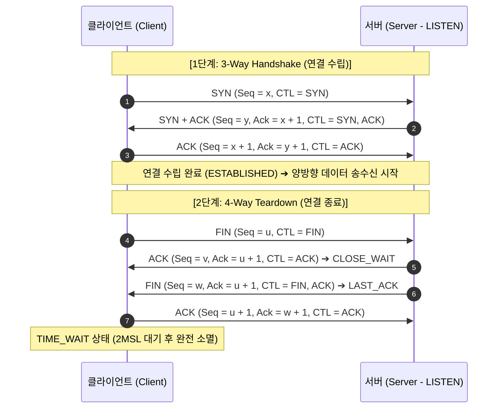
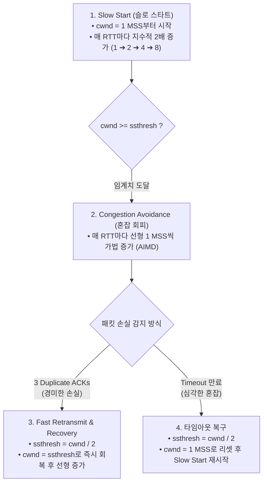

> [!abstract] 핵심 요약
> **전송 계층(Transport Layer)**은 비신뢰적인 IP 네트워크 위에서 애플리케이션 프로세스 간(End-to-End)의 신뢰성 있는 양방향 데이터 스트림 통신을 제공한다.
> 연결 수립을 위한 **3-Way Handshake(SYN/ACK)**와 종료 시 잔여 패킷을 처리하는 **4-Way Teardown(TIME_WAIT)**, 수신측 버퍼 오버플로를 방지하는 **흐름 제어(Flow Control - rwnd)**, 그리고 네트워크 붕괴를 막기 위해 $cwnd$를 동적으로 제어하는 **혼잡 제어(Congestion Control - AIMD, Slow Start)**는 인터넷의 핵심 엔진이다.

---

## 1. TCP 3-Way Handshake & 4-Way Teardown



---

## 2. TCP 혼잡 제어(Congestion Control) 메커니즘

$$\text{Effective Window} = \min(cwnd, rwnd)$$



---

## 3. 실시간 TCP 혼잡 윈도우(CWND) 변화 시뮬레이터

```html preview
<div style="font-family:system-ui,-apple-system,sans-serif;padding:20px;background:var(--card);color:var(--card-foreground);border:1px solid var(--border);border-radius:var(--radius)">
  <div style="font-size:16px;font-weight:700;margin-bottom:14px;color:var(--primary);display:flex;align-items:center;gap:8px">
    <span>📈 TCP 혼잡 제어 윈도우(CWND) 실시간 추적기</span>
  </div>

  <div style="display:flex;gap:8px;align-items:center;margin-bottom:12px">
    <button id="btnRttPass" style="padding:6px 12px;background:var(--primary);color:#fff;border:none;border-radius:var(--radius);font-weight:700;cursor:pointer">1 RTT 경과 (ACK 수신)</button>
    <button id="btnDupAck" style="padding:6px 12px;background:var(--chart-1);color:#fff;border:none;border-radius:var(--radius);font-weight:700;cursor:pointer">3 Dup ACKs 발생</button>
    <button id="btnTimeout" style="padding:6px 12px;background:var(--destructive,#ef4444);color:#fff;border:none;border-radius:var(--radius);font-weight:700;cursor:pointer">Timeout 발생</button>
    <button id="btnResetCwnd" style="padding:6px 10px;background:var(--muted);color:var(--foreground);border:1px solid var(--border);border-radius:var(--radius);font-size:11px;cursor:pointer">초기화</button>
  </div>

  <div style="display:grid;grid-template-columns:repeat(3, 1fr);gap:10px;margin-bottom:12px">
    <div style="padding:10px;background:var(--background);border:1px solid var(--border);border-radius:var(--radius);text-align:center">
      <div style="font-size:10px;color:var(--muted-foreground)">현재 cwnd 크기</div>
      <div id="cwndOut" style="font-family:monospace;font-size:16px;font-weight:800;color:var(--primary);margin-top:2px">1 MSS</div>
    </div>
    <div style="padding:10px;background:var(--background);border:1px solid var(--border);border-radius:var(--radius);text-align:center">
      <div style="font-size:10px;color:var(--muted-foreground)">임계값 (ssthresh)</div>
      <div id="ssthreshOut" style="font-family:monospace;font-size:16px;font-weight:800;color:var(--chart-2);margin-top:2px">16 MSS</div>
    </div>
    <div style="padding:10px;background:var(--background);border:1px solid var(--border);border-radius:var(--radius);text-align:center">
      <div style="font-size:10px;color:var(--muted-foreground)">현재 동작 단계</div>
      <div id="tcpPhaseOut" style="font-size:12px;font-weight:800;color:var(--chart-1);margin-top:4px">Slow Start (지수증가)</div>
    </div>
  </div>

  <div id="cwndLogDesc" style="padding:10px;background:var(--background);border:1px solid var(--border);border-radius:var(--radius);font-size:11px">
    연결 시작: Slow Start 단계에서 cwnd가 1에서 시작하여 매 RTT마다 2배로 증가합니다.
  </div>

  <script>
    var cwnd = 1;
    var ssthresh = 16;

    function updateCwndUI(log) {
      document.getElementById('cwndOut').textContent = cwnd + " MSS";
      document.getElementById('ssthreshOut').textContent = ssthresh + " MSS";

      var phase = (cwnd < ssthresh) ? "Slow Start (지수증가)" : "Congestion Avoidance (가법증가)";
      document.getElementById('tcpPhaseOut').textContent = phase;
      document.getElementById('cwndLogDesc').textContent = log;
    }

    document.getElementById('btnRttPass').onclick = function() {
      if (cwnd < ssthresh) {
        cwnd = cwnd * 2;
        updateCwndUI("⚡ [Slow Start] ACK 수신으로 cwnd가 2배 증가했습니다 (" + cwnd + " MSS).");
      } else {
        cwnd = cwnd + 1;
        updateCwndUI("📈 [Congestion Avoidance] 임계치 도달 후 cwnd가 1 MSS 선형 증가했습니다 (" + cwnd + " MSS).");
      }
    };

    document.getElementById('btnDupAck').onclick = function() {
      ssthresh = Math.max(Math.floor(cwnd / 2), 2);
      cwnd = ssthresh;
      updateCwndUI("🔔 [3 Dup ACKs] 빠른 재전송 트리거! ssthresh = " + ssthresh + ", cwnd = " + cwnd + " MSS로 설정 후 빠른 회복을 시작합니다.");
    };

    document.getElementById('btnTimeout').onclick = function() {
      ssthresh = Math.max(Math.floor(cwnd / 2), 2);
      cwnd = 1;
      updateCwndUI("⛔ [Timeout] 중대한 네트워크 혼잡 감지! ssthresh = " + ssthresh + ", cwnd를 1 MSS로 리셋하고 Slow Start를 재시작합니다.");
    };

    document.getElementById('btnResetCwnd').onclick = function() {
      cwnd = 1;
      ssthresh = 16;
      updateCwndUI("초기화 완료: Slow Start 1 MSS");
    };
  </script>
</div>
```
