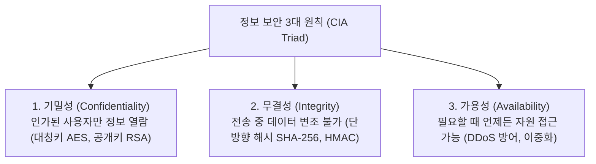
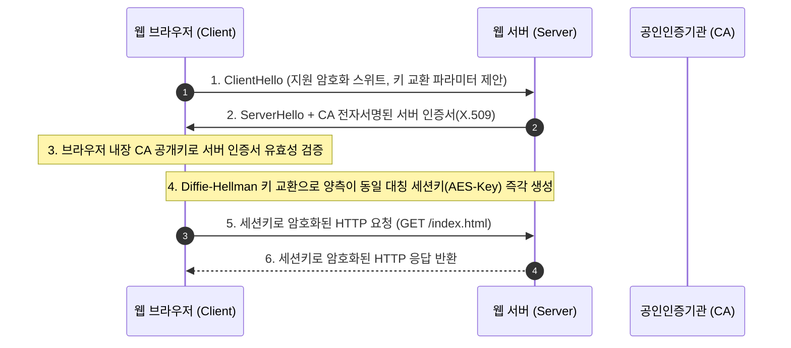

> [!abstract] 핵심 요약
> 개방형 분산 네트워크에서 도청, 변조, 위장을 방지하기 위한 **네트워크 보안(Network Security)**은 필수적이다.
> 기밀성을 보장하는 고속 **대칭키(AES)**와 키 배송 문제를 해결하는 **공개키(RSA)**의 하이브리드 결합, 무결성과 부인 방지를 위한 **해시(SHA-256) 기반 전자서명**, 그리고 인증서 검증과 세션키를 수립하는 **SSL/TLS 1.3 핸드셰이크(HTTPS)** 프로토콜 스택을 체계적으로 이해해야 한다.

---

## 1. 보안 3대 요소(CIA)와 암호화 알고리즘 비교



| 구분 | 대칭키 암호화 (Symmetric) | 비대칭키 / 공개키 암호화 (Asymmetric) |
| :-- | :-- | :-- |
| **키 구조** | 암복호화에 **동일한 비밀키** 1개 사용 | **공개키(Public)** + **개인키(Private)** 쌍 사용 |
| **대표 알고리즘** | **AES-256**, ChaCha20, DES/3DES | **RSA**, ECC, Diffie-Hellman |
| **연산 속도** | **초고속** (대용량 데이터 스트림 암호화) | 상대적으로 느림 (키 교환 및 서명에 국한) |
| **주요 난제** | 사전에 키를 안전하게 전달해야 하는 키 배송 문제 | 공개키가 진짜 상대방의 것인지 증명 필요 (CA 인증서) |

---

## 2. SSL/TLS 1.3 하이브리드 핸드셰이크 흐름 (HTTPS)



---

## 3. 실시간 RSA 공개키 암복호화 & 전자서명 시뮬레이터

```html preview
<div style="font-family:system-ui,-apple-system,sans-serif;padding:20px;background:var(--card);color:var(--card-foreground);border:1px solid var(--border);border-radius:var(--radius)">
  <div style="font-size:16px;font-weight:700;margin-bottom:14px;color:var(--primary);display:flex;align-items:center;gap:8px">
    <span>🔐 공개키 암호화 & 전자서명 원리 대화형 시뮬레이터</span>
  </div>

  <div style="margin-bottom:12px">
    <label style="font-size:11px;color:var(--muted-foreground)">송신 평문 메시지 (Plaintext):</label>
    <input id="inSecMsg" type="text" value="Secret Network Payload" style="width:100%;padding:4px 8px;background:var(--background);color:var(--foreground);border:1px solid var(--border);border-radius:var(--radius);font-family:monospace;font-size:12px;font-weight:700" />
  </div>

  <div style="display:flex;gap:8px;margin-bottom:12px">
    <button id="btnEncryptPub" style="flex:1;padding:6px;background:var(--primary);color:#fff;border:none;border-radius:var(--radius);font-weight:700;cursor:pointer">1. 공개키로 암호화 (기밀성)</button>
    <button id="btnSignPriv" style="flex:1;padding:6px;background:var(--chart-1);color:#fff;border:none;border-radius:var(--radius);font-weight:700;cursor:pointer">2. 개인키로 전자서명 (인증/무결성)</button>
  </div>

  <div style="padding:10px;background:var(--background);border:1px solid var(--border);border-radius:var(--radius)">
    <div style="font-size:10px;color:var(--muted-foreground);margin-bottom:4px">변환 결과 출력:</div>
    <div id="secResultOut" style="font-family:monospace;font-size:11px;word-break:break-all;color:var(--card-foreground);line-height:1.5">
      버튼을 클릭하여 암호화 또는 서명을 수행하세요.
    </div>
  </div>

  <script>
    document.getElementById('btnEncryptPub').onclick = function() {
      var msg = document.getElementById('inSecMsg').value;
      var out = document.getElementById('secResultOut');
      out.innerHTML = "<span style='color:var(--primary);font-weight:700'>[암호화 완료 - 수신자 공개키 적용]</span><br/>" +
        "암호문: <code>" + btoa(msg).split('').reverse().join('') + "98e4f1a20b==</code><br/>" +
        "💡 오직 수신자의 개인키(Private Key)로만 원본을 복호화할 수 있습니다 (기밀성 보장).";
    };

    document.getElementById('btnSignPriv').onclick = function() {
      var msg = document.getElementById('inSecMsg').value;
      var out = document.getElementById('secResultOut');
      out.innerHTML = "<span style='color:var(--chart-1);font-weight:700'>[전자서명 생성 - 송신자 개인키 적용]</span><br/>" +
        "SHA-256 해시: <code>e3b0c44298fc1c149afbf4c8996fb92427ae41e4649b934ca495991b7852b855</code><br/>" +
        "전자서명: <code>SIG_" + btoa(msg) + "</code><br/>" +
        "💡 송신자의 공개키로 서명을 검증하여 데이터가 전송 중 변조되지 않았음을 입증합니다 (부인 방지).";
    };
  </script>
</div>
```
