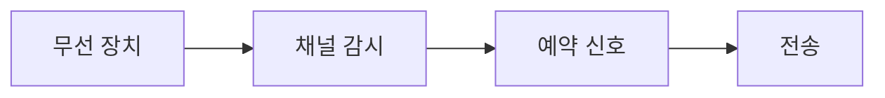

> [!abstract] 한 줄 요약
> 무선 네트워크는 같은 전파 공간을 공유하므로, 보이지 않는 송신자까지 고려하는 충돌 회피가 필요하다.



> [!info] 핵심 원리
> 와이파이는 IEEE 802.11 기반의 무선 근거리 네트워크다. 공유기는 하나의 LAN에 속한 장치를 무선으로 연결하게 하며, 와이파이 규격은 서로 다른 대역과 세대를 가진다.

## 들리지 않는 송신자의 문제

무선 환경에서는 한 장치가 다른 장치의 신호를 듣지 못할 수 있다. 그래서 숨겨진 호스트가 같은 수신자에게 전송해 충돌하는 문제가 생긴다. CSMA/CA는 채널 감시와 RTS·CTS 신호를 사용해 다른 장치가 일정 시간 전송을 피하도록 돕는다. 블루투스는 개인 작업 공간의 가까운 장치를 연결하는 무선 개인 통신망의 예다.

```html preview
<div style="padding: 14px; border: 1px solid var(--border); border-radius: 14px; background: var(--card);">
  <div style="font-weight: 700; color: var(--foreground); margin-bottom: 8px;">08. 무선통신 시스템의 흐름</div>
  <svg viewBox="0 0 560 130" role="img" aria-label="감시에서 RTS에서 CTS에서 전송 흐름" style="width: 100%; height: auto;">
    <g transform="translate(16 44)"><rect width="118" height="54" rx="10" style="fill: var(--background); stroke: var(--chart-1); stroke-width: 2"></rect><text x="59" y="32" text-anchor="middle" style="fill: var(--foreground); font-size: 13px; font-family: sans-serif">감시</text></g><path d="M134 71 H150" style="stroke: var(--muted-foreground); stroke-width: 2; fill: none"></path><g transform="translate(152 44)"><rect width="118" height="54" rx="10" style="fill: var(--background); stroke: var(--chart-2); stroke-width: 2"></rect><text x="59" y="32" text-anchor="middle" style="fill: var(--foreground); font-size: 13px; font-family: sans-serif">RTS</text></g><path d="M270 71 H286" style="stroke: var(--muted-foreground); stroke-width: 2; fill: none"></path><g transform="translate(288 44)"><rect width="118" height="54" rx="10" style="fill: var(--background); stroke: var(--chart-3); stroke-width: 2"></rect><text x="59" y="32" text-anchor="middle" style="fill: var(--foreground); font-size: 13px; font-family: sans-serif">CTS</text></g><path d="M406 71 H422" style="stroke: var(--muted-foreground); stroke-width: 2; fill: none"></path><g transform="translate(424 44)"><rect width="118" height="54" rx="10" style="fill: var(--background); stroke: var(--chart-4); stroke-width: 2"></rect><text x="59" y="32" text-anchor="middle" style="fill: var(--foreground); font-size: 13px; font-family: sans-serif">전송</text></g>
    <text x="16" y="120" style="fill: var(--muted-foreground); font-size: 12px; font-family: sans-serif;">각 상자는 역할을, 화살표는 처리 순서를 나타낸다.</text>
  </svg>
</div>
```

<Tabs>
<Tab label="와이파이">
근거리 LAN 연결을 무선으로 확장한다.
</Tab>
<Tab label="충돌 회피">
채널 감시와 예약 신호로 전송 시점을 조정한다.
</Tab>
<Tab label="블루투스">
가까운 개인 작업 공간의 장치 연결에 초점을 둔다.
</Tab>
</Tabs>

> [!note] 연결해서 생각하기
> 무선 네트워크는 같은 전파 공간을 공유하므로, 보이지 않는 송신자까지 고려하는 충돌 회피가 필요하다. 이 관점으로 보면, 용어를 개별 정의가 아니라 전달 과정의 어느 지점에 놓이는지로 정리할 수 있다.

<details>
<summary>스스로 점검하기</summary>

1. 숨겨진 호스트 문제가 왜 생기는지 말한다.
2. CSMA/CD와 CSMA/CA를 같은 방식으로 부르지 않는다.
3. RTS·CTS의 목적을 설명한다.

</details>

> [!tip] 학습 점검
> 무선에서는 ‘채널이 비어 보인다’와 ‘다른 송신자가 없다’를 같은 판단으로 놓지 않는다.
