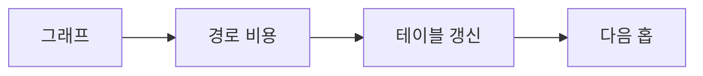

> [!abstract] 한 줄 요약
> 라우팅 알고리즘은 라우터와 링크를 그래프로 보고, 비용이 작은 경로를 찾거나 변화에 맞춰 갱신한다.



> [!info] 핵심 원리
> 정적 라우팅은 주어진 상태에서 목적지로 가는 경로를 찾고, 동적 라우팅은 라우터와 통신선 상태의 변화를 감지해 경로를 바꾼다. 그래프에서 노드는 라우터, 선은 통신선을 나타낸다.

## 알고리즘의 정보 범위

최단 경로 방식은 출발점에서 현재까지의 최소 비용과 이전 경로 정보를 갱신하며 결과로 사이클 없는 경로 구조를 만든다. 거리 벡터 방식은 이웃과 라우팅 테이블을 교환하지만 잘못된 정보가 계속 늘어나는 문제가 생길 수 있다. 연결 상태 방식은 연결 정보를 알리고 최단 경로 계산을 사용하며 일련번호와 나이로 오래된 정보를 가린다.

```html preview
<div style="padding: 14px; border: 1px solid var(--border); border-radius: 14px; background: var(--card);">
  <div style="font-weight: 700; color: var(--foreground); margin-bottom: 8px;">10. 라우팅 알고리즘의 흐름</div>
  <svg viewBox="0 0 560 130" role="img" aria-label="그래프에서 비용에서 갱신에서 다음 홉 흐름" style="width: 100%; height: auto;">
    <g transform="translate(16 44)"><rect width="118" height="54" rx="10" style="fill: var(--background); stroke: var(--chart-1); stroke-width: 2"></rect><text x="59" y="32" text-anchor="middle" style="fill: var(--foreground); font-size: 13px; font-family: sans-serif">그래프</text></g><path d="M134 71 H150" style="stroke: var(--muted-foreground); stroke-width: 2; fill: none"></path><g transform="translate(152 44)"><rect width="118" height="54" rx="10" style="fill: var(--background); stroke: var(--chart-2); stroke-width: 2"></rect><text x="59" y="32" text-anchor="middle" style="fill: var(--foreground); font-size: 13px; font-family: sans-serif">비용</text></g><path d="M270 71 H286" style="stroke: var(--muted-foreground); stroke-width: 2; fill: none"></path><g transform="translate(288 44)"><rect width="118" height="54" rx="10" style="fill: var(--background); stroke: var(--chart-3); stroke-width: 2"></rect><text x="59" y="32" text-anchor="middle" style="fill: var(--foreground); font-size: 13px; font-family: sans-serif">갱신</text></g><path d="M406 71 H422" style="stroke: var(--muted-foreground); stroke-width: 2; fill: none"></path><g transform="translate(424 44)"><rect width="118" height="54" rx="10" style="fill: var(--background); stroke: var(--chart-4); stroke-width: 2"></rect><text x="59" y="32" text-anchor="middle" style="fill: var(--foreground); font-size: 13px; font-family: sans-serif">다음 홉</text></g>
    <text x="16" y="120" style="fill: var(--muted-foreground); font-size: 12px; font-family: sans-serif;">각 상자는 역할을, 화살표는 처리 순서를 나타낸다.</text>
  </svg>
</div>
```

<Tabs>
<Tab label="최단 경로">
작은 비용 후보를 차례로 확정하며 경로 정보를 갱신한다.
</Tab>
<Tab label="거리 벡터">
이웃과 거리 정보를 교환해 테이블을 만든다.
</Tab>
<Tab label="연결 상태">
연결 정보를 공유하고 각자 최단 경로를 계산한다.
</Tab>
</Tabs>

> [!note] 연결해서 생각하기
> 라우팅 알고리즘은 라우터와 링크를 그래프로 보고, 비용이 작은 경로를 찾거나 변화에 맞춰 갱신한다. 이 관점으로 보면, 용어를 개별 정의가 아니라 전달 과정의 어느 지점에 놓이는지로 정리할 수 있다.

<details>
<summary>스스로 점검하기</summary>

1. 그래프의 노드와 선이 무엇을 뜻하는지 말한다.
2. 정적·동적 라우팅의 차이를 설명한다.
3. 거리 벡터의 무한 증가 문제를 요약한다.

</details>

> [!warning] 원문 오류
> 추출 원문에는 `shortest pach` 표기가 있다. 이 노트는 해당 원문 표기를 고치지 않고 오류임만 기록한다.

---

## 원본 강의 흐름 인터랙티브

```html preview
<div style="font-family:system-ui,sans-serif;padding:20px;color:var(--foreground)">
  <label for="noteFlow928499" style="font-size:14px;font-weight:600">라우팅 알고리즘 단계</label>
  <div id="noteFlow928499-out" style="font-size:26px;font-weight:700;color:var(--chart-1);margin:6px 0">라우팅 알고리즘 핵심 개념</div>
  <input id="noteFlow928499" type="range" min="1" max="3" step="1" value="1" style="width:100%;accent-color:var(--primary)" />
  <p style="font-size:13px;color:var(--muted-foreground)">슬라이더를 움직이면 원본 PDF에서 정리한 이 노트의 흐름을 확인합니다.</p>
  <script>
    var noteFlow928499 = document.getElementById('noteFlow928499');
    var noteFlow928499Out = document.getElementById('noteFlow928499-out');
    var noteFlow928499Steps = ["라우팅 알고리즘 핵심 개념","라우팅 알고리즘 처리 절차","라우팅 알고리즘 검증·응용"];
    noteFlow928499.addEventListener('input', function () { noteFlow928499Out.textContent = noteFlow928499Steps[Number(noteFlow928499.value) - 1]; });
  </script>
</div>
```
