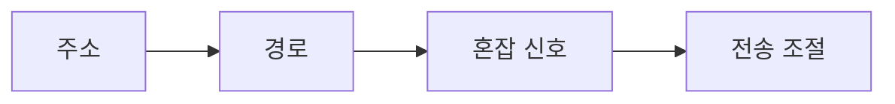

> [!abstract] 한 줄 요약
> IP는 주소와 라우팅을 바탕으로 서로 다른 LAN을 잇고, 혼잡 제어는 전달량과 전송 간격을 조절한다.



> [!info] 핵심 원리
> 네트워크가 요구하는 품질에는 신뢰성, 지연, 지터, 대역폭이 있으며 응용 프로그램마다 우선순위가 다르다. 하나의 지표만 높다고 모든 서비스 요구가 충족되는 것은 아니다.

## 혼잡을 다루는 두 손잡이

혼잡 제어는 혼잡한 구간의 흐름을 바꾸어 부담을 낮추는 작업이다. 전송 창을 줄이거나 패킷 사이의 간격을 조절하면 한 번에 밀어 넣는 양을 바꿀 수 있다. 토큰 버킷은 일정하지 않게 들어오는 패킷을 받아 일정한 간격의 처리로 조절하는 발상으로 소개된다. IP는 주소 체계·도메인 이름·주소 변환·서브넷처럼 전달 주변의 작업도 함께 다룬다.

```html preview
<div style="padding: 14px; border: 1px solid var(--border); border-radius: 14px; background: var(--card);">
  <div style="font-weight: 700; color: var(--foreground); margin-bottom: 8px;">11. 인터넷 프로토콜과 라우팅의 흐름</div>
  <svg viewBox="0 0 560 130" role="img" aria-label="요구에서 경로에서 완충에서 조절 흐름" style="width: 100%; height: auto;">
    <g transform="translate(16 44)"><rect width="118" height="54" rx="10" style="fill: var(--background); stroke: var(--chart-1); stroke-width: 2"></rect><text x="59" y="32" text-anchor="middle" style="fill: var(--foreground); font-size: 13px; font-family: sans-serif">요구</text></g><path d="M134 71 H150" style="stroke: var(--muted-foreground); stroke-width: 2; fill: none"></path><g transform="translate(152 44)"><rect width="118" height="54" rx="10" style="fill: var(--background); stroke: var(--chart-2); stroke-width: 2"></rect><text x="59" y="32" text-anchor="middle" style="fill: var(--foreground); font-size: 13px; font-family: sans-serif">경로</text></g><path d="M270 71 H286" style="stroke: var(--muted-foreground); stroke-width: 2; fill: none"></path><g transform="translate(288 44)"><rect width="118" height="54" rx="10" style="fill: var(--background); stroke: var(--chart-3); stroke-width: 2"></rect><text x="59" y="32" text-anchor="middle" style="fill: var(--foreground); font-size: 13px; font-family: sans-serif">완충</text></g><path d="M406 71 H422" style="stroke: var(--muted-foreground); stroke-width: 2; fill: none"></path><g transform="translate(424 44)"><rect width="118" height="54" rx="10" style="fill: var(--background); stroke: var(--chart-4); stroke-width: 2"></rect><text x="59" y="32" text-anchor="middle" style="fill: var(--foreground); font-size: 13px; font-family: sans-serif">조절</text></g>
    <text x="16" y="120" style="fill: var(--muted-foreground); font-size: 12px; font-family: sans-serif;">각 상자는 역할을, 화살표는 처리 순서를 나타낸다.</text>
  </svg>
</div>
```

<Tabs>
<Tab label="품질">
신뢰성·지연·지터·대역폭을 응용별로 함께 본다.
</Tab>
<Tab label="혼잡">
창 크기와 전송 간격을 조절해 부담을 낮춘다.
</Tab>
<Tab label="주소">
IP·MAC·도메인·서브넷의 역할을 구분한다.
</Tab>
</Tabs>

> [!note] 연결해서 생각하기
> IP는 주소와 라우팅을 바탕으로 서로 다른 LAN을 잇고, 혼잡 제어는 전달량과 전송 간격을 조절한다. 이 관점으로 보면, 용어를 개별 정의가 아니라 전달 과정의 어느 지점에 놓이는지로 정리할 수 있다.

<details>
<summary>스스로 점검하기</summary>

1. 대역폭과 지연을 같은 지표로 취급하지 않는다.
2. 혼잡 제어가 하는 일을 한 문장으로 말한다.
3. 토큰 버킷의 입·출력 관점을 설명한다.

</details>

> [!warning] 원문 오류
> 추출 원문에는 `chock packet` 표기가 있다. 이 노트는 해당 원문 표기를 고치지 않고 오류임만 기록한다.

---

## 원본 강의 흐름 인터랙티브

```html preview
<div style="font-family:system-ui,sans-serif;padding:20px;color:var(--foreground)">
  <label for="noteFlow878710" style="font-size:14px;font-weight:600">인터넷 프로토콜과 라우팅 단계</label>
  <div id="noteFlow878710-out" style="font-size:26px;font-weight:700;color:var(--chart-1);margin:6px 0">인터넷 프로토콜과 라우팅 핵심 개념</div>
  <input id="noteFlow878710" type="range" min="1" max="3" step="1" value="1" style="width:100%;accent-color:var(--primary)" />
  <p style="font-size:13px;color:var(--muted-foreground)">슬라이더를 움직이면 원본 PDF에서 정리한 이 노트의 흐름을 확인합니다.</p>
  <script>
    var noteFlow878710 = document.getElementById('noteFlow878710');
    var noteFlow878710Out = document.getElementById('noteFlow878710-out');
    var noteFlow878710Steps = ["인터넷 프로토콜과 라우팅 핵심 개념","인터넷 프로토콜과 라우팅 처리 절차","인터넷 프로토콜과 라우팅 검증·응용"];
    noteFlow878710.addEventListener('input', function () { noteFlow878710Out.textContent = noteFlow878710Steps[Number(noteFlow878710.value) - 1]; });
  </script>
</div>
```
