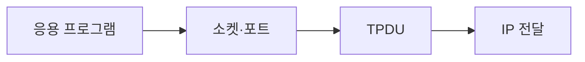

> [!abstract] 한 줄 요약
> 전송 계층은 응용 프로그램과 네트워크 사이의 연결을 맡고, 포트·일련번호·확인 응답으로 여러 대화를 구분한다.



> [!info] 핵심 원리
> 전송 계층은 여러 프로그램이 인터넷을 사용할 수 있는 인터페이스를 제공하고, 목적지에서 데이터 순서·손실을 확인하는 일을 맡는다. TCP가 대표 프로토콜로 제시된다.

## 한 컴퓨터 안의 여러 대화

포트는 같은 호스트에서 서로 다른 응용 프로그램을 구분하는 식별자다. 클라이언트는 요청을 보내고, 서버는 서비스를 기다리는 프로그램을 실행한다. 전송 계층은 연결을 설정하고 해제하며, 일련번호와 ACK를 통해 순서 변화나 손실을 다루고, 슬라이딩 윈도우로 혼잡 상황을 조절한다.

```html preview
<div style="padding: 14px; border: 1px solid var(--border); border-radius: 14px; background: var(--card);">
  <div style="font-weight: 700; color: var(--foreground); margin-bottom: 8px;">13. 전송 계층의 흐름</div>
  <svg viewBox="0 0 560 130" role="img" aria-label="앱에서 포트에서 확인에서 전달 흐름" style="width: 100%; height: auto;">
    <g transform="translate(16 44)"><rect width="118" height="54" rx="10" style="fill: var(--background); stroke: var(--chart-1); stroke-width: 2"></rect><text x="59" y="32" text-anchor="middle" style="fill: var(--foreground); font-size: 13px; font-family: sans-serif">앱</text></g><path d="M134 71 H150" style="stroke: var(--muted-foreground); stroke-width: 2; fill: none"></path><g transform="translate(152 44)"><rect width="118" height="54" rx="10" style="fill: var(--background); stroke: var(--chart-2); stroke-width: 2"></rect><text x="59" y="32" text-anchor="middle" style="fill: var(--foreground); font-size: 13px; font-family: sans-serif">포트</text></g><path d="M270 71 H286" style="stroke: var(--muted-foreground); stroke-width: 2; fill: none"></path><g transform="translate(288 44)"><rect width="118" height="54" rx="10" style="fill: var(--background); stroke: var(--chart-3); stroke-width: 2"></rect><text x="59" y="32" text-anchor="middle" style="fill: var(--foreground); font-size: 13px; font-family: sans-serif">확인</text></g><path d="M406 71 H422" style="stroke: var(--muted-foreground); stroke-width: 2; fill: none"></path><g transform="translate(424 44)"><rect width="118" height="54" rx="10" style="fill: var(--background); stroke: var(--chart-4); stroke-width: 2"></rect><text x="59" y="32" text-anchor="middle" style="fill: var(--foreground); font-size: 13px; font-family: sans-serif">전달</text></g>
    <text x="16" y="120" style="fill: var(--muted-foreground); font-size: 12px; font-family: sans-serif;">각 상자는 역할을, 화살표는 처리 순서를 나타낸다.</text>
  </svg>
</div>
```

<Tabs>
<Tab label="인터페이스">
응용 프로그램이 네트워크 서비스를 쓰게 하는 접점이다.
</Tab>
<Tab label="포트">
한 호스트 안에서 서비스를 구분하는 번호다.
</Tab>
<Tab label="신뢰성">
일련번호와 ACK로 순서·누락을 확인한다.
</Tab>
</Tabs>

> [!note] 연결해서 생각하기
> 전송 계층은 응용 프로그램과 네트워크 사이의 연결을 맡고, 포트·일련번호·확인 응답으로 여러 대화를 구분한다. 이 관점으로 보면, 용어를 개별 정의가 아니라 전달 과정의 어느 지점에 놓이는지로 정리할 수 있다.

<details>
<summary>스스로 점검하기</summary>

1. IP와 전송 계층의 책임을 나눈다.
2. 포트가 필요한 상황을 든다.
3. 연결 설정·해제의 의미를 설명한다.

</details>

> [!warning] 원문 오류
> 추출 원문에는 `TSAPTansport Service Access Point` 표기가 있다. 이 노트는 해당 원문 표기를 고치지 않고 오류임만 기록한다.
