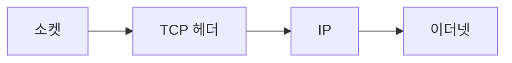

> [!abstract] 한 줄 요약
> TCP는 소켓에서 받은 데이터를 IP로 넘기기 전에 식별·순서·확인·연결 제어 정보를 헤더에 담는다.



> [!info] 핵심 원리
> TCP 헤더는 기본 부분과 선택적 부분으로 구성되며, 출발지·목적지 포트는 어떤 응용 프로그램 대화인지 구분하게 한다. 포트 번호는 16비트 범위를 사용한다.

## 헤더는 전달의 계약서

일련번호와 ACK 번호는 데이터의 순서와 확인에 쓰이고, 연결 설정·해제에도 관여한다. ECE와 CWR은 네트워크 계층의 혼잡 신호와 전송 계층의 전송 창 조절을 잇는다. URG·ACK·PSH·SYN·FIN 같은 제어 플래그는 데이터 처리와 연결 상태에 관한 의미를 전달한다.

```html preview
<div style="padding: 14px; border: 1px solid var(--border); border-radius: 14px; background: var(--card);">
  <div style="font-weight: 700; color: var(--foreground); margin-bottom: 8px;">14. TCP와 소켓 프로그래밍의 흐름</div>
  <svg viewBox="0 0 560 130" role="img" aria-label="소켓에서 헤더에서 IP에서 링크 흐름" style="width: 100%; height: auto;">
    <g transform="translate(16 44)"><rect width="118" height="54" rx="10" style="fill: var(--background); stroke: var(--chart-1); stroke-width: 2"></rect><text x="59" y="32" text-anchor="middle" style="fill: var(--foreground); font-size: 13px; font-family: sans-serif">소켓</text></g><path d="M134 71 H150" style="stroke: var(--muted-foreground); stroke-width: 2; fill: none"></path><g transform="translate(152 44)"><rect width="118" height="54" rx="10" style="fill: var(--background); stroke: var(--chart-2); stroke-width: 2"></rect><text x="59" y="32" text-anchor="middle" style="fill: var(--foreground); font-size: 13px; font-family: sans-serif">헤더</text></g><path d="M270 71 H286" style="stroke: var(--muted-foreground); stroke-width: 2; fill: none"></path><g transform="translate(288 44)"><rect width="118" height="54" rx="10" style="fill: var(--background); stroke: var(--chart-3); stroke-width: 2"></rect><text x="59" y="32" text-anchor="middle" style="fill: var(--foreground); font-size: 13px; font-family: sans-serif">IP</text></g><path d="M406 71 H422" style="stroke: var(--muted-foreground); stroke-width: 2; fill: none"></path><g transform="translate(424 44)"><rect width="118" height="54" rx="10" style="fill: var(--background); stroke: var(--chart-4); stroke-width: 2"></rect><text x="59" y="32" text-anchor="middle" style="fill: var(--foreground); font-size: 13px; font-family: sans-serif">링크</text></g>
    <text x="16" y="120" style="fill: var(--muted-foreground); font-size: 12px; font-family: sans-serif;">각 상자는 역할을, 화살표는 처리 순서를 나타낸다.</text>
  </svg>
</div>
```

<Tabs>
<Tab label="식별">
출발지·목적지 포트가 대화를 구분한다.
</Tab>
<Tab label="순서">
일련번호와 ACK 번호가 전달 상태를 이어 준다.
</Tab>
<Tab label="제어">
플래그가 연결·확인·처리 방식의 신호가 된다.
</Tab>
</Tabs>

> [!note] 연결해서 생각하기
> TCP는 소켓에서 받은 데이터를 IP로 넘기기 전에 식별·순서·확인·연결 제어 정보를 헤더에 담는다. 이 관점으로 보면, 용어를 개별 정의가 아니라 전달 과정의 어느 지점에 놓이는지로 정리할 수 있다.

<details>
<summary>스스로 점검하기</summary>

1. 소켓·TCP·IP·이더넷의 순서를 설명한다.
2. 포트와 일련번호의 차이를 말한다.
3. 혼잡 신호가 왜 두 계층을 잇는지 설명한다.

</details>

> [!warning] 원문 오류
> 추출 원문에는 `THL` 표기와 이를 `TCP Header Length`로 풀어 쓴 부분이 있다. 이 노트는 해당 원문 표기를 고치지 않고 오류임만 기록한다.

---

## 원본 강의 흐름 인터랙티브

```html preview
<div style="font-family:system-ui,sans-serif;padding:20px;color:var(--foreground)">
  <label for="noteFlow9947313" style="font-size:14px;font-weight:600">TCP와 소켓 프로그래밍 단계</label>
  <div id="noteFlow9947313-out" style="font-size:26px;font-weight:700;color:var(--chart-1);margin:6px 0">TCP와 소켓 프로그래밍 핵심 개념</div>
  <input id="noteFlow9947313" type="range" min="1" max="3" step="1" value="1" style="width:100%;accent-color:var(--primary)" />
  <p style="font-size:13px;color:var(--muted-foreground)">슬라이더를 움직이면 원본 PDF에서 정리한 이 노트의 흐름을 확인합니다.</p>
  <script>
    var noteFlow9947313 = document.getElementById('noteFlow9947313');
    var noteFlow9947313Out = document.getElementById('noteFlow9947313-out');
    var noteFlow9947313Steps = ["TCP와 소켓 프로그래밍 핵심 개념","TCP와 소켓 프로그래밍 처리 절차","TCP와 소켓 프로그래밍 검증·응용"];
    noteFlow9947313.addEventListener('input', function () { noteFlow9947313Out.textContent = noteFlow9947313Steps[Number(noteFlow9947313.value) - 1]; });
  </script>
</div>
```
