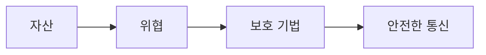

> [!abstract] 한 줄 요약
> 네트워크 보안은 송수신·저장 과정의 훼손·변조·유출을 줄이는 방법이며, 위협의 경로와 보호 기법을 함께 본다.



> [!info] 핵심 원리
> 악성 소프트웨어와 사회공학적 사기는 서로 다른 방식으로 정보를 노린다. 바이러스·트로이 목마·랜섬웨어, 피싱·파밍·스푸핑은 감염 경로와 사용자의 판단을 함께 고려하게 한다.

## 기밀성만으로는 충분하지 않다

암호화는 평문을 키로 변환해 허가받지 않은 사람이 내용을 읽기 어렵게 하는 방법이다. 대칭키는 하나의 키를 공유하고, 비대칭키는 공개키와 개인키의 쌍을 사용한다. 웹 보안에서는 인증과 암호화를 결합해 통신 상대와 전송 내용의 위험을 낮추려 하며, TLS는 안전한 전송을 위한 프로토콜로 소개된다.

```html preview
<div style="padding: 14px; border: 1px solid var(--border); border-radius: 14px; background: var(--card);">
  <div style="font-weight: 700; color: var(--foreground); margin-bottom: 8px;">16. 네트워크 보안의 흐름</div>
  <svg viewBox="0 0 560 130" role="img" aria-label="자산에서 위협에서 키에서 보호 흐름" style="width: 100%; height: auto;">
    <g transform="translate(16 44)"><rect width="118" height="54" rx="10" style="fill: var(--background); stroke: var(--chart-1); stroke-width: 2"></rect><text x="59" y="32" text-anchor="middle" style="fill: var(--foreground); font-size: 13px; font-family: sans-serif">자산</text></g><path d="M134 71 H150" style="stroke: var(--muted-foreground); stroke-width: 2; fill: none"></path><g transform="translate(152 44)"><rect width="118" height="54" rx="10" style="fill: var(--background); stroke: var(--chart-2); stroke-width: 2"></rect><text x="59" y="32" text-anchor="middle" style="fill: var(--foreground); font-size: 13px; font-family: sans-serif">위협</text></g><path d="M270 71 H286" style="stroke: var(--muted-foreground); stroke-width: 2; fill: none"></path><g transform="translate(288 44)"><rect width="118" height="54" rx="10" style="fill: var(--background); stroke: var(--chart-3); stroke-width: 2"></rect><text x="59" y="32" text-anchor="middle" style="fill: var(--foreground); font-size: 13px; font-family: sans-serif">키</text></g><path d="M406 71 H422" style="stroke: var(--muted-foreground); stroke-width: 2; fill: none"></path><g transform="translate(424 44)"><rect width="118" height="54" rx="10" style="fill: var(--background); stroke: var(--chart-4); stroke-width: 2"></rect><text x="59" y="32" text-anchor="middle" style="fill: var(--foreground); font-size: 13px; font-family: sans-serif">보호</text></g>
    <text x="16" y="120" style="fill: var(--muted-foreground); font-size: 12px; font-family: sans-serif;">각 상자는 역할을, 화살표는 처리 순서를 나타낸다.</text>
  </svg>
</div>
```

<Tabs>
<Tab label="위협">
악성 코드와 피싱은 접근 방식과 피해 양상이 다르다.
</Tab>
<Tab label="암호화">
평문·암호문·키의 관계를 먼저 구분한다.
</Tab>
<Tab label="웹 보안">
인증과 암호화를 조합해 통신 위험을 줄인다.
</Tab>
</Tabs>

> [!note] 연결해서 생각하기
> 네트워크 보안은 송수신·저장 과정의 훼손·변조·유출을 줄이는 방법이며, 위협의 경로와 보호 기법을 함께 본다. 이 관점으로 보면, 용어를 개별 정의가 아니라 전달 과정의 어느 지점에 놓이는지로 정리할 수 있다.

<details>
<summary>스스로 점검하기</summary>

1. 악성 코드와 피싱을 구분한다.
2. 대칭키와 비대칭키의 키 구성을 비교한다.
3. 암호화와 인증의 목적을 분리해 설명한다.

</details>

> [!warning] 원문 오류
> 추출 원문에는 `HTTPS는 TTPS는` 표기가 있다. 이 노트는 해당 원문 표기를 고치지 않고 오류임만 기록한다.
