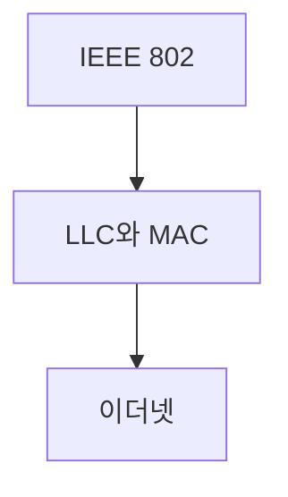

> [!abstract] 한 줄 요약
> LAN 규격은 LLC와 MAC의 역할을 나누고, 이더넷은 프레임과 매체 접근 규칙으로 동작한다.

## 이 노트의 지도



## 핵심 개념

강의는 LAN 관련 표준을 IEEE 802에서 정의하고, LAN의 데이터 링크 계층을 논리 연결 제어와 매체 접근 제어로 나눌 수 있다고 설명한다.

> [!important] 핵심 규칙
> LLC는 802.2에, MAC은 802.3부터 802.22까지의 규격에 연결된다.

$$
\text{LAN data link}=\text{LLC}+\text{MAC}
$$

<details>
<summary>이더넷의 위치</summary>

이더넷은 IEEE 802.3에 정의되며, 초기의 버스 형태에서 현재의 별 형태 구성으로 바뀌었다.

</details>

<Tabs>
  <Tab label="LLC">논리 연결 제어는 802.2에 정의된 역할이다.</Tab>
  <Tab label="MAC">매체 접근 제어는 802.3부터 802.22의 범위로 제시된다.</Tab>
</Tabs>

> [!tip] 적용 단서
> 공유 매체에서는 모든 호스트가 선의 사용 여부를 듣고, 충돌을 감지하면 전송을 멈춘다는 ==CSMA/CD==의 관점을 먼저 잡는다.

## 핵심 단서

```html preview
<div style="font-family:system-ui,sans-serif;padding:20px;color:var(--foreground)">
  <h3 style="margin:0 0 14px;font-size:15px;font-weight:600">이더넷 프레임의 크기 경계</h3>
  <div id="bars" style="display:flex;align-items:flex-end;gap:14px;height:170px"></div>
  <script>
    var data = [['최소', 64], ['데이터', 1500], ['최대', 1518]];
    var max = Math.max.apply(null, data.map(function (d) { return d[1]; }));
    document.getElementById('bars').innerHTML = data.map(function (d, i) {
      return '<div style="flex:1;display:flex;flex-direction:column;align-items:center;' +
        'gap:6px;height:100%;justify-content:flex-end">' +
        '<span style="font-size:12px;font-weight:600">' + d[1] + '</span>' +
        '<div style="width:100%;height:' + (d[1] / max * 100) + '%;' +
        'background:var(--chart-' + (i + 1) + ');' +
        'border-radius:var(--radius) var(--radius) 0 0"></div>' +
        '<span style="font-size:12px;color:var(--muted-foreground)">' + d[0] + '</span>' +
        '</div>';
    }).join('');
  </script>
</div>
```

$$
64\le\text{Ethernet frame bytes}\le1518
$$

<details>
<summary>프레임의 경계</summary>

강의는 이더넷 데이터 크기를 최대 1500바이트로, 전체 프레임 크기를 최소 64바이트와 최대 1518바이트로 제시한다.

</details>

<details>
<summary>오류 확인</summary>

FCS 필드는 이더넷 프레임의 오류 탐색을 위한 필드이며 CRC-32를 사용한다.

</details>

> [!question]- 스스로 점검
> **Q.** LLC와 MAC을 나누어 보는 이유는 무엇인가?
>
> **A.** LAN 데이터 링크 계층에서 논리 연결 제어와 매체 접근 제어의 책임이 구분되기 때문이다.

## 작성 경계

> [!warning] 출처 경계
> 제공된 추출 텍스트만 사용했으며 원본 시각자료·첨부물·페이지 표기는 넣지 않았다.
