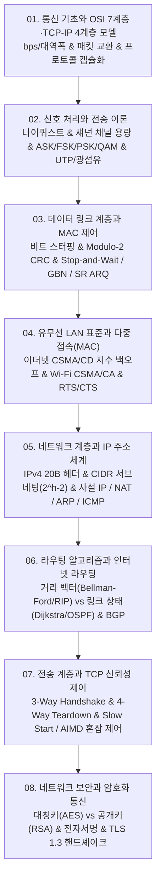

# 📚 컴퓨터 네트워크 (Computer Networks) 전체 강의 로드맵

물리 계층의 신호 처리 및 나이퀴스트/섀넌 채널 용량, 데이터 링크 계층의 프레이밍과 CRC/ARQ 오류 제어, 유무선 매체 접근 제어(CSMA/CD, CSMA/CA), 네트워크 계층의 IPv4 헤더·CIDR 서브네팅 및 NAT, 라우팅 알고리즘(거리 벡터 RIP vs 링크 상태 OSPF/다이크스트라 & BGP), 전송 계층의 TCP 3-Way Handshake·슬라이딩 윈도우 및 AIMD 혼잡 제어, 그리고 네트워크 보안(AES, RSA, SHA-256, SSL/TLS)까지 컴퓨터 통신 인프라의 전 계층을 체계적으로 다룹니다.

---

## 🗺️ 강의 목차 (Curriculum Overview)

---

## 📑 개별 정리 문서 목록

1. [01. 통신 기초와 OSI 7계층·TCP-IP 4계층 모델](file:///Users/um-yunsang/work/edu/ComputerScience/04_systems-infrastructure/computer-networks/notes/01.%20%ED%86%B5%EC%8B%A0%20%EA%B8%B0%EC%B4%88%EC%99%80%20OSI%207%EA%B3%84%EC%층%C2%B7TCP-IP%204%EA%B3%84%EC%층%20%EB%AA%A8%EB%8D%B8.md)
   - 전송 시간 정량 공식($T = \text{bits} / \text{bps}$), 패킷 교환 원리, PDU 캡슐화 계산기
2. [02. 신호 처리와 전송 이론 - 나이퀴스트·섀넌 공식 및 변복조](file:///Users/um-yunsang/work/edu/ComputerScience/04_systems-infrastructure/computer-networks/notes/02.%20%EC%8B%A0%ED%98%B8%20%EC%B2%98%EB%A6%AC%EC%99%80%20%EC%A0%84%EC%86%A1%20%EC%9D%B4%EB%A1%A0%20-%20%EB%82%98%EC%9D%B4%ED%80%B4%EC%8A%A4%ED%8A%B8%C2%B7%EC%84%80%EB%84%8C%20%EA%B3%B5%EC%8B%9D%20%EB%B0%8F%20%EB%B3%80%EB%B3%B5%EC%A1%B0.md)
   - 나이퀴스트($2B\log_2 M$) 및 섀넌($B\log_2(1+\text{SNR})$) 공식, ASK/FSK/PSK/QAM, SNR 채널 용량 계산기
3. [03. 데이터 링크 계층과 MAC 제어 - 프레이밍, 오류 제어(CRC)와 슬라이딩 윈도우](file:///Users/um-yunsang/work/edu/ComputerScience/04_systems-infrastructure/computer-networks/notes/03.%20%EB%8D%B0%EC%9D%B4%ED%84%B0%20%EB%A7%81%ED%81%AC%20%EA%B3%84%EC%층%EA%B3%BC%20MAC%20%EC%A0%9C%EC%96%B4%20-%20%ED%94%84%EB%A0%88%EC%9D%B4%EB%B0%8D,%20%EC%98%A4%EB%A5%98%20%EC%A0%9C%EC%96%B4(CRC)%EC%99%80%20%EC%8A%AC%EB%9D%BC%EC%9D%B4%EB%94%A9%20%EC%9C%88%EB%8F%84%EC%9A%B0.md)
   - 비트 스터핑 메커니즘, Modulo-2 다항식 나눗셈, 실시간 CRC 계산기, 3대 ARQ 프로토콜 비교
4. [04. 유무선 LAN 표준과 다중 접속(MAC) - 이더넷(CSMA-CD)과 Wi-Fi(CSMA-CA)](file:///Users/um-yunsang/work/edu/ComputerScience/04_systems-infrastructure/computer-networks/notes/04.%20%EC%9C%A0%EB%AC%B4%EC%84%A0%20LAN%20%ED%91%9C%EC%A4%80%EA%B3%BC%20%EB%8B%A4%EC%A4%91%20%EC%A0%91%EC%86%8D(MAC)%20-%20%EC%9D%B4%EB%8D%94%EB%84%B7(CSMA-CD)%EA%B3%BC%20Wi-Fi(CSMA-CA).md)
   - CSMA/CD 2진 지수 백오프 시뮬레이터, Wi-Fi CSMA/CA 및 RTS/CTS 은닉 노드 해결
5. [05. 네트워크 계층과 IP 주소 체계 - IPv4 헤더, 서브네팅(CIDR), NAT와 ARP-ICMP](file:///Users/um-yunsang/work/edu/ComputerScience/04_systems-infrastructure/computer-networks/notes/05.%20%EB%84%A4%ED%8A%B8%EC%9B%8C%ED%81%AC%20%EA%B3%84%EC%층%EA%B3%BC%20IP%20%EC%A3%BC%EC%86%8C%20%EC%B2%B4%EA%B3%84%20-%20IPv4%20%ED%97%A4%EB%8D%94,%20%EC%84%9C%EB%B8%8C%EB%84%A4%ED%8C%85(CIDR),%20NAT%EC%99%80%20ARP-ICMP.md)
   - IPv4 20바이트 헤더 패킷 다이어그램, CIDR 프리픽스 기반 실시간 서브넷 마스크 계산기, NAT 및 ARP
6. [06. 라우팅 알고리즘과 인터넷 라우팅 - 거리 벡터(RIP) vs 링크 상태(OSPF·다이크스트라) 및 BGP](file:///Users/um-yunsang/work/edu/ComputerScience/04_systems-infrastructure/computer-networks/notes/06.%20%EB%9D%BC%EC%9A%B0%ED%8C%85%20%EC%95%8C%EA%B3%A0%EB%A6%AC%EC%A6%98%EA%B3%BC%20%EC%9D%B8%ED%84%B0%EB%84%B7%20%EB%9D%BC%EC%9A%B0%ED%8C%85%20-%20%EA%B1%B0%EB%A6%AC%20%EB%B2%A1%ED%84%B0(RIP)%20vs%20%EB%A7%81%ED%81%AC%20%EC%83%81%ED%83%9C(OSPF%C2%B7%EB%8B%A4%EC%9D%B4%ED%81%AC%EC%8A%A4%ED%8A%B8%EB%9D%BC)%20%EB%B0%8F%20BGP.md)
   - Bellman-Ford vs Dijkstra 알고리즘, 무한 계수 문제, 실시간 다이크스트라 최단 경로 계산기
7. [07. 전송 계층과 TCP 신뢰성 제어 - 3-Way Handshake, 흐름 제어 및 혼잡 제어](file:///Users/um-yunsang/work/edu/ComputerScience/04_systems-infrastructure/computer-networks/notes/07.%20%EC%A0%84%EC%86%A1%20%EA%B3%84%EC%층%EA%B3%BC%20TCP%20%EC%8B%A0%EB%A2%B0%EC%84%B1%20%EC%A0%9C%EC%96%B4%20-%203-Way%20Handshake,%20%ED%9D%90%EB%A6%84%20%EC%A0%9C%EC%96%B4%20%EB%B0%8F%20%ED%98%BC%EC%9E%A1%20%EC%A0%9C%EC%96%B4.md)
   - TCP 3-Way Handshake & 4-Way Teardown 시퀀스, Slow Start 및 AIMD 혼잡 윈도우(CWND) 시뮬레이터
8. [08. 네트워크 보안과 암호화 통신 - 대칭·비대칭 암호화, 디지털 서명과 SSL-TLS](file:///Users/um-yunsang/work/edu/ComputerScience/04_systems-infrastructure/computer-networks/notes/08.%20%EB%84%A4%ED%8A%B8%EC%9B%8C%ED%81%AC%20%EB%B3%B4%EC%95%88%EA%B3%BC%20%EC%95%94%ED%98%B8%ED%99%94%20%ED%86%B5%EC%8B%A0%20-%20%EB%8C%80%EC%B8%AD%C2%B7%EB%89%B4%EB%8C%80%EC%B8%AD%20%EC%95%94%ED%98%B8%ED%99%94,%20%EB%94%94%EC%A7%80%ED%84%B8%20%EC%84%9C%EB%AA%85%EA%B3%BC%20SSL-TLS.md)
   - CIA 3요소, 대칭키 AES vs 공개키 RSA, TLS 1.3 핸드셰이크 흐름, 암복호화/전자서명 시뮬레이터
