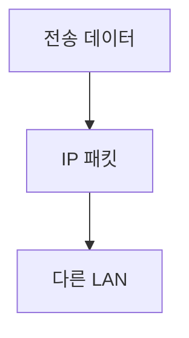

> [!abstract] 한 줄 요약
> 네트워크 계층은 LAN 사이에서 패킷을 전달하고 라우터가 목적지까지의 경로를 잇게 한다.

## 이 노트의 지도



## 핵심 개념

강의는 IP를 대표 프로토콜로 들며, 네트워크 계층이 전송 계층 데이터를 패킷에 넣어 목적지에 전달하고 라우팅이 경로를 결정한다고 설명한다.

> [!important] 핵심 규칙
> 인터넷에서 LAN과 LAN을 잇는 장비가 ==라우터==이며, 라우팅의 목적은 목적지까지 데이터를 빠르게 전달하는 것이다.

$$
\text{network delivery}=\text{packet}+\text{route}
$$

<details>
<summary>가상 회선</summary>

가상 사설망은 패킷 교환망의 일정 채널을 빌려 독점적으로 사용하며, 통신 전 셋업 단계를 거친다.

</details>


> [!tip] 적용 단서
> 회선교환·패킷교환·가상회선은 모두 연결 방식을 설명하지만, ==가상회선==은 패킷교환망 위에서 회선교환처럼 쓰는 형태다.

## 핵심 단서

```html preview
<div style="font-family:system-ui,sans-serif;padding:20px">
  <div id="cards" style="display:flex;gap:14px;flex-wrap:wrap"></div>
  <script>
    var stats = [
      ['대표 프로토콜', 'IP', '패킷 전달', 'var(--chart-1)'],
      ['연결 장비', '라우터', 'LAN과 LAN', 'var(--chart-2)'],
      ['연결 관문', '게이트웨이', '계층 역할 확장', 'var(--chart-5)']
    ];
    document.getElementById('cards').innerHTML = stats.map(function (s) {
      return '<div style="flex:1;min-width:150px;padding:16px;background:var(--card);' +
        'color:var(--card-foreground);border:1px solid var(--border);' +
        'border-radius:var(--radius)">' +
        '<div style="font-size:13px;color:var(--muted-foreground)">' + s[0] + '</div>' +
        '<div style="font-size:26px;font-weight:700;margin-top:4px">' + s[1] + '</div>' +
        '<div style="font-size:12px;font-weight:600;margin-top:4px;color:' + s[3] + '">' +
        s[2] + '</div>' +
        '</div>';
    }).join('');
  </script>
</div>
```

$$
\text{gateway}=\text{router}+\text{upper-layer role}
$$

<details>
<summary>게이트웨이</summary>

강의는 보통 네트워크 연결 지점의 라우터가 게이트웨이 역할을 맡고, 게이트웨이는 라우터에 전송 계층이나 응용 계층 역할이 더해진 것으로 설명한다.

</details>


> [!question]- 스스로 점검
> **Q.** 라우터와 게이트웨이를 같은 말로만 볼 수 없는 이유는 무엇인가?
>
> **A.** 라우터는 LAN 연결 장비이고, 강의의 게이트웨이는 그 위에 전송·응용 계층 역할이 추가된 개념이기 때문이다.

## 작성 경계

> [!warning] 출처 경계
> 제공된 추출 텍스트만 사용했으며 원본 시각자료·첨부물·페이지 표기는 넣지 않았다.

---

## 원본 강의 흐름 인터랙티브

```html preview
<div style="font-family:system-ui,sans-serif;padding:20px;color:var(--foreground)">
  <label for="noteFlow2527616" style="font-size:14px;font-weight:600">네트워크 계층 단계</label>
  <div id="noteFlow2527616-out" style="font-size:26px;font-weight:700;color:var(--chart-1);margin:6px 0">네트워크 계층 핵심 개념</div>
  <input id="noteFlow2527616" type="range" min="1" max="3" step="1" value="1" style="width:100%;accent-color:var(--primary)" />
  <p style="font-size:13px;color:var(--muted-foreground)">슬라이더를 움직이면 원본 PDF에서 정리한 이 노트의 흐름을 확인합니다.</p>
  <script>
    var noteFlow2527616 = document.getElementById('noteFlow2527616');
    var noteFlow2527616Out = document.getElementById('noteFlow2527616-out');
    var noteFlow2527616Steps = ["네트워크 계층 핵심 개념","네트워크 계층 처리 절차","네트워크 계층 검증·응용"];
    noteFlow2527616.addEventListener('input', function () { noteFlow2527616Out.textContent = noteFlow2527616Steps[Number(noteFlow2527616.value) - 1]; });
  </script>
</div>
```
