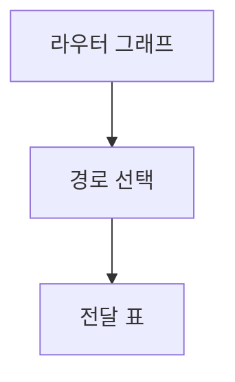

> [!abstract] 한 줄 요약
> 라우팅은 그래프로 표현한 네트워크에서 빠른 경로를 고르고 변화에 맞춰 경로 정보를 갱신하는 작업이다.

## 이 노트의 지도



## 핵심 개념

강의는 라우터와 통신선 연결을 그래프로 표현하며, 노드는 라우터, 선은 통신선, 선의 숫자는 전송 시간이나 거리를 뜻한다고 설명한다.

> [!important] 핵심 규칙
> 라우팅 알고리즘의 핵심 목적은 각 라우터로 가는 ==가장 빠른 경로==를 찾는 것이다.

$$
\operatorname{cost}(path)=\sum_i\operatorname{cost}(edge_i)
$$

<details>
<summary>정적과 동적</summary>

정적 라우팅은 현재 상태에서 목적지까지 갈 곳을 찾고, 동적 라우팅은 라우터 상태를 감지해 경로를 변경한다.

</details>

<Tabs>
  <Tab label="거리 벡터">라우터가 주기적으로 자신의 기준 거리 정보가 든 라우팅 테이블을 주고받는다.</Tab>
  <Tab label="연결 상태">직접 연결된 이웃 정보만 보내고 최단경로 알고리즘을 사용한다.</Tab>
</Tabs>

> [!tip] 적용 단서
> 최단경로의 결과가 사이클 없는 ==트리==로 표현된다는 점을 경로 계산 결과와 연결해 기억한다.

## 핵심 단서

```html preview
<div style="font-family:system-ui,sans-serif;padding:20px;display:flex;align-items:center;gap:20px;color:var(--foreground)">
  <svg width="120" height="120" viewBox="0 0 120 120" role="img" aria-label="three routing approaches">
    <circle cx="60" cy="60" r="46" stroke-width="14" style="fill: none; stroke: var(--border)" />
    <circle cx="60" cy="60" r="46" stroke-width="14"
      stroke-linecap="round" stroke-dasharray="289" stroke-dashoffset="0"
      transform="rotate(-90 60 60)" style="fill: none; stroke: var(--chart-1)" />
    <text x="60" y="67" text-anchor="middle" font-size="22" font-weight="700"
      style="fill: var(--foreground)">3</text>
  </svg>
  <div>
    <div style="font-weight:600;font-size:15px">핵심 경로 방식</div>
    <div style="font-size:13px;color:var(--muted-foreground);margin-top:2px">정적·거리 벡터·연결 상태</div>
  </div>
</div>
```

$$
\text{shortest path result}\Rightarrow\text{tree}
$$

<details>
<summary>최단경로 알고리즘</summary>

강의는 최단경로 알고리즘을 대표적인 정적 라우팅 알고리즘으로 들고, 집합에 출발 라우터를 넣은 뒤 가장 짧은 경로를 반복해 선택한다고 설명한다.

</details>

<details>
<summary>연결 상태의 갱신</summary>

연결 상태 라우팅은 일련번호와 나이를 추가해 잘못된 정보 도착을 막고, 이웃 라우터 정보를 바탕으로 테이블을 갱신한다.

</details>

> [!question]- 스스로 점검
> **Q.** 거리 벡터와 연결 상태 라우팅의 정보 교환은 어떻게 다른가?
>
> **A.** 거리 벡터는 라우팅 테이블의 거리 정보를 주기적으로 주고받고, 연결 상태는 자신에게 직접 연결된 이웃 정보를 보낸다.

## 작성 경계

> [!warning] 출처 경계
> 제공된 추출 텍스트만 사용했으며 원본 시각자료·첨부물·페이지 표기는 넣지 않았다.
