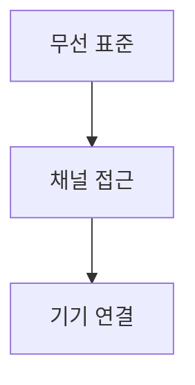

> [!abstract] 한 줄 요약
> 무선통신은 표준·주파수·충돌 회피 방식과 용도별 근거리 기술을 함께 고려한다.

## 이 노트의 지도



## 핵심 개념

강의는 Wi-Fi를 IEEE 802.11 표준에 기반한 WLAN으로, 블루투스를 개인 작업 공간의 기기를 연결하는 WPAN 기술로 설명한다.

> [!important] 핵심 규칙
> Wi-Fi에서는 충돌을 감지하기보다 ==충돌 회피== 프로토콜 CSMA/CA를 사용한다.

$$
\text{WiFi band}\in\{2.4,5\}\ \text{GHz}
$$

<details>
<summary>Wi-Fi 규격</summary>

강의는 802.11b, a, g, n, ac, ax를 대중적인 Wi-Fi 규격으로 열거한다.

</details>

> [!tip] 적용 단서
> 초기 WEP에는 쉽게 뚫리는 단점이 있었고, 이후 WPA와 WPA2가 제시되었다는 ==보안 방식의 변화==를 구분한다.

## 핵심 단서

```html preview
<div style="font-family:system-ui,sans-serif;padding:20px;display:flex;align-items:center;gap:20px;color:var(--foreground)">
  <svg width="120" height="120" viewBox="0 0 120 120" role="img" aria-label="six listed Wi-Fi standards">
    <circle cx="60" cy="60" r="46" stroke-width="14" style="fill: none; stroke: var(--border)" />
    <circle cx="60" cy="60" r="46" stroke-width="14"
      stroke-linecap="round" stroke-dasharray="289" stroke-dashoffset="0"
      transform="rotate(-90 60 60)" style="fill: none; stroke: var(--chart-1)" />
    <text x="60" y="67" text-anchor="middle" font-size="22" font-weight="700"
      style="fill: var(--foreground)">6</text>
  </svg>
  <div>
    <div style="font-weight:600;font-size:15px">주요 Wi-Fi 규격</div>
    <div style="font-size:13px;color:var(--muted-foreground);margin-top:2px">강의에서 열거한 6개 규격</div>
  </div>
</div>
```

$$
\text{Bluetooth range}\approx10\ \text{m}
$$

<details>
<summary>CSMA/CA의 상태</summary>

사용 가능한 채널을 감시하다 전송 가능할 때 시작하며, 다른 통신이 진행되면 가상전송 모드가 될 수 있다.

</details>

<details>
<summary>블루투스의 범위</summary>

블루투스는 기기의 간단한 연결을 위해 만들어진 무선 시스템으로, WPAN은 약 10m 거리의 통신으로 소개된다.

</details>

> [!question]- 스스로 점검
> **Q.** 무선에서 CSMA/CA가 필요한 이유는 무엇인가?
>
> **A.** 강의는 Wi-Fi가 충돌 회피 프로토콜로 전송 가능 채널을 판단한 뒤 전송을 시작한다고 설명한다.

## 작성 경계

> [!warning] 출처 경계
> 제공된 추출 텍스트만 사용했으며 원본 시각자료·첨부물·페이지 표기는 넣지 않았다.

---

## 원본 강의 흐름 인터랙티브

```html preview
<div style="font-family:system-ui,sans-serif;padding:20px;color:var(--foreground)">
  <label for="noteFlow1008618" style="font-size:14px;font-weight:600">무선통신 시스템 단계</label>
  <div id="noteFlow1008618-out" style="font-size:26px;font-weight:700;color:var(--chart-1);margin:6px 0">무선통신 시스템 핵심 개념</div>
  <input id="noteFlow1008618" type="range" min="1" max="3" step="1" value="1" style="width:100%;accent-color:var(--primary)" />
  <p style="font-size:13px;color:var(--muted-foreground)">슬라이더를 움직이면 원본 PDF에서 정리한 이 노트의 흐름을 확인합니다.</p>
  <script>
    var noteFlow1008618 = document.getElementById('noteFlow1008618');
    var noteFlow1008618Out = document.getElementById('noteFlow1008618-out');
    var noteFlow1008618Steps = ["무선통신 시스템 핵심 개념","무선통신 시스템 처리 절차","무선통신 시스템 검증·응용"];
    noteFlow1008618.addEventListener('input', function () { noteFlow1008618Out.textContent = noteFlow1008618Steps[Number(noteFlow1008618.value) - 1]; });
  </script>
</div>
```
