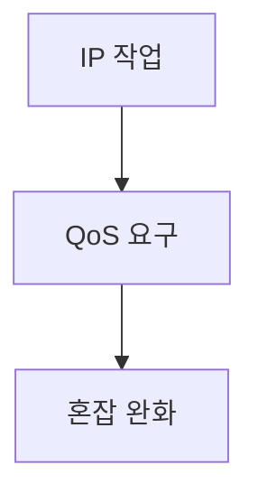

> [!abstract] 한 줄 요약
> IP 관련 작업은 주소와 LAN 연결을 다루며, QoS와 혼잡 제어는 전달 품질을 조절한다.

## 이 노트의 지도



## 핵심 개념

강의는 IP 관련 작업으로 IP·도메인 주소 관리, IP와 MAC 주소 변환, 서브넷 분할과 이기종 LAN 연결을 제시한다.

> [!important] 핵심 규칙
> QoS의 요구 항목은 ==신뢰성·지연·지터·대역폭==이다.

$$
Q=\{\text{reliability},\text{delay},\text{jitter},\text{bandwidth}\}
$$

<details>
<summary>서비스별 요구</summary>

이메일은 높은 신뢰성을 요구하지만 지연·지터·대역폭은 낮아도 된다고 제시되며, 화상회의는 지연·지터·대역폭 요구가 크다.

</details>

<Tabs>
  <Tab label="혼잡 신호">초크 패킷은 상대 호스트에 윈도우 크기를 줄이자는 의미로 보내는 패킷이다.</Tab>
  <Tab label="흐름 조절">패킷을 일정 간격으로 조절하면 혼잡이 완화될 수 있으며 토큰 버킷이 버퍼를 이용한 방식으로 소개된다.</Tab>
</Tabs>

> [!tip] 적용 단서
> 혼잡 완화는 무조건 재전송하기보다 ==윈도우 크기==와 전송 간격을 조절하는 관점으로 읽는다.

## 핵심 단서

```html preview
<div style="font-family:system-ui,sans-serif;padding:20px">
  <div id="cards" style="display:flex;gap:14px;flex-wrap:wrap"></div>
  <script>
    var stats = [
      ['신뢰성', '이메일', '높은 요구', 'var(--chart-2)'],
      ['지연', '화상회의', '큰 요구', 'var(--chart-1)'],
      ['대역폭', '화상회의', '큰 요구', 'var(--chart-5)']
    ];
    document.getElementById('cards').innerHTML = stats.map(function (s) {
      return '<div style="flex:1;min-width:150px;padding:16px;background:var(--card);' +
        'color:var(--card-foreground);border:1px solid var(--border);' +
        'border-radius:var(--radius)">' +
        '<div style="font-size:13px;color:var(--muted-foreground)">' + s[0] + '</div>' +
        '<div style="font-size:26px;font-weight:700;margin-top:4px">' + s[1] + '</div>' +
        '<div style="font-size:12px;font-weight:600;margin-top:4px;color:' + s[3] + '">' +
        s[2] + '</div>' +
        '</div>';
    }).join('');
  </script>
</div>
```

$$
\text{congestion relief}\Rightarrow\text{smaller window}
$$

<details>
<summary>TTL</summary>

TTL을 넘겨 네트워크를 돌아다니는 패킷은 라우터에서 폐기되며, 시간 오차 때문에 홉으로 표시하는 추세가 설명된다.

</details>

<details>
<summary>IP 헤더</summary>

IP 헤더의 Source Address는 보내는 호스트의 IP 주소, Destination Address는 받는 호스트의 IP 주소를 뜻한다.

</details>

> [!question]- 스스로 점검
> **Q.** QoS 항목을 서비스마다 구분해야 하는 이유는 무엇인가?
>
> **A.** 이메일과 화상회의처럼 필요한 신뢰성·지연·지터·대역폭의 조합이 다르기 때문이다.

## 작성 경계

> [!warning] 출처 경계
> 제공된 추출 텍스트만 사용했으며 원본 시각자료·첨부물·페이지 표기는 넣지 않았다.

---

## 원본 강의 흐름 인터랙티브

```html preview
<div style="font-family:system-ui,sans-serif;padding:20px;color:var(--foreground)">
  <label for="noteFlow163319" style="font-size:14px;font-weight:600">인터넷 프로토콜과 라우팅 단계</label>
  <div id="noteFlow163319-out" style="font-size:26px;font-weight:700;color:var(--chart-1);margin:6px 0">인터넷 프로토콜과 라우팅 핵심 개념</div>
  <input id="noteFlow163319" type="range" min="1" max="3" step="1" value="1" style="width:100%;accent-color:var(--primary)" />
  <p style="font-size:13px;color:var(--muted-foreground)">슬라이더를 움직이면 원본 PDF에서 정리한 이 노트의 흐름을 확인합니다.</p>
  <script>
    var noteFlow163319 = document.getElementById('noteFlow163319');
    var noteFlow163319Out = document.getElementById('noteFlow163319-out');
    var noteFlow163319Steps = ["인터넷 프로토콜과 라우팅 핵심 개념","인터넷 프로토콜과 라우팅 처리 절차","인터넷 프로토콜과 라우팅 검증·응용"];
    noteFlow163319.addEventListener('input', function () { noteFlow163319Out.textContent = noteFlow163319Steps[Number(noteFlow163319.value) - 1]; });
  </script>
</div>
```
